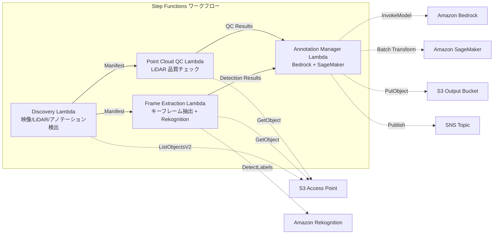

# UC9: 自動運転 / ADAS — 映像・LiDAR 前処理・品質チェック・アノテーション

## 概要

FSx for NetApp ONTAP の S3 Access Points を活用し、ダッシュカム映像と LiDAR 点群データの前処理、品質チェック、アノテーション管理を自動化するサーバーレスワークフローです。

### このパターンが適しているケース

- ダッシュカム映像や LiDAR 点群データが FSx ONTAP 上に大量に蓄積されている
- 映像からのキーフレーム抽出と物体検出（車両、歩行者、交通標識）を自動化したい
- LiDAR 点群の品質チェック（点密度、座標整合性）を定期的に実施したい
- COCO 互換形式でアノテーションメタデータを管理したい
- SageMaker Batch Transform による点群セグメンテーション推論を組み込みたい

### このパターンが適さないケース

- リアルタイムの自動運転推論パイプラインが必要
- 大規模な映像トランスコーディング（MediaConvert / EC2 が適切）
- 完全な LiDAR SLAM 処理（HPC クラスタが適切）
- ONTAP REST API へのネットワーク到達性が確保できない環境

### 主な機能

- S3 AP 経由で映像（.mp4, .avi, .mkv）、LiDAR（.pcd, .las, .laz, .ply）、アノテーション（.json）を自動検出
- Rekognition DetectLabels による物体検出（車両、歩行者、交通標識、車線マーキング）
- LiDAR 点群の品質チェック（point_count, coordinate_bounds, point_density, NaN 検証）
- Bedrock によるアノテーション提案生成
- SageMaker Batch Transform による点群セグメンテーション推論
- COCO 互換 JSON 形式でのアノテーション出力

## アーキテクチャ



### ワークフローステップ

1. **Discovery**: S3 AP から映像、LiDAR、アノテーションファイルを検出
2. **Frame Extraction**: 映像からキーフレームを抽出し、Rekognition で物体検出
3. **Point Cloud QC**: LiDAR 点群のヘッダーメタデータ抽出と品質検証
4. **Annotation Manager**: Bedrock でアノテーション提案生成、SageMaker で点群セグメンテーション

## 前提条件

- AWS アカウントと適切な IAM 権限
- FSx for NetApp ONTAP ファイルシステム（ONTAP 9.17.1P4D3 以上）
- S3 Access Point が有効化されたボリューム（映像・LiDAR データを格納）
- VPC、プライベートサブネット
- Amazon Bedrock モデルアクセスが有効（Claude / Nova）
- SageMaker エンドポイント（点群セグメンテーションモデル）— オプショナル

## デプロイ手順

### 1. CloudFormation デプロイ

```bash
aws cloudformation deploy \
  --template-file autonomous-driving/template.yaml \
  --stack-name fsxn-autonomous-driving \
  --parameter-overrides \
    S3AccessPointAlias=<your-volume-ext-s3alias> \
    VpcId=<your-vpc-id> \
    PrivateSubnetIds=<subnet-1>,<subnet-2> \
    ScheduleExpression="rate(1 hour)" \
    NotificationEmail=<your-email@example.com> \
    EnableVpcEndpoints=false \
    EnableCloudWatchAlarms=false \
  --capabilities CAPABILITY_IAM CAPABILITY_AUTO_EXPAND \
  --region ap-northeast-1
```

## 設定パラメータ一覧

| パラメータ | 説明 | デフォルト | 必須 |
|-----------|------|----------|------|
| `S3AccessPointAlias` | FSx ONTAP S3 AP Alias（入力用） | — | ✅ |
| `ScheduleExpression` | EventBridge Scheduler のスケジュール式 | `rate(1 hour)` | |
| `VpcId` | VPC ID | — | ✅ |
| `PrivateSubnetIds` | プライベートサブネット ID リスト | — | ✅ |
| `NotificationEmail` | SNS 通知先メールアドレス | — | ✅ |
| `FrameExtractionInterval` | キーフレーム抽出間隔（秒） | `5` | |
| `MapConcurrency` | Map ステートの並列実行数 | `5` | |
| `LambdaMemorySize` | Lambda メモリサイズ (MB) | `2048` | |
| `LambdaTimeout` | Lambda タイムアウト (秒) | `600` | |
| `EnableVpcEndpoints` | Interface VPC Endpoints の有効化 | `false` | |
| `EnableCloudWatchAlarms` | CloudWatch Alarms の有効化 | `false` | |

## クリーンアップ

```bash
aws s3 rm s3://fsxn-autonomous-driving-output-${AWS_ACCOUNT_ID} --recursive

aws cloudformation delete-stack \
  --stack-name fsxn-autonomous-driving \
  --region ap-northeast-1

aws cloudformation wait stack-delete-complete \
  --stack-name fsxn-autonomous-driving \
  --region ap-northeast-1
```

## 参考リンク

- [FSx ONTAP S3 Access Points 概要](https://docs.aws.amazon.com/fsx/latest/ONTAPGuide/accessing-data-via-s3-access-points.html)
- [Amazon Rekognition ラベル検出](https://docs.aws.amazon.com/rekognition/latest/dg/labels.html)
- [Amazon SageMaker Batch Transform](https://docs.aws.amazon.com/sagemaker/latest/dg/batch-transform.html)
- [COCO データフォーマット](https://cocodataset.org/#format-data)
- [LAS ファイルフォーマット仕様](https://www.asprs.org/divisions-committees/lidar-division/laser-las-file-format-exchange-activities)

## SageMaker Batch Transform 統合（Phase 3）

Phase 3 では、**SageMaker Batch Transform による LiDAR 点群セグメンテーション推論** をオプトインで利用できます。Step Functions の Callback Pattern（`.waitForTaskToken`）を使用し、非同期でバッチ推論ジョブの完了を待機します。

### 有効化

```bash
aws cloudformation deploy \
  --template-file autonomous-driving/template.yaml \
  --stack-name fsxn-autonomous-driving \
  --parameter-overrides \
    EnableSageMakerTransform=true \
    MockMode=true \
    ... # 他のパラメータ
  --capabilities CAPABILITY_IAM CAPABILITY_AUTO_EXPAND
```

### ワークフロー

```
Discovery → Frame Extraction → Point Cloud QC
  → [EnableSageMakerTransform=true] SageMaker Invoke (.waitForTaskToken)
  → SageMaker Batch Transform Job
  → EventBridge (job state change) → SageMaker Callback (SendTaskSuccess/Failure)
  → Annotation Manager (Rekognition + SageMaker 結果統合)
```

### モックモード

テスト環境では `MockMode=true`（デフォルト）を使用することで、実際の SageMaker モデルデプロイなしに Callback Pattern のデータフローを検証できます。

- **MockMode=true**: SageMaker API を呼び出さず、モックセグメンテーション出力（入力 point_count と同数のランダムラベル）を生成し、直接 SendTaskSuccess を呼び出す
- **MockMode=false**: 実際の SageMaker CreateTransformJob を実行。事前にモデルのデプロイが必要

### 設定パラメータ（Phase 3 追加）

| パラメータ | 説明 | デフォルト |
|-----------|------|----------|
| `EnableSageMakerTransform` | SageMaker Batch Transform の有効化 | `false` |
| `MockMode` | モックモード（テスト用） | `true` |
| `SageMakerModelName` | SageMaker モデル名 | — |
| `SageMakerInstanceType` | Batch Transform インスタンスタイプ | `ml.m5.xlarge` |

## Supported Regions

UC9 は以下のサービスを使用します:

| サービス | リージョン制約 |
|---------|-------------|
| Amazon Rekognition | ほぼ全リージョンで利用可能 |
| Amazon Bedrock | 対応リージョンを確認（[Bedrock 対応リージョン](https://docs.aws.amazon.com/general/latest/gr/bedrock.html)） |
| SageMaker Batch Transform | ほぼ全リージョンで利用可能（インスタンスタイプの可用性はリージョンにより異なる） |
| AWS X-Ray | ほぼ全リージョンで利用可能 |
| CloudWatch EMF | ほぼ全リージョンで利用可能 |

> SageMaker Batch Transform を有効化する場合、デプロイ前に [AWS Regional Services List](https://aws.amazon.com/about-aws/global-infrastructure/regional-product-services/) でターゲットリージョンのインスタンスタイプ可用性を確認してください。詳細は [リージョン互換性マトリックス](../docs/region-compatibility.md) を参照。
