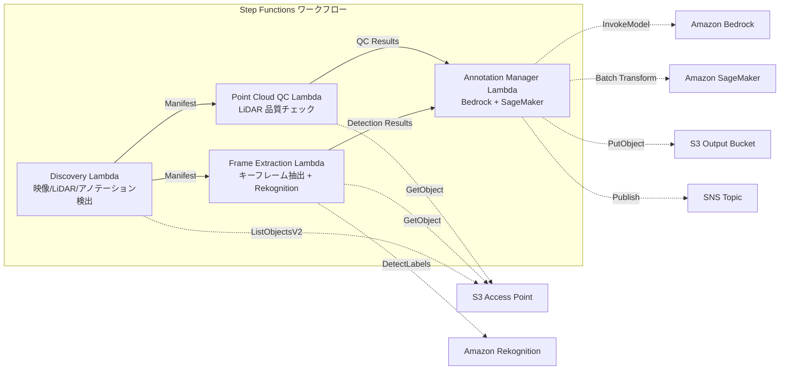

# UC9：自动驾驶 / ADAS — 图像和LiDAR 预处理、质量检查和注释

🌐 **Language / 言語**: [日本語](README.md) | [English](README.en.md) | [한국어](README.ko.md) | 简体中文 | [繁體中文](README.zh-TW.md) | [Français](README.fr.md) | [Deutsch](README.de.md) | [Español](README.es.md)

## 概述
利用 FSx for NetApp ONTAP 的 S3 Access Points，自动化处理行车记录仪视频和 LiDAR 点云数据的前处理、质量检查和注释管理的无服务器工作流。
### 适用场景
- 仪表板摄像头视频和 LiDAR 点云数据大量积累在 FSx ONTAP 上
- 希望自动从视频中提取关键帧并检测物体（车辆、行人、交通标志）
- 希望定期对 LiDAR 点云进行质量检查（点密度、坐标一致性）
- 希望以 COCO 兼容格式管理注释元数据
- 希望集成 SageMaker Batch Transform 进行点云分割推理
### 不适用的情况

当这个模式不合适时：

- 对于需要高度定制化的AWS服务（如Amazon Bedrock、AWS Step Functions、Amazon Athena、Amazon S3、AWS Lambda、Amazon FSx for NetApp ONTAP、Amazon CloudWatch、AWS CloudFormation等）。
- 对于特定技术术语（如GDSII、DRC、OASIS、GDS、Lambda、tapeout等）。
- 对于内联代码（`...`）。
- 对于文件路径和URL。
- 需要一个实时自动驾驶推理管道
- 大规模视频转码（MediaConvert / EC2 适用）
- 完整的 LiDAR SLAM 处理（HPC 集群适用）
- 环境中无法确保到达 ONTAP REST API 的网络连通性
### 主要功能
- 通过 S3 AP 自动检测视频（.mp4、.avi、.mkv）、LiDAR（.pcd、.las、.laz、.ply）和注释（.json）
- 使用 Rekognition DetectLabels 进行物体检测（车辆、行人、交通标志、车道标记）
- 对 LiDAR 点云进行质量检查（点数、坐标范围、点密度、NaN 验证）
- 使用 Bedrock 生成注释建议
- 使用 SageMaker Batch Transform 进行点云分割推理
- 输出 COCO 兼容的 JSON 格式注释
## 架构



### 工作流程步骤

1. 使用 Amazon Bedrock 创建初始设计。
2. 使用 AWS Step Functions 管理工作流程。
3. 使用 Amazon Athena 查询数据。
4. 将数据存储在 Amazon S3 中。
5. 使用 AWS Lambda 执行代码。
6. 使用 Amazon FSx for NetApp ONTAP 管理文件系统。
7. 使用 Amazon CloudWatch 监控资源。
8. 使用 AWS CloudFormation 管理基础设施即代码。

注意：保持 GDSII、DRC、OASIS、GDS、Lambda、tapeout 等术语不变。保持 `...` 代码段、文件路径和 URL 不变。
1. **发现**：从S3 AP检测图像、LiDAR和注释文件
2. **帧提取**：从图像中提取关键帧，并使用Rekognition进行物体检测
3. **点云质量控制**：提取LiDAR点云的头部元数据并进行质量验证
4. **注释管理器**：使用Bedrock生成注释建议，使用SageMaker进行点云分割
## 前提条件
- AWS 账户和适当的 IAM 权限
- FSx for NetApp ONTAP 文件系统（ONTAP 9.17.1P4D3 及以上）
- 已启用 S3 Access Point 的卷（存储图像和 LiDAR 数据）
- VPC，私有子网
- 启用 Amazon Bedrock 模型访问（Claude / Nova）
- SageMaker 端点（点云分割模型）—— 可选
## 部署步骤

### 1. CloudFormation 部署

```bash
aws cloudformation deploy \
  --template-file autonomous-driving/template.yaml \
  --stack-name fsxn-autonomous-driving \
  --parameter-overrides \
    S3AccessPointAlias=<your-volume-ext-s3alias> \
    S3AccessPointName=<your-s3ap-name> \
    VpcId=<your-vpc-id> \
    PrivateSubnetIds=<subnet-1>,<subnet-2> \
    ScheduleExpression="rate(1 hour)" \
    NotificationEmail=<your-email@example.com> \
    EnableVpcEndpoints=false \
    EnableCloudWatchAlarms=false \
  --capabilities CAPABILITY_IAM CAPABILITY_AUTO_EXPAND \
  --region ap-northeast-1
```

## 设置参数列表

| パラメータ | 説明 | デフォルト | 必須 |
|-----------|------|----------|------|
| `S3AccessPointAlias` | FSx ONTAP S3 AP Alias（入力用） | — | ✅ |
| `S3AccessPointName` | S3 AP 名（ARN ベースの IAM 権限付与用。省略時は Alias ベースのみ） | `""` | ⚠️ 推奨 |
| `ScheduleExpression` | EventBridge Scheduler のスケジュール式 | `rate(1 hour)` | |
| `VpcId` | VPC ID | — | ✅ |
| `PrivateSubnetIds` | プライベートサブネット ID リスト | — | ✅ |
| `NotificationEmail` | SNS 通知先メールアドレス | — | ✅ |
| `FrameExtractionInterval` | キーフレーム抽出間隔（秒） | `5` | |
| `MapConcurrency` | Map ステートの並列実行数 | `5` | |
| `LambdaMemorySize` | Lambda メモリサイズ (MB) | `2048` | |
| `LambdaTimeout` | Lambda タイムアウト (秒) | `600` | |
| `EnableVpcEndpoints` | Interface VPC Endpoints の有効化 | `false` | |
| `EnableCloudWatchAlarms` | CloudWatch Alarms の有効化 | `false` | |
| `EnableSnapStart` | 启用 Lambda SnapStart（冷启动缩短） | `false` | |

## 清理

```bash
aws s3 rm s3://fsxn-autonomous-driving-output-${AWS_ACCOUNT_ID} --recursive

aws cloudformation delete-stack \
  --stack-name fsxn-autonomous-driving \
  --region ap-northeast-1

aws cloudformation wait stack-delete-complete \
  --stack-name fsxn-autonomous-driving \
  --region ap-northeast-1
```

## 参考链接
- [FSx ONTAP S3 访问点概述](https://docs.aws.amazon.com/fsx/latest/ONTAPGuide/accessing-data-via-s3-access-points.html)
- [Amazon Rekognition 标签检测](https://docs.aws.amazon.com/rekognition/latest/dg/labels.html)
- [Amazon SageMaker 批量转换](https://docs.aws.amazon.com/sagemaker/latest/dg/batch-transform.html)
- [COCO 数据格式](https://cocodataset.org/#format-data)
- [LAS 文件格式规范](https://www.asprs.org/divisions-committees/lidar-division/laser-las-file-format-exchange-activities)
## SageMaker Batch Transform 集成（第3阶段）
第三阶段提供**选择性使用 SageMaker Batch Transform 进行 LiDAR 点云分割推理**。使用 Step Functions 的回调模式（`.waitForTaskToken`）异步等待批量推理任务完成。
### 启用

```bash
aws cloudformation deploy \
  --template-file autonomous-driving/template.yaml \
  --stack-name fsxn-autonomous-driving \
  --parameter-overrides \
    EnableSageMakerTransform=true \
    MockMode=true \
    ... # 他のパラメータ
  --capabilities CAPABILITY_IAM CAPABILITY_AUTO_EXPAND
```

### 工作流程

```
Discovery → Frame Extraction → Point Cloud QC
  → [EnableSageMakerTransform=true] SageMaker Invoke (.waitForTaskToken)
  → SageMaker Batch Transform Job
  → EventBridge (job state change) → SageMaker Callback (SendTaskSuccess/Failure)
  → Annotation Manager (Rekognition + SageMaker 結果統合)
```

### 模拟模式
在测试环境中，使用 `MockMode=true`（默认）可以在不实际部署 SageMaker 模型的情况下验证 Callback Pattern 的数据流。

- **MockMode=true**：不调用 SageMaker API，生成模拟分割输出（与输入 point_count 数量相同的随机标签），然后直接调用 SendTaskSuccess
- **MockMode=false**：执行实际的 SageMaker CreateTransformJob。需要预先部署模型
### 配置参数（阶段 3 添加）

| パラメータ | 説明 | デフォルト |
|-----------|------|----------|
| `EnableSageMakerTransform` | SageMaker Batch Transform の有効化 | `false` |
| `MockMode` | モックモード（テスト用） | `true` |
| `SageMakerModelName` | SageMaker モデル名 | — |
| `SageMakerInstanceType` | Batch Transform インスタンスタイプ | `ml.m5.xlarge` |

## 支持的地区
UC9 使用以下服务：
| サービス | リージョン制約 |
|---------|-------------|
| Amazon Rekognition | ほぼ全リージョンで利用可能 |
| Amazon Bedrock | 対応リージョンを確認（[Bedrock 対応リージョン](https://docs.aws.amazon.com/general/latest/gr/bedrock.html)） |
| SageMaker Batch Transform | ほぼ全リージョンで利用可能（インスタンスタイプの可用性はリージョンにより異なる） |
| AWS X-Ray | ほぼ全リージョンで利用可能 |
| CloudWatch EMF | ほぼ全リージョンで利用可能 |
> 如果启用 SageMaker Batch Transform，请在部署前查看目标地区的实例类型可用性 [AWS Regional Services List](https://aws.amazon.com/about-aws/global-infrastructure/regional-product-services/)。详情请参见 [区域兼容性矩阵](../docs/region-compatibility.md)。