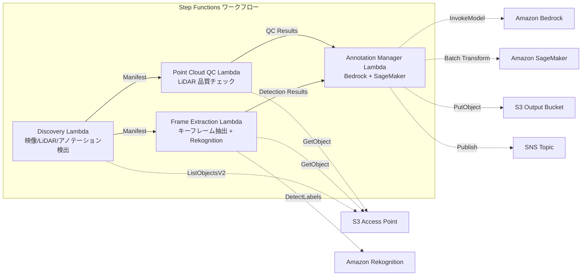

# UC9: 自動駕駛 / ADAS — 影像・LiDAR 前處理・品質檢查・註解

🌐 **Language / 言語**: [日本語](README.md) | [English](README.en.md) | [한국어](README.ko.md) | [简体中文](README.zh-CN.md) | 繁體中文 | [Français](README.fr.md) | [Deutsch](README.de.md) | [Español](README.es.md)

## 概述
利用 Amazon FSx for NetApp ONTAP 的 S3 Access Points，自動化一個無伺服器工作流程，用於行車記錄儀影像和 LiDAR 點雲數據的預處理、質量檢查和註釋管理。
### 此種模式適用的情況
- 行車攝像機影像和 LiDAR 點雲數據大量儲存在 FSx ONTAP 上
- 希望自動化影像中的關鍵幀提取和物體檢測（車輛、行人、交通標誌）
- 希望定期進行 LiDAR 點雲的質量檢查（點密度、坐標一致性）
- 希望以 COCO 兼容格式管理註釋元數據
- 希望加入 SageMaker Batch Transform 的點雲分割推論
### 不適合的情況
- 需要實時自動駕駛推理管道
- 大規模影像轉碼（MediaConvert / EC2 適合）
- 完整的 LiDAR SLAM 處理（HPC 叢集適合）
- 無法確保到 ONTAP REST API 的網路到達性環境
### 主要功能
- 透過 S3 AP 自動檢測影像（.mp4,.avi,.mkv）、LiDAR（.pcd,.las,.laz,.ply）、註解（.json）
- 使用 Rekognition DetectLabels 進行物體檢測（車輛、行人、交通標誌、車道標記）
- LiDAR 點雲品質檢查（point_count, coordinate_bounds, point_density, NaN 檢測）
- 使用 Bedrock 生成註解建議
- 使用 SageMaker Batch Transform 進行點雲分割推斷
- 輸出 COCO 兼容 JSON 格式的註解
## 架構



### 工作流程步驟
1. **探索**：從 S3 AP 探索影像、LiDAR 和註釋檔案
2. **影像框架提取**：從影像中提取關鍵影像框並使用 Rekognition 進行物體檢測
3. **點雲質量控制**：提取 LiDAR 點雲的標頭元數據並進行質量驗證
4. **註釋管理器**：在 Bedrock 中生成註釋建議，在 SageMaker 中進行點雲分割
## 前提條件
- AWS 帳戶和適當的 IAM 權限
- FSx for NetApp ONTAP 文件系統（ONTAP 9.17.1P4D3 以上）
- 已啟用 S3 存取點的卷（用於儲存影像和 LiDAR 數據）
- VPC、私有子網
- Amazon Bedrock 模型存取已啟用（Claude / Nova）
- SageMaker 端點（點雲分割模型）— 可選
## 部署步驟

### 1. CloudFormation 部署

```bash
aws cloudformation deploy \
  --template-file autonomous-driving/template.yaml \
  --stack-name fsxn-autonomous-driving \
  --parameter-overrides \
    S3AccessPointAlias=<your-volume-ext-s3alias> \
    S3AccessPointName=<your-s3ap-name> \
    VpcId=<your-vpc-id> \
    PrivateSubnetIds=<subnet-1>,<subnet-2> \
    ScheduleExpression="rate(1 hour)" \
    NotificationEmail=<your-email@example.com> \
    EnableVpcEndpoints=false \
    EnableCloudWatchAlarms=false \
  --capabilities CAPABILITY_IAM CAPABILITY_AUTO_EXPAND \
  --region ap-northeast-1
```

## 設定參數列表

| パラメータ | 説明 | デフォルト | 必須 |
|-----------|------|----------|------|
| `S3AccessPointAlias` | FSx ONTAP S3 AP Alias（入力用） | — | ✅ |
| `S3AccessPointName` | S3 AP 名（ARN ベースの IAM 権限付与用。省略時は Alias ベースのみ） | `""` | ⚠️ 推奨 |
| `ScheduleExpression` | EventBridge Scheduler のスケジュール式 | `rate(1 hour)` | |
| `VpcId` | VPC ID | — | ✅ |
| `PrivateSubnetIds` | プライベートサブネット ID リスト | — | ✅ |
| `NotificationEmail` | SNS 通知先メールアドレス | — | ✅ |
| `FrameExtractionInterval` | キーフレーム抽出間隔（秒） | `5` | |
| `MapConcurrency` | Map ステートの並列実行数 | `5` | |
| `LambdaMemorySize` | Lambda メモリサイズ (MB) | `2048` | |
| `LambdaTimeout` | Lambda タイムアウト (秒) | `600` | |
| `EnableVpcEndpoints` | Interface VPC Endpoints の有効化 | `false` | |
| `EnableCloudWatchAlarms` | CloudWatch Alarms の有効化 | `false` | |
| `EnableSnapStart` | 啟用 Lambda SnapStart（冷啟動縮短） | `false` | |

## 清理

```bash
aws s3 rm s3://fsxn-autonomous-driving-output-${AWS_ACCOUNT_ID} --recursive

aws cloudformation delete-stack \
  --stack-name fsxn-autonomous-driving \
  --region ap-northeast-1

aws cloudformation wait stack-delete-complete \
  --stack-name fsxn-autonomous-driving \
  --region ap-northeast-1
```

## 參考連結
- [FSx ONTAP S3 存取點概覽](https://docs.aws.amazon.com/fsx/latest/ONTAPGuide/accessing-data-via-s3-access-points.html)
- [Amazon Rekognition 標籤檢測](https://docs.aws.amazon.com/rekognition/latest/dg/labels.html)
- [Amazon SageMaker 批次轉換](https://docs.aws.amazon.com/sagemaker/latest/dg/batch-transform.html)
- [COCO 資料格式](https://cocodataset.org/#format-data)
- [LAS 檔案格式規範](https://www.asprs.org/divisions-committees/lidar-division/laser-las-file-format-exchange-activities)
## SageMaker Batch Transform 統合（第 3 階段）
第 3 階段中，**SageMaker Batch Transform 進行 LiDAR 點群分割推論** 可選擇使用。使用 Step Functions 的 Callback Pattern（`.waitForTaskToken`），以非同步方式等待批次推論作業完成。
### 啟用

```bash
aws cloudformation deploy \
  --template-file autonomous-driving/template.yaml \
  --stack-name fsxn-autonomous-driving \
  --parameter-overrides \
    EnableSageMakerTransform=true \
    MockMode=true \
    ... # 他のパラメータ
  --capabilities CAPABILITY_IAM CAPABILITY_AUTO_EXPAND
```

### 工作流程

```
Discovery → Frame Extraction → Point Cloud QC
  → [EnableSageMakerTransform=true] SageMaker Invoke (.waitForTaskToken)
  → SageMaker Batch Transform Job
  → EventBridge (job state change) → SageMaker Callback (SendTaskSuccess/Failure)
  → Annotation Manager (Rekognition + SageMaker 結果統合)
```

### 模擬模式
在測試環境中，使用 `MockMode=true`（預設值）可以在不進行實際 SageMaker 模型部署的情況下驗證 Callback Pattern 的資料流程。

- **MockMode=true**：不呼叫 SageMaker API，生成模擬分段輸出（隨機標籤數與輸入的 point_count 相同），並直接呼叫 SendTaskSuccess
- **MockMode=false**：執行實際的 SageMaker CreateTransformJob。需要事先部署模型
### 設定參數（第3階段新增）

| パラメータ | 説明 | デフォルト |
|-----------|------|----------|
| `EnableSageMakerTransform` | SageMaker Batch Transform の有効化 | `false` |
| `MockMode` | モックモード（テスト用） | `true` |
| `SageMakerModelName` | SageMaker モデル名 | — |
| `SageMakerInstanceType` | Batch Transform インスタンスタイプ | `ml.m5.xlarge` |

## 支援的地區
UC9 使用以下服務：
| サービス | リージョン制約 |
|---------|-------------|
| Amazon Rekognition | ほぼ全リージョンで利用可能 |
| Amazon Bedrock | 対応リージョンを確認（[Bedrock 対応リージョン](https://docs.aws.amazon.com/general/latest/gr/bedrock.html)） |
| SageMaker Batch Transform | ほぼ全リージョンで利用可能（インスタンスタイプの可用性はリージョンにより異なる） |
| AWS X-Ray | ほぼ全リージョンで利用可能 |
| CloudWatch EMF | ほぼ全リージョンで利用可能 |
> 當啟用 SageMaker Batch Transform 時，請在部署前於 [AWS Regional Services List](https://aws.amazon.com/about-aws/global-infrastructure/regional-product-services/) 確認目標區域的執行個體類型可用性。詳細信息請參閱 [區域相容性矩陣](../docs/region-compatibility.md)。