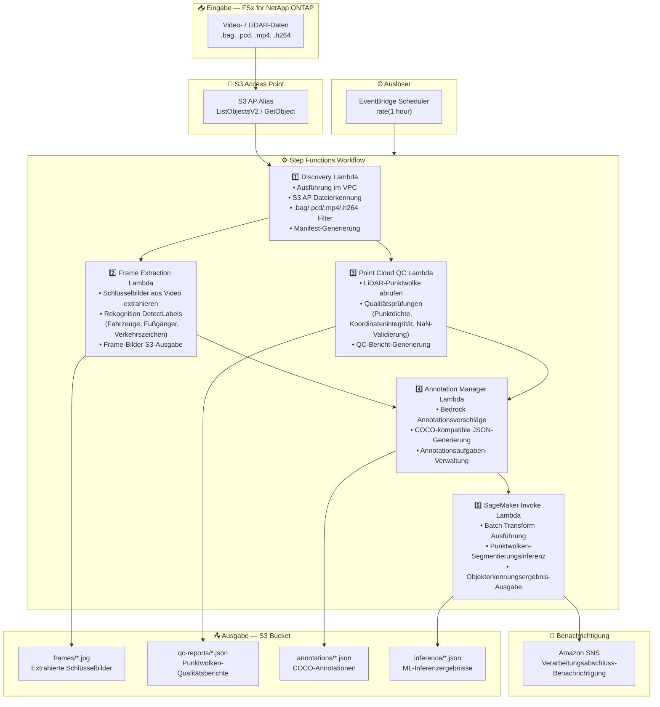

# UC9: Autonomes Fahren / ADAS — Video- und LiDAR-Vorverarbeitung, Qualitätsprüfung und Annotation

🌐 **Language / 言語**: [日本語](architecture.md) | [English](architecture.en.md) | [한국어](architecture.ko.md) | [简体中文](architecture.zh-CN.md) | [繁體中文](architecture.zh-TW.md) | [Français](architecture.fr.md) | Deutsch | [Español](architecture.es.md)

## End-to-End-Architektur (Eingabe → Ausgabe)

---

## Architekturdiagramm



---

## Datenfluss im Detail

### Eingabe
| Element | Beschreibung |
|---------|--------------|
| **Quelle** | FSx for NetApp ONTAP Volume |
| **Dateitypen** | .bag, .pcd, .mp4, .h264 (ROS bag, LiDAR-Punktwolke, Dashcam-Video) |
| **Zugriffsmethode** | S3 Access Point (ListObjectsV2 + GetObject) |
| **Lesestrategie** | Vollständiger Dateiabruf (erforderlich für Frame-Extraktion und Punktwolkenanalyse) |

### Verarbeitung
| Schritt | Service | Funktion |
|---------|---------|----------|
| Discovery | Lambda (VPC) | Video-/LiDAR-Daten über S3 AP erkennen, Manifest generieren |
| Frame Extraction | Lambda + Rekognition | Schlüsselbilder aus Video extrahieren, Objekterkennung |
| Point Cloud QC | Lambda | LiDAR-Punktwolken-Qualitätsprüfungen (Punktdichte, Koordinatenintegrität, NaN-Validierung) |
| Annotation Manager | Lambda + Bedrock | Annotationsvorschläge generieren, COCO JSON-Ausgabe |
| SageMaker Invoke | Lambda + SageMaker | Batch Transform für Punktwolken-Segmentierungsinferenz |

### Ausgabe
| Artefakt | Format | Beschreibung |
|----------|--------|--------------|
| Schlüsselbilder | `frames/YYYY/MM/DD/{stem}_frame_{n}.jpg` | Extrahierte Schlüsselbilder |
| QC-Bericht | `qc-reports/YYYY/MM/DD/{stem}_qc.json` | Punktwolken-Qualitätsprüfungsergebnisse |
| Annotationen | `annotations/YYYY/MM/DD/{stem}_coco.json` | COCO-kompatible Annotationen |
| Inferenz | `inference/YYYY/MM/DD/{stem}_segmentation.json` | ML-Inferenzergebnisse |
| SNS-Benachrichtigung | E-Mail | Verarbeitungsabschluss-Benachrichtigung (Anzahl und Qualitätswerte) |

---

## Wichtige Designentscheidungen

1. **S3 AP statt NFS** — Kein NFS-Mount von Lambda erforderlich; große Daten werden über die S3-API abgerufen
2. **Parallele Verarbeitung** — Frame Extraction und Point Cloud QC laufen parallel zur Reduzierung der Verarbeitungszeit
3. **Rekognition + SageMaker zweistufig** — Rekognition für sofortige Objekterkennung, SageMaker für hochpräzise Segmentierung
4. **COCO-kompatibles Format** — Branchenstandard-Annotationsformat gewährleistet Kompatibilität mit nachgelagerten ML-Pipelines
5. **Qualitäts-Gate** — Point Cloud QC filtert Daten, die Qualitätsstandards nicht erfüllen, frühzeitig in der Pipeline
6. **Polling (nicht ereignisgesteuert)** — S3 AP unterstützt keine Ereignisbenachrichtigungen, daher wird eine periodische geplante Ausführung verwendet

---

## Verwendete AWS-Services

| Service | Rolle |
|---------|-------|
| FSx for NetApp ONTAP | Speicherung autonomer Fahrdaten (Video/LiDAR) |
| S3 Access Points | Serverloser Zugriff auf ONTAP-Volumes |
| EventBridge Scheduler | Periodischer Auslöser |
| Step Functions | Workflow-Orchestrierung |
| Lambda (Python 3.13) | Compute (Discovery, Frame Extraction, Point Cloud QC, Annotation Manager, SageMaker Invoke) |
| Lambda SnapStart | Kaltstart-Reduzierung (Opt-in, Phase 6A) |
| Amazon Rekognition | Objekterkennung (Fahrzeuge, Fußgänger, Verkehrszeichen) |
| Amazon SageMaker | Inferenz (4-Wege-Routing: Batch / Serverless / Provisioned / Components) |
| SageMaker Inference Components | Echtes Scale-to-Zero (MinInstanceCount=0, Phase 6B) |
| Amazon Bedrock | Generierung von Annotationsvorschlägen |
| SNS | Verarbeitungsabschluss-Benachrichtigung |
| Secrets Manager | ONTAP REST API Anmeldedatenverwaltung |
| CloudWatch + X-Ray | Observability |
| CloudFormation Guard Hooks | Richtliniendurchsetzung bei Bereitstellung (Phase 6B) |

---

## Inferenz-Routing (Phase 4/5/6B)

UC9 unterstützt 4-Wege-Inferenz-Routing. Auswahl über den Parameter `InferenceType`:

| Pfad | Bedingung | Latenz | Leerlaufkosten |
|------|-----------|--------|----------------|
| Batch Transform | `InferenceType=none` or `file_count >= threshold` | Minuten–Stunden | $0 |
| Serverless Inference | `InferenceType=serverless` | 6–45s (cold) | $0 |
| Provisioned Endpoint | `InferenceType=provisioned` | Millisekunden | ~$140/Monat |
| **Inference Components** | `InferenceType=components` | 2–5 Min (scale-from-zero) | **$0** |

### Inference Components (Phase 6B)

Inference Components erreichen echtes Scale-to-Zero mit `MinInstanceCount=0`:

```
SageMaker Endpoint (existiert immer, Leerlaufkosten $0)
  └── Inference Component (MinInstanceCount=0)
       ├── [Leerlauf] → 0 Instanzen → $0/Stunde
       ├── [Anfrage eingehend] → Auto Scaling → Instanz startet (2–5 Min)
       └── [Leerlauf-Timeout] → Scale-in → 0 Instanzen
```

Aktivierung: `EnableInferenceComponents=true` + `InferenceType=components`

---

## Lambda SnapStart (Phase 6A)

Alle Lambda-Funktionen unterstützen Opt-in SnapStart:

- **Aktivierung**: Stack-Update mit `EnableSnapStart=true` + `scripts/enable-snapstart.sh` für Versionsveröffentlichung
- **Effekt**: Kaltstart 1–3s → 100–500ms
- **Einschränkung**: Gilt nur für Published Versions (nicht für $LATEST)

Details: [SnapStart-Leitfaden](../../docs/snapstart-guide.md)
