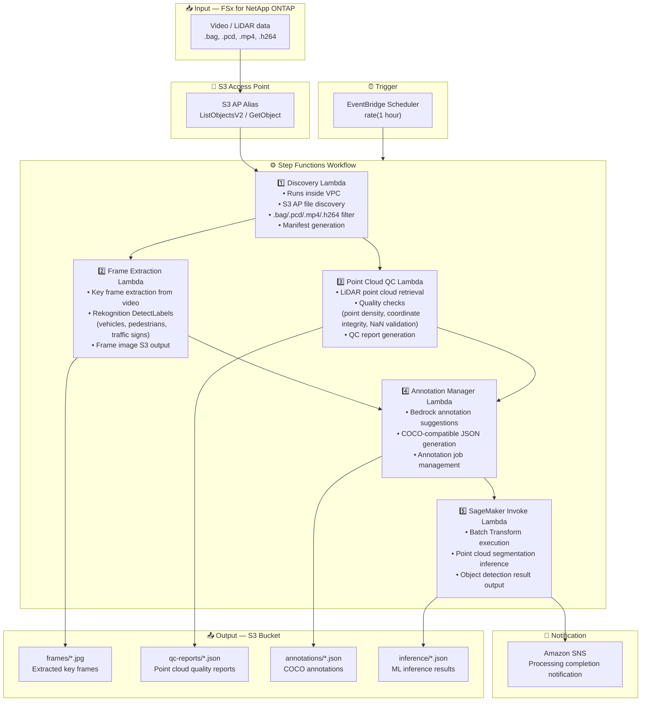

# UC9: Autonomous Driving / ADAS — Video & LiDAR Preprocessing, Quality Check & Annotation

🌐 **Language / 言語**: [日本語](architecture.md) | English | [한국어](architecture.ko.md) | [简体中文](architecture.zh-CN.md) | [繁體中文](architecture.zh-TW.md) | [Français](architecture.fr.md) | [Deutsch](architecture.de.md) | [Español](architecture.es.md)

## End-to-End Architecture (Input → Output)

---

## Architecture Diagram



---

## Data Flow Detail

### Input
| Item | Description |
|------|-------------|
| **Source** | FSx for NetApp ONTAP volume |
| **File Types** | .bag, .pcd, .mp4, .h264 (ROS bag, LiDAR point cloud, dashcam video) |
| **Access Method** | S3 Access Point (ListObjectsV2 + GetObject) |
| **Read Strategy** | Full file retrieval (required for frame extraction & point cloud analysis) |

### Processing
| Step | Service | Function |
|------|---------|----------|
| Discovery | Lambda (VPC) | Discover video/LiDAR data via S3 AP, generate manifest |
| Frame Extraction | Lambda + Rekognition | Extract key frames from video, object detection |
| Point Cloud QC | Lambda | LiDAR point cloud quality checks (point density, coordinate integrity, NaN validation) |
| Annotation Manager | Lambda + Bedrock | Generate annotation suggestions, COCO JSON output |
| SageMaker Invoke | Lambda + SageMaker | Batch Transform for point cloud segmentation inference |

### Output
| Artifact | Format | Description |
|----------|--------|-------------|
| Key Frames | `frames/YYYY/MM/DD/{stem}_frame_{n}.jpg` | Extracted key frame images |
| QC Report | `qc-reports/YYYY/MM/DD/{stem}_qc.json` | Point cloud quality check results |
| Annotations | `annotations/YYYY/MM/DD/{stem}_coco.json` | COCO-compatible annotations |
| Inference | `inference/YYYY/MM/DD/{stem}_segmentation.json` | ML inference results |
| SNS Notification | Email | Processing completion notification (count & quality scores) |

---

## Key Design Decisions

1. **S3 AP over NFS** — No NFS mount needed from Lambda; large data retrieved via S3 API
2. **Parallel processing** — Frame Extraction and Point Cloud QC run in parallel to reduce processing time
3. **Rekognition + SageMaker two-stage** — Rekognition for immediate object detection, SageMaker for high-accuracy segmentation
4. **COCO-compatible format** — Industry-standard annotation format ensures compatibility with downstream ML pipelines
5. **Quality gate** — Point Cloud QC filters out data not meeting quality standards early in the pipeline
6. **Polling (not event-driven)** — S3 AP does not support event notifications, so periodic scheduled execution is used

---

## AWS Services Used

| Service | Role |
|---------|------|
| FSx for NetApp ONTAP | Autonomous driving data storage (video/LiDAR) |
| S3 Access Points | Serverless access to ONTAP volumes |
| EventBridge Scheduler | Periodic trigger |
| Step Functions | Workflow orchestration |
| Lambda (Python 3.13) | Compute (Discovery, Frame Extraction, Point Cloud QC, Annotation Manager, SageMaker Invoke) |
| Lambda SnapStart | Cold start reduction (opt-in, Phase 6A) |
| Amazon Rekognition | Object detection (vehicles, pedestrians, traffic signs) |
| Amazon SageMaker | Inference (4-way routing: Batch / Serverless / Provisioned / Components) |
| SageMaker Inference Components | True scale-to-zero (MinInstanceCount=0, Phase 6B) |
| Amazon Bedrock | Annotation suggestion generation |
| SNS | Processing completion notification |
| Secrets Manager | ONTAP REST API credential management |
| CloudWatch + X-Ray | Observability |
| CloudFormation Guard Hooks | Deploy-time policy enforcement (Phase 6B) |

---

## Inference Routing (Phase 4/5/6B)

UC9 supports 4-way inference routing. Select via `InferenceType` parameter:

| Path | Condition | Latency | Idle Cost |
|------|-----------|---------|-----------|
| Batch Transform | `InferenceType=none` or `file_count >= threshold` | Minutes–hours | $0 |
| Serverless Inference | `InferenceType=serverless` | 6–45s (cold) | $0 |
| Provisioned Endpoint | `InferenceType=provisioned` | Milliseconds | ~$140/mo |
| **Inference Components** | `InferenceType=components` | 2–5 min (scale-from-zero) | **$0** |

### Inference Components (Phase 6B)

Inference Components achieve true scale-to-zero with `MinInstanceCount=0`:

```
SageMaker Endpoint (always exists, $0 idle cost)
  └── Inference Component (MinInstanceCount=0)
       ├── [Idle] → 0 instances → $0/hour
       ├── [Request arrives] → Auto Scaling → Instance launches (2–5 min)
       └── [Idle timeout] → Scale-in → 0 instances
```

Enable: `EnableInferenceComponents=true` + `InferenceType=components`

---

## Lambda SnapStart (Phase 6A)

All Lambda functions support opt-in SnapStart:

- **Enable**: Stack update with `EnableSnapStart=true` + `scripts/enable-snapstart.sh` for version publishing
- **Effect**: Cold start 1–3s → 100–500ms
- **Limitation**: Applies to Published Versions only (not $LATEST)

Details: [SnapStart Guide](../../docs/snapstart-guide.md)
