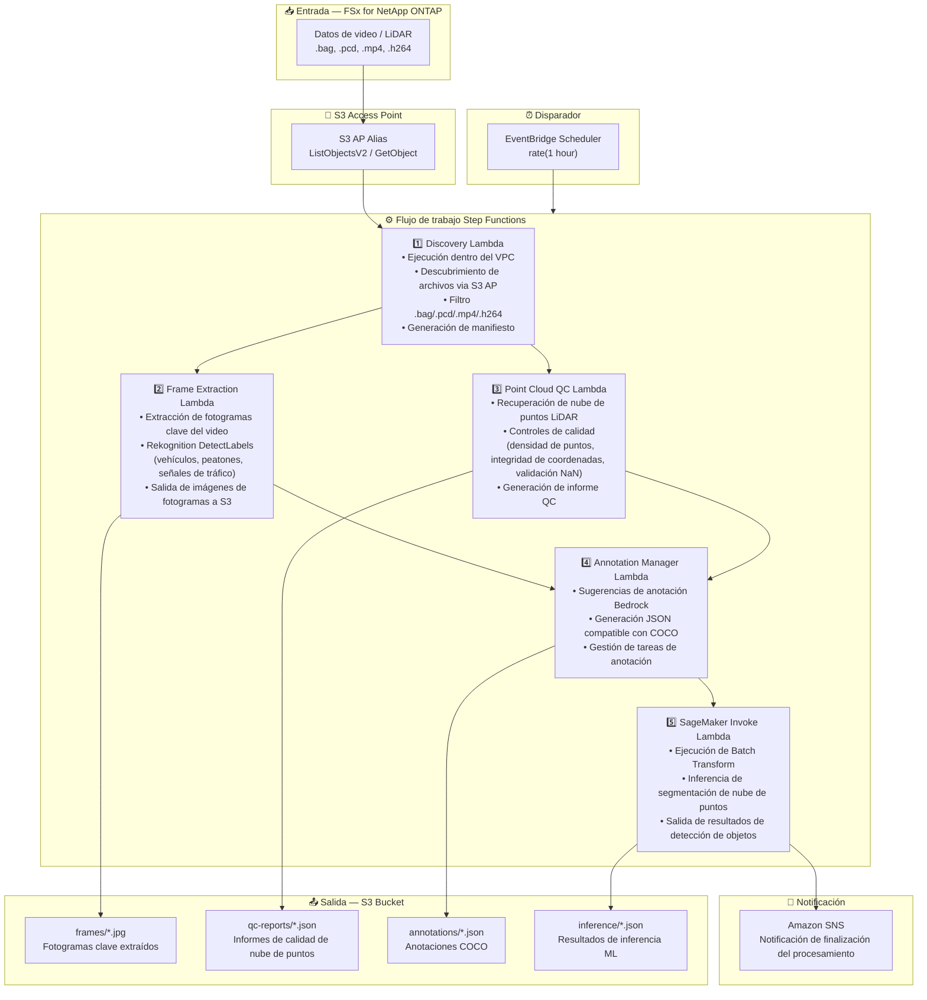

# UC9: Conducción autónoma / ADAS — Preprocesamiento de video y LiDAR, control de calidad y anotación

🌐 **Language / 言語**: [日本語](architecture.md) | [English](architecture.en.md) | [한국어](architecture.ko.md) | [简体中文](architecture.zh-CN.md) | [繁體中文](architecture.zh-TW.md) | [Français](architecture.fr.md) | [Deutsch](architecture.de.md) | Español

## Arquitectura de extremo a extremo (Entrada → Salida)

---

## Diagrama de arquitectura



---

## Detalle del flujo de datos

### Entrada
| Elemento | Descripción |
|----------|-------------|
| **Origen** | Volumen FSx for NetApp ONTAP |
| **Tipos de archivo** | .bag, .pcd, .mp4, .h264 (ROS bag, nube de puntos LiDAR, video dashcam) |
| **Método de acceso** | S3 Access Point (ListObjectsV2 + GetObject) |
| **Estrategia de lectura** | Recuperación completa del archivo (necesaria para extracción de fotogramas y análisis de nube de puntos) |

### Procesamiento
| Paso | Servicio | Función |
|------|----------|---------|
| Discovery | Lambda (VPC) | Descubrir datos de video/LiDAR via S3 AP, generar manifiesto |
| Frame Extraction | Lambda + Rekognition | Extraer fotogramas clave del video, detección de objetos |
| Point Cloud QC | Lambda | Controles de calidad de nube de puntos LiDAR (densidad de puntos, integridad de coordenadas, validación NaN) |
| Annotation Manager | Lambda + Bedrock | Generar sugerencias de anotación, salida JSON COCO |
| SageMaker Invoke | Lambda + SageMaker | Batch Transform para inferencia de segmentación de nube de puntos |

### Salida
| Artefacto | Formato | Descripción |
|-----------|---------|-------------|
| Fotogramas clave | `frames/YYYY/MM/DD/{stem}_frame_{n}.jpg` | Imágenes de fotogramas clave extraídos |
| Informe QC | `qc-reports/YYYY/MM/DD/{stem}_qc.json` | Resultados del control de calidad de nube de puntos |
| Anotaciones | `annotations/YYYY/MM/DD/{stem}_coco.json` | Anotaciones compatibles con COCO |
| Inferencia | `inference/YYYY/MM/DD/{stem}_segmentation.json` | Resultados de inferencia ML |
| Notificación SNS | Correo electrónico | Notificación de finalización del procesamiento (cantidad y puntuaciones de calidad) |

---

## Decisiones de diseño clave

1. **S3 AP en lugar de NFS** — No se necesita montaje NFS desde Lambda; datos grandes recuperados via API S3
2. **Procesamiento paralelo** — Frame Extraction y Point Cloud QC se ejecutan en paralelo para reducir el tiempo de procesamiento
3. **Rekognition + SageMaker en dos etapas** — Rekognition para detección de objetos inmediata, SageMaker para segmentación de alta precisión
4. **Formato compatible con COCO** — Formato de anotación estándar de la industria que garantiza compatibilidad con pipelines ML posteriores
5. **Puerta de calidad** — Point Cloud QC filtra datos que no cumplen los estándares de calidad al inicio del pipeline
6. **Sondeo (no basado en eventos)** — S3 AP no admite notificaciones de eventos, por lo que se utiliza ejecución programada periódica

---

## Servicios AWS utilizados

| Servicio | Rol |
|----------|-----|
| FSx for NetApp ONTAP | Almacenamiento de datos de conducción autónoma (video/LiDAR) |
| S3 Access Points | Acceso serverless a volúmenes ONTAP |
| EventBridge Scheduler | Disparador periódico |
| Step Functions | Orquestación del flujo de trabajo |
| Lambda (Python 3.13) | Cómputo (Discovery, Frame Extraction, Point Cloud QC, Annotation Manager, SageMaker Invoke) |
| Lambda SnapStart | Reducción de arranque en frío (opt-in, Phase 6A) |
| Amazon Rekognition | Detección de objetos (vehículos, peatones, señales de tráfico) |
| Amazon SageMaker | Inferencia (enrutamiento de 4 vías: Batch / Serverless / Provisioned / Components) |
| SageMaker Inference Components | Verdadero scale-to-zero (MinInstanceCount=0, Phase 6B) |
| Amazon Bedrock | Generación de sugerencias de anotación |
| SNS | Notificación de finalización del procesamiento |
| Secrets Manager | Gestión de credenciales de la API REST de ONTAP |
| CloudWatch + X-Ray | Observabilidad |
| CloudFormation Guard Hooks | Aplicación de políticas en despliegue (Phase 6B) |

---

## Enrutamiento de inferencia (Phase 4/5/6B)

UC9 soporta enrutamiento de inferencia de 4 vías. Selección mediante el parámetro `InferenceType`:

| Ruta | Condición | Latencia | Costo en reposo |
|------|-----------|----------|-----------------|
| Batch Transform | `InferenceType=none` or `file_count >= threshold` | Minutos–horas | $0 |
| Serverless Inference | `InferenceType=serverless` | 6–45s (cold) | $0 |
| Provisioned Endpoint | `InferenceType=provisioned` | Milisegundos | ~$140/mes |
| **Inference Components** | `InferenceType=components` | 2–5 min (scale-from-zero) | **$0** |

### Inference Components (Phase 6B)

Inference Components logran verdadero scale-to-zero con `MinInstanceCount=0`:

```
SageMaker Endpoint (siempre existe, costo en reposo $0)
  └── Inference Component (MinInstanceCount=0)
       ├── [Reposo] → 0 instancias → $0/hora
       ├── [Solicitud llega] → Auto Scaling → Instancia se inicia (2–5 min)
       └── [Tiempo de espera agotado] → Scale-in → 0 instancias
```

Activar: `EnableInferenceComponents=true` + `InferenceType=components`

---

## Lambda SnapStart (Phase 6A)

Todas las funciones Lambda soportan SnapStart opt-in:

- **Activar**: Actualización de stack con `EnableSnapStart=true` + `scripts/enable-snapstart.sh` para publicación de versión
- **Efecto**: Arranque en frío 1–3s → 100–500ms
- **Limitación**: Se aplica solo a Published Versions (no a $LATEST)

Detalles: [Guía SnapStart](../../docs/snapstart-guide.md)
