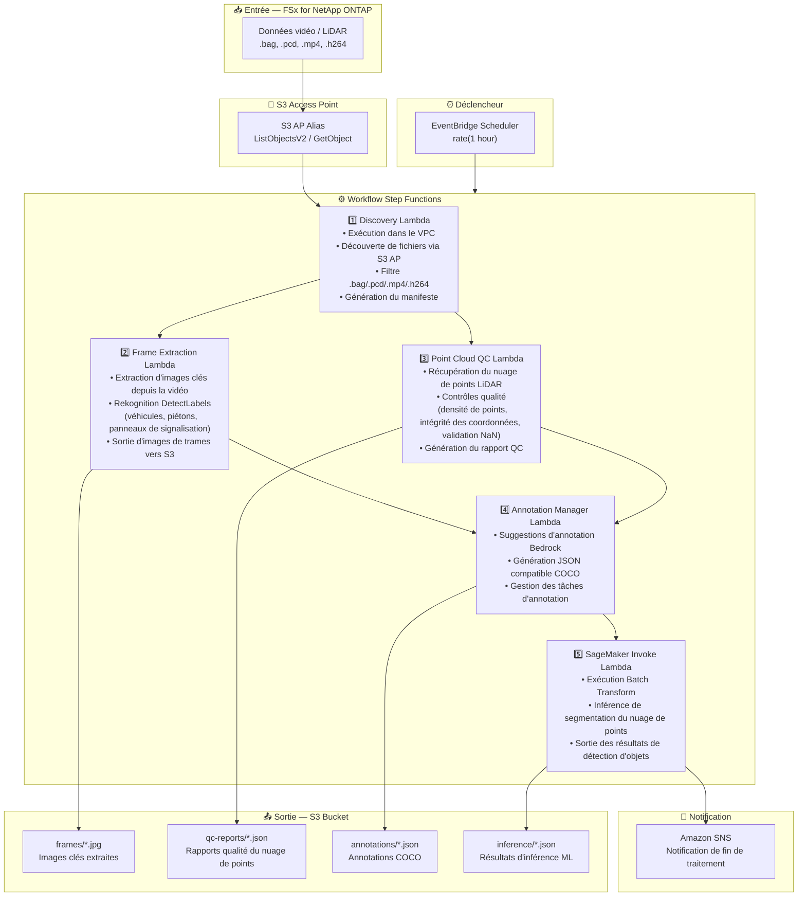

# UC9: Conduite autonome / ADAS — Prétraitement vidéo et LiDAR, contrôle qualité et annotation

🌐 **Language / 言語**: [日本語](architecture.md) | [English](architecture.en.md) | [한국어](architecture.ko.md) | [简体中文](architecture.zh-CN.md) | [繁體中文](architecture.zh-TW.md) | Français | [Deutsch](architecture.de.md) | [Español](architecture.es.md)

## Architecture de bout en bout (Entrée → Sortie)

---

## Flux de haut niveau

```
┌─────────────────────────────────────────────────────────────────────────────┐
│                         FSx for NetApp ONTAP                                 │
│                                                                              │
│  /vol/driving_data/                                                          │
│  ├── rosbag/drive_20240315_001.bag       (ROS bag video+LiDAR)               │
│  ├── lidar/scan_20240315_001.pcd         (LiDAR point cloud)                 │
│  ├── camera/front_20240315_001.mp4       (Dashcam video)                     │
│  └── camera/rear_20240315_001.h264       (Rear camera video)                 │
│                                                                              │
└──────────────────────────────────┬───────────────────────────────────────────┘
                                   │
                                   ▼
┌──────────────────────────────────────────────────────────────────────────────┐
│                      S3 Access Point (Data Path)                              │
│                                                                              │
│  Alias: fsxn-driving-vol-ext-s3alias                                         │
│  • ListObjectsV2 (video/LiDAR data discovery)                                │
│  • GetObject (BAG/PCD/MP4/H264 retrieval)                                    │
│  • No NFS/SMB mount required from Lambda                                     │
│                                                                              │
└──────────────────────────────────┬───────────────────────────────────────────┘
                                   │
                                   ▼
┌──────────────────────────────────────────────────────────────────────────────┐
│                    EventBridge Scheduler (Trigger)                            │
│                                                                              │
│  Schedule: rate(1 hour) — configurable                                       │
│  Target: Step Functions State Machine                                        │
│                                                                              │
└──────────────────────────────────┬───────────────────────────────────────────┘
                                   │
                                   ▼
┌──────────────────────────────────────────────────────────────────────────────┐
│                    AWS Step Functions (Orchestration)                         │
│                                                                              │
│  ┌───────────┐  ┌──────────────┐  ┌──────────────┐  ┌──────────────────┐   │
│  │ Discovery  │─▶│Frame Extract │─▶│Point Cloud QC│─▶│Annotation Manager│   │
│  │ Lambda     │  │ Lambda       │  │ Lambda       │  │ Lambda           │   │
│  │           │  │             │  │             │  │                 │   │
│  │ • VPC内    │  │ • Key frame │  │ • Point     │  │ • Bedrock       │   │
│  │ • S3 AP   │  │   extraction│  │   density   │  │   suggestions   │   │
│  │ • BAG/PCD │  │ • Rekognition│  │ • Coordinate│  │ • SageMaker     │   │
│  │   /MP4    │  │   detection │  │   integrity │  │   inference     │   │
│  └───────────┘  └──────────────┘  │ • NaN check │  │ • COCO JSON     │   │
│                                    └──────────────┘  └──────────────────┘   │
│                                                          │                   │
│                                                          ▼                   │
│                                                 ┌────────────────┐          │
│                                                 │SageMaker Invoke │          │
│                                                 │ Lambda          │          │
│                                                 │                │          │
│                                                 │ • Batch Transform│         │
│                                                 │ • Point cloud   │          │
│                                                 │   segmentation  │          │
│                                                 └────────────────┘          │
│                                                                              │
└──────────────────────────────────────────────────────────────────────────────┘
                                   │
                                   ▼
┌──────────────────────────────────────────────────────────────────────────────┐
│                         Output (S3 Bucket)                                    │
│                                                                              │
│  s3://{stack}-output-{account}/                                              │
│  ├── frames/YYYY/MM/DD/                                                      │
│  │   └── drive_001_frame_0001.jpg    ← Extracted key frames                 │
│  ├── qc-reports/YYYY/MM/DD/                                                  │
│  │   └── scan_001_qc.json           ← Point cloud quality report            │
│  ├── annotations/YYYY/MM/DD/                                                 │
│  │   └── drive_001_coco.json        ← COCO format annotations              │
│  └── inference/YYYY/MM/DD/                                                   │
│      └── scan_001_segmentation.json  ← Segmentation results                │
│                                                                              │
└──────────────────────────────────────────────────────────────────────────────┘
```

---

## Diagramme Mermaid



---

## Détail du flux de données

### Entrée
| Élément | Description |
|---------|-------------|
| **Source** | Volume FSx for NetApp ONTAP |
| **Types de fichiers** | .bag, .pcd, .mp4, .h264 (ROS bag, nuage de points LiDAR, vidéo dashcam) |
| **Méthode d'accès** | S3 Access Point (ListObjectsV2 + GetObject) |
| **Stratégie de lecture** | Récupération complète du fichier (nécessaire pour l'extraction de trames et l'analyse du nuage de points) |

### Traitement
| Étape | Service | Fonction |
|-------|---------|----------|
| Discovery | Lambda (VPC) | Découverte des données vidéo/LiDAR via S3 AP, génération du manifeste |
| Frame Extraction | Lambda + Rekognition | Extraction d'images clés depuis la vidéo, détection d'objets |
| Point Cloud QC | Lambda | Contrôles qualité du nuage de points LiDAR (densité de points, intégrité des coordonnées, validation NaN) |
| Annotation Manager | Lambda + Bedrock | Génération de suggestions d'annotation, sortie JSON COCO |
| SageMaker Invoke | Lambda + SageMaker | Batch Transform pour l'inférence de segmentation du nuage de points |

### Sortie
| Artefact | Format | Description |
|----------|--------|-------------|
| Images clés | `frames/YYYY/MM/DD/{stem}_frame_{n}.jpg` | Images clés extraites |
| Rapport QC | `qc-reports/YYYY/MM/DD/{stem}_qc.json` | Résultats du contrôle qualité du nuage de points |
| Annotations | `annotations/YYYY/MM/DD/{stem}_coco.json` | Annotations compatibles COCO |
| Inférence | `inference/YYYY/MM/DD/{stem}_segmentation.json` | Résultats d'inférence ML |
| Notification SNS | E-mail | Notification de fin de traitement (nombre et scores de qualité) |

---

## Décisions de conception clés

1. **S3 AP plutôt que NFS** — Pas de montage NFS nécessaire depuis Lambda ; données volumineuses récupérées via l'API S3
2. **Traitement parallèle** — Frame Extraction et Point Cloud QC s'exécutent en parallèle pour réduire le temps de traitement
3. **Rekognition + SageMaker en deux étapes** — Rekognition pour la détection d'objets immédiate, SageMaker pour la segmentation haute précision
4. **Format compatible COCO** — Format d'annotation standard de l'industrie garantissant la compatibilité avec les pipelines ML en aval
5. **Porte de qualité** — Point Cloud QC filtre les données ne répondant pas aux normes de qualité en début de pipeline
6. **Interrogation périodique (non événementielle)** — S3 AP ne prend pas en charge les notifications d'événements, une exécution planifiée périodique est donc utilisée

---

## Services AWS utilisés

| Service | Rôle |
|---------|------|
| FSx for NetApp ONTAP | Stockage de données de conduite autonome (vidéo et LiDAR) |
| S3 Access Points | Accès serverless aux volumes ONTAP |
| EventBridge Scheduler | Déclencheur périodique |
| Step Functions | Orchestration du workflow |
| Lambda | Calcul (Discovery, Frame Extraction, Point Cloud QC, Annotation Manager, SageMaker Invoke) |
| Amazon Rekognition | Détection d'objets (véhicules, piétons, panneaux de signalisation) |
| Amazon SageMaker | Batch Transform (inférence de segmentation du nuage de points) |
| Amazon Bedrock | Génération de suggestions d'annotation |
| SNS | Notification de fin de traitement |
| Secrets Manager | Gestion des identifiants de l'API REST ONTAP |
| CloudWatch + X-Ray | Observabilité |
