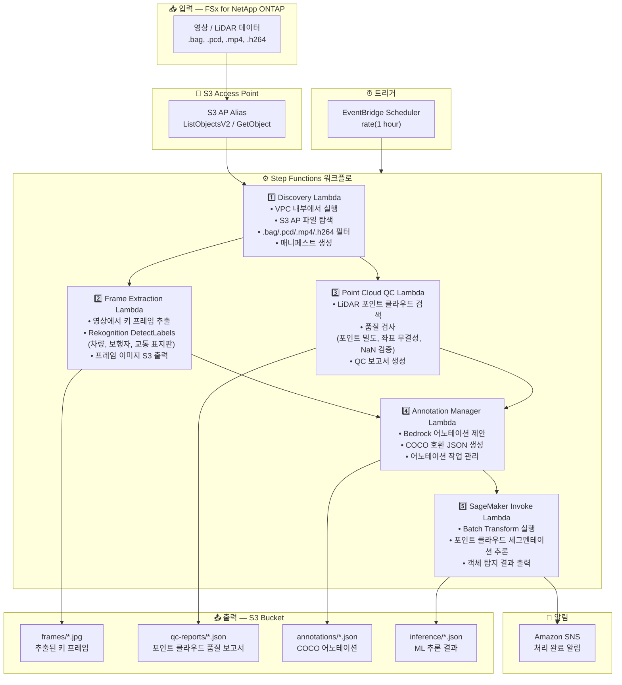

# UC9: 자율주행 / ADAS — 영상 및 LiDAR 전처리, 품질 검사, 어노테이션

🌐 **Language / 言語**: [日本語](architecture.md) | [English](architecture.en.md) | 한국어 | [简体中文](architecture.zh-CN.md) | [繁體中文](architecture.zh-TW.md) | [Français](architecture.fr.md) | [Deutsch](architecture.de.md) | [Español](architecture.es.md)

## 엔드투엔드 아키텍처 (입력 → 출력)

---

## 아키텍처 다이어그램



---

## 데이터 흐름 상세

### 입력
| 항목 | 설명 |
|------|------|
| **소스** | FSx for NetApp ONTAP 볼륨 |
| **파일 유형** | .bag, .pcd, .mp4, .h264 (ROS bag, LiDAR 포인트 클라우드, 대시캠 영상) |
| **접근 방식** | S3 Access Point (ListObjectsV2 + GetObject) |
| **읽기 전략** | 전체 파일 검색 (프레임 추출 및 포인트 클라우드 분석에 필요) |

### 처리
| 단계 | 서비스 | 기능 |
|------|--------|------|
| Discovery | Lambda (VPC) | S3 AP를 통해 영상/LiDAR 데이터 탐색, 매니페스트 생성 |
| Frame Extraction | Lambda + Rekognition | 영상에서 키 프레임 추출, 객체 탐지 |
| Point Cloud QC | Lambda | LiDAR 포인트 클라우드 품질 검사 (포인트 밀도, 좌표 무결성, NaN 검증) |
| Annotation Manager | Lambda + Bedrock | 어노테이션 제안 생성, COCO JSON 출력 |
| SageMaker Invoke | Lambda + SageMaker | 포인트 클라우드 세그멘테이션 추론을 위한 Batch Transform |

### 출력
| 산출물 | 형식 | 설명 |
|--------|------|------|
| 키 프레임 | `frames/YYYY/MM/DD/{stem}_frame_{n}.jpg` | 추출된 키 프레임 이미지 |
| QC 보고서 | `qc-reports/YYYY/MM/DD/{stem}_qc.json` | 포인트 클라우드 품질 검사 결과 |
| 어노테이션 | `annotations/YYYY/MM/DD/{stem}_coco.json` | COCO 호환 어노테이션 |
| 추론 결과 | `inference/YYYY/MM/DD/{stem}_segmentation.json` | ML 추론 결과 |
| SNS 알림 | 이메일 | 처리 완료 알림 (건수 및 품질 점수) |

---

## 주요 설계 결정

1. **NFS 대신 S3 AP** — Lambda에서 NFS 마운트 불필요; 대용량 데이터를 S3 API로 검색
2. **병렬 처리** — Frame Extraction과 Point Cloud QC를 병렬 실행하여 처리 시간 단축
3. **Rekognition + SageMaker 2단계** — Rekognition으로 즉시 객체 탐지, SageMaker로 고정밀 세그멘테이션
4. **COCO 호환 형식** — 업계 표준 어노테이션 형식으로 다운스트림 ML 파이프라인과의 호환성 보장
5. **품질 게이트** — Point Cloud QC가 파이프라인 초기에 품질 기준 미달 데이터를 필터링
6. **폴링 (이벤트 기반 아님)** — S3 AP는 이벤트 알림을 지원하지 않으므로 주기적 스케줄 실행 사용

---

## 사용 AWS 서비스

| 서비스 | 역할 |
|--------|------|
| FSx for NetApp ONTAP | 자율주행 데이터 스토리지 (영상/LiDAR) |
| S3 Access Points | ONTAP 볼륨에 대한 서버리스 접근 |
| EventBridge Scheduler | 주기적 트리거 |
| Step Functions | 워크플로 오케스트레이션 |
| Lambda (Python 3.13) | 컴퓨팅 (Discovery, Frame Extraction, Point Cloud QC, Annotation Manager, SageMaker Invoke) |
| Lambda SnapStart | 콜드 스타트 감소 (옵트인, Phase 6A) |
| Amazon Rekognition | 객체 탐지 (차량, 보행자, 교통 표지판) |
| Amazon SageMaker | 추론 (4-way 라우팅: Batch / Serverless / Provisioned / Components) |
| SageMaker Inference Components | 진정한 scale-to-zero (MinInstanceCount=0, Phase 6B) |
| Amazon Bedrock | 어노테이션 제안 생성 |
| SNS | 처리 완료 알림 |
| Secrets Manager | ONTAP REST API 자격 증명 관리 |
| CloudWatch + X-Ray | 관측 가능성 |
| CloudFormation Guard Hooks | 배포 시 정책 적용 (Phase 6B) |

---

## 추론 라우팅 (Phase 4/5/6B)

UC9는 4-way 추론 라우팅을 지원합니다. `InferenceType` 파라미터로 선택:

| 경로 | 조건 | 지연 시간 | 유휴 비용 |
|------|------|-----------|-----------|
| Batch Transform | `InferenceType=none` or `file_count >= threshold` | 분~시간 | $0 |
| Serverless Inference | `InferenceType=serverless` | 6–45초 (cold) | $0 |
| Provisioned Endpoint | `InferenceType=provisioned` | 밀리초 | ~$140/월 |
| **Inference Components** | `InferenceType=components` | 2–5분 (scale-from-zero) | **$0** |

### Inference Components (Phase 6B)

Inference Components는 `MinInstanceCount=0`으로 진정한 scale-to-zero를 달성합니다:

```
SageMaker Endpoint (항상 존재, 유휴 비용 $0)
  └── Inference Component (MinInstanceCount=0)
       ├── [유휴] → 0 인스턴스 → $0/시간
       ├── [요청 도착] → Auto Scaling → 인스턴스 시작 (2–5분)
       └── [유휴 타임아웃] → Scale-in → 0 인스턴스
```

활성화: `EnableInferenceComponents=true` + `InferenceType=components`

---

## Lambda SnapStart (Phase 6A)

모든 Lambda 함수에서 SnapStart를 옵트인으로 활성화 가능:

- **활성화**: `EnableSnapStart=true`로 스택 업데이트 + `scripts/enable-snapstart.sh`로 버전 게시
- **효과**: 콜드 스타트 1–3초 → 100–500ms
- **제한**: Published Versions에만 적용 ($LATEST에는 적용되지 않음)

상세: [SnapStart 가이드](../../docs/snapstart-guide.md)
