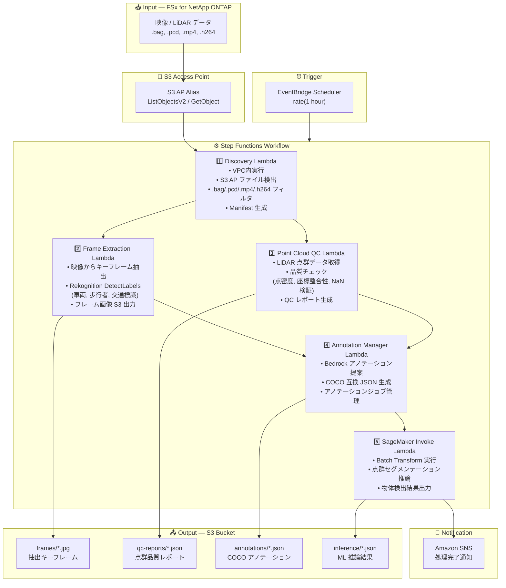

# UC9: 自動運転 / ADAS — 映像・LiDAR 前処理・品質チェック・アノテーション

🌐 **Language / 言語**: 日本語 | [English](architecture.en.md) | [한국어](architecture.ko.md) | [简体中文](architecture.zh-CN.md) | [繁體中文](architecture.zh-TW.md) | [Français](architecture.fr.md) | [Deutsch](architecture.de.md) | [Español](architecture.es.md)

## End-to-End Architecture (Input → Output)

---

## Architecture Diagram



---

## Data Flow Detail

### Input
| Item | Description |
|------|-------------|
| **Source** | FSx for NetApp ONTAP volume |
| **File Types** | .bag, .pcd, .mp4, .h264 (ROS bag, LiDAR 点群, ダッシュカム映像) |
| **Access Method** | S3 Access Point (ListObjectsV2 + GetObject) |
| **Read Strategy** | ファイル全体を取得（フレーム抽出・点群解析に必要） |

### Processing
| Step | Service | Function |
|------|---------|----------|
| Discovery | Lambda (VPC) | S3 AP で映像/LiDAR データ検出、Manifest 生成 |
| Frame Extraction | Lambda + Rekognition | 映像からキーフレーム抽出、物体検出 |
| Point Cloud QC | Lambda | LiDAR 点群の品質チェック（点密度、座標整合性、NaN 検証） |
| Annotation Manager | Lambda + Bedrock | アノテーション提案生成、COCO JSON 出力 |
| SageMaker Invoke | Lambda + SageMaker | Batch Transform による点群セグメンテーション推論 |

### Output
| Artifact | Format | Description |
|----------|--------|-------------|
| Key Frames | `frames/YYYY/MM/DD/{stem}_frame_{n}.jpg` | 抽出キーフレーム画像 |
| QC Report | `qc-reports/YYYY/MM/DD/{stem}_qc.json` | 点群品質チェック結果 |
| Annotations | `annotations/YYYY/MM/DD/{stem}_coco.json` | COCO 互換アノテーション |
| Inference | `inference/YYYY/MM/DD/{stem}_segmentation.json` | ML 推論結果 |
| SNS Notification | Email | 処理完了通知（処理件数・品質スコア） |

---

## Key Design Decisions

1. **S3 AP over NFS** — Lambda から NFS マウント不要、S3 API で大容量データ取得
2. **並列処理** — Frame Extraction と Point Cloud QC を並列実行し、処理時間を短縮
3. **Rekognition + SageMaker 二段構成** — Rekognition で即時物体検出、SageMaker で高精度セグメンテーション
4. **COCO 互換形式** — 業界標準のアノテーション形式で下流 ML パイプラインとの互換性確保
5. **品質ゲート** — Point Cloud QC で品質基準を満たさないデータを早期フィルタリング
6. **ポーリングベース** — S3 AP はイベント通知非対応のため、定期スケジュール実行

---

## AWS Services Used

| Service | Role |
|---------|------|
| FSx for NetApp ONTAP | 自動運転データストレージ（映像・LiDAR 保管） |
| S3 Access Points | ONTAP ボリュームへのサーバーレスアクセス |
| EventBridge Scheduler | 定期トリガー |
| Step Functions | ワークフローオーケストレーション |
| Lambda (Python 3.13) | コンピュート（Discovery, Frame Extraction, Point Cloud QC, Annotation Manager, SageMaker Invoke） |
| Lambda SnapStart | コールドスタート削減（オプトイン、Phase 6A） |
| Amazon Rekognition | 物体検出（車両、歩行者、交通標識） |
| Amazon SageMaker | 推論（4-way ルーティング: Batch / Serverless / Provisioned / Components） |
| SageMaker Inference Components | 真の scale-to-zero（MinInstanceCount=0、Phase 6B） |
| Amazon Bedrock | アノテーション提案生成 |
| SNS | 処理完了通知 |
| Secrets Manager | ONTAP REST API 認証情報管理 |
| CloudWatch + X-Ray | オブザーバビリティ |
| CloudFormation Guard Hooks | デプロイ時ポリシー強制（Phase 6B） |

---

## Inference Routing (Phase 4/5/6B)

UC9 は 4-way 推論ルーティングをサポートします。`InferenceType` パラメータで選択:

| パス | 条件 | レイテンシ | アイドルコスト |
|------|------|-----------|-------------|
| Batch Transform | `InferenceType=none` or `file_count >= threshold` | 分〜時間 | $0 |
| Serverless Inference | `InferenceType=serverless` | 6–45 秒 (cold) | $0 |
| Provisioned Endpoint | `InferenceType=provisioned` | ミリ秒 | ~$140/月 |
| **Inference Components** | `InferenceType=components` | 2–5 分 (scale-from-zero) | **$0** |

### Inference Components (Phase 6B)

Inference Components は `MinInstanceCount=0` で真の scale-to-zero を実現:

```
SageMaker Endpoint (常時存在、アイドル時コスト $0)
  └── Inference Component (MinInstanceCount=0)
       ├── [アイドル] → 0 インスタンス → $0/時間
       ├── [リクエスト到着] → Auto Scaling → インスタンス起動 (2–5 分)
       └── [アイドルタイムアウト] → Scale-in → 0 インスタンス
```

有効化: `EnableInferenceComponents=true` + `InferenceType=components`

---

## Lambda SnapStart (Phase 6A)

全 Lambda 関数で SnapStart をオプトインで有効化可能:

- **有効化**: `EnableSnapStart=true` でスタック更新 + `scripts/enable-snapstart.sh` でバージョン公開
- **効果**: コールドスタート 1–3 秒 → 100–500ms
- **制約**: Published Versions にのみ適用（$LATEST には効かない）

詳細: [SnapStart ガイド](../../docs/snapstart-guide.md)
