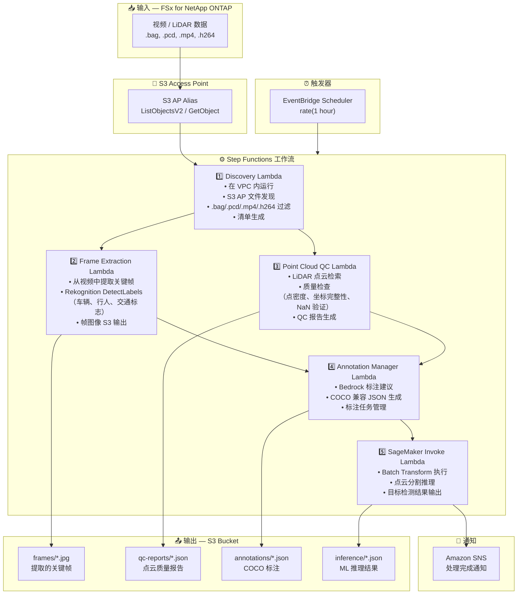

# UC9: 自动驾驶 / ADAS — 视频与 LiDAR 预处理、质量检查与标注

🌐 **Language / 言語**: [日本語](architecture.md) | [English](architecture.en.md) | [한국어](architecture.ko.md) | 简体中文 | [繁體中文](architecture.zh-TW.md) | [Français](architecture.fr.md) | [Deutsch](architecture.de.md) | [Español](architecture.es.md)

## 端到端架构（输入 → 输出）

---

## 架构图



---

## 数据流详情

### 输入
| 项目 | 说明 |
|------|------|
| **来源** | FSx for NetApp ONTAP 卷 |
| **文件类型** | .bag, .pcd, .mp4, .h264（ROS bag、LiDAR 点云、行车记录仪视频） |
| **访问方式** | S3 Access Point（ListObjectsV2 + GetObject） |
| **读取策略** | 完整文件检索（帧提取和点云分析所需） |

### 处理
| 步骤 | 服务 | 功能 |
|------|------|------|
| Discovery | Lambda（VPC） | 通过 S3 AP 发现视频/LiDAR 数据，生成清单 |
| Frame Extraction | Lambda + Rekognition | 从视频中提取关键帧，目标检测 |
| Point Cloud QC | Lambda | LiDAR 点云质量检查（点密度、坐标完整性、NaN 验证） |
| Annotation Manager | Lambda + Bedrock | 生成标注建议，COCO JSON 输出 |
| SageMaker Invoke | Lambda + SageMaker | 点云分割推理的 Batch Transform |

### 输出
| 产出物 | 格式 | 说明 |
|--------|------|------|
| 关键帧 | `frames/YYYY/MM/DD/{stem}_frame_{n}.jpg` | 提取的关键帧图像 |
| QC 报告 | `qc-reports/YYYY/MM/DD/{stem}_qc.json` | 点云质量检查结果 |
| 标注 | `annotations/YYYY/MM/DD/{stem}_coco.json` | COCO 兼容标注 |
| 推理结果 | `inference/YYYY/MM/DD/{stem}_segmentation.json` | ML 推理结果 |
| SNS 通知 | 电子邮件 | 处理完成通知（数量和质量分数） |

---

## 关键设计决策

1. **S3 AP 优于 NFS** — Lambda 无需 NFS 挂载；通过 S3 API 检索大数据
2. **并行处理** — Frame Extraction 和 Point Cloud QC 并行运行以缩短处理时间
3. **Rekognition + SageMaker 两阶段** — Rekognition 用于即时目标检测，SageMaker 用于高精度分割
4. **COCO 兼容格式** — 行业标准标注格式确保与下游 ML 管道的兼容性
5. **质量门控** — Point Cloud QC 在管道早期过滤不满足质量标准的数据
6. **轮询（非事件驱动）** — S3 AP 不支持事件通知，因此使用定期计划执行

---

## 使用的 AWS 服务

| 服务 | 角色 |
|------|------|
| FSx for NetApp ONTAP | 自动驾驶数据存储（视频/LiDAR） |
| S3 Access Points | 对 ONTAP 卷的无服务器访问 |
| EventBridge Scheduler | 定期触发器 |
| Step Functions | 工作流编排 |
| Lambda (Python 3.13) | 计算（Discovery, Frame Extraction, Point Cloud QC, Annotation Manager, SageMaker Invoke） |
| Lambda SnapStart | 冷启动减少（可选启用，Phase 6A） |
| Amazon Rekognition | 目标检测（车辆、行人、交通标志） |
| Amazon SageMaker | 推理（4-way 路由: Batch / Serverless / Provisioned / Components） |
| SageMaker Inference Components | 真正的 scale-to-zero（MinInstanceCount=0，Phase 6B） |
| Amazon Bedrock | 标注建议生成 |
| SNS | 处理完成通知 |
| Secrets Manager | ONTAP REST API 凭证管理 |
| CloudWatch + X-Ray | 可观测性 |
| CloudFormation Guard Hooks | 部署时策略强制（Phase 6B） |

---

## 推理路由 (Phase 4/5/6B)

UC9 支持 4-way 推理路由。通过 `InferenceType` 参数选择：

| 路径 | 条件 | 延迟 | 空闲成本 |
|------|------|------|----------|
| Batch Transform | `InferenceType=none` or `file_count >= threshold` | 分钟~小时 | $0 |
| Serverless Inference | `InferenceType=serverless` | 6–45秒 (cold) | $0 |
| Provisioned Endpoint | `InferenceType=provisioned` | 毫秒 | ~$140/月 |
| **Inference Components** | `InferenceType=components` | 2–5分钟 (scale-from-zero) | **$0** |

### Inference Components (Phase 6B)

Inference Components 通过 `MinInstanceCount=0` 实现真正的 scale-to-zero：

```
SageMaker Endpoint (始终存在，空闲成本 $0)
  └── Inference Component (MinInstanceCount=0)
       ├── [空闲] → 0 实例 → $0/小时
       ├── [请求到达] → Auto Scaling → 实例启动 (2–5分钟)
       └── [空闲超时] → Scale-in → 0 实例
```

启用: `EnableInferenceComponents=true` + `InferenceType=components`

---

## Lambda SnapStart (Phase 6A)

所有 Lambda 函数支持可选启用 SnapStart：

- **启用**: 使用 `EnableSnapStart=true` 更新堆栈 + `scripts/enable-snapstart.sh` 发布版本
- **效果**: 冷启动 1–3秒 → 100–500ms
- **限制**: 仅适用于 Published Versions（不适用于 $LATEST）

详情: [SnapStart 指南](../../docs/snapstart-guide.md)
