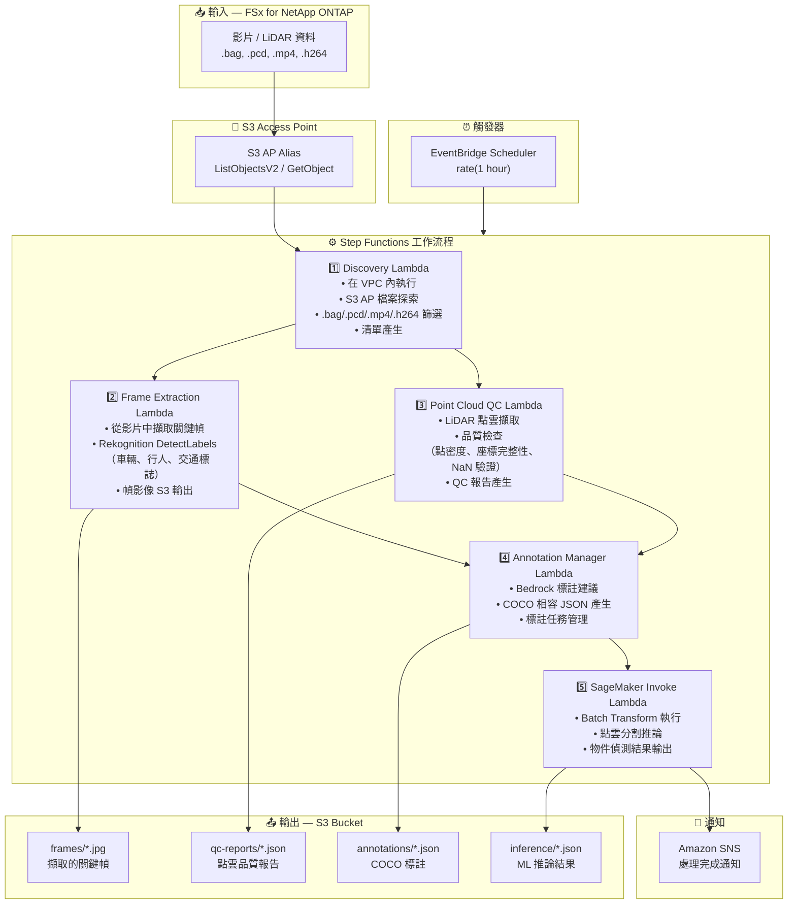

# UC9: 自動駕駛 / ADAS — 影片與 LiDAR 前處理、品質檢查與標註

🌐 **Language / 言語**: [日本語](architecture.md) | [English](architecture.en.md) | [한국어](architecture.ko.md) | [简体中文](architecture.zh-CN.md) | 繁體中文 | [Français](architecture.fr.md) | [Deutsch](architecture.de.md) | [Español](architecture.es.md)

## 端對端架構（輸入 → 輸出）

---

## 架構圖



---

## 資料流程詳情

### 輸入
| 項目 | 說明 |
|------|------|
| **來源** | FSx for NetApp ONTAP 磁碟區 |
| **檔案類型** | .bag, .pcd, .mp4, .h264（ROS bag、LiDAR 點雲、行車記錄器影片） |
| **存取方式** | S3 Access Point（ListObjectsV2 + GetObject） |
| **讀取策略** | 完整檔案擷取（幀擷取和點雲分析所需） |

### 處理
| 步驟 | 服務 | 功能 |
|------|------|------|
| Discovery | Lambda（VPC） | 透過 S3 AP 探索影片/LiDAR 資料，產生清單 |
| Frame Extraction | Lambda + Rekognition | 從影片中擷取關鍵幀，物件偵測 |
| Point Cloud QC | Lambda | LiDAR 點雲品質檢查（點密度、座標完整性、NaN 驗證） |
| Annotation Manager | Lambda + Bedrock | 產生標註建議，COCO JSON 輸出 |
| SageMaker Invoke | Lambda + SageMaker | 點雲分割推論的 Batch Transform |

### 輸出
| 產出物 | 格式 | 說明 |
|--------|------|------|
| 關鍵幀 | `frames/YYYY/MM/DD/{stem}_frame_{n}.jpg` | 擷取的關鍵幀影像 |
| QC 報告 | `qc-reports/YYYY/MM/DD/{stem}_qc.json` | 點雲品質檢查結果 |
| 標註 | `annotations/YYYY/MM/DD/{stem}_coco.json` | COCO 相容標註 |
| 推論結果 | `inference/YYYY/MM/DD/{stem}_segmentation.json` | ML 推論結果 |
| SNS 通知 | 電子郵件 | 處理完成通知（數量和品質分數） |

---

## 關鍵設計決策

1. **S3 AP 優於 NFS** — Lambda 無需 NFS 掛載；透過 S3 API 擷取大型資料
2. **平行處理** — Frame Extraction 和 Point Cloud QC 平行執行以縮短處理時間
3. **Rekognition + SageMaker 兩階段** — Rekognition 用於即時物件偵測，SageMaker 用於高精度分割
4. **COCO 相容格式** — 業界標準標註格式確保與下游 ML 管線的相容性
5. **品質閘門** — Point Cloud QC 在管線早期過濾不符合品質標準的資料
6. **輪詢（非事件驅動）** — S3 AP 不支援事件通知，因此使用定期排程執行

---

## 使用的 AWS 服務

| 服務 | 角色 |
|------|------|
| FSx for NetApp ONTAP | 自動駕駛資料儲存（影片/LiDAR） |
| S3 Access Points | 對 ONTAP 磁碟區的無伺服器存取 |
| EventBridge Scheduler | 定期觸發器 |
| Step Functions | 工作流程編排 |
| Lambda (Python 3.13) | 運算（Discovery, Frame Extraction, Point Cloud QC, Annotation Manager, SageMaker Invoke） |
| Lambda SnapStart | 冷啟動減少（可選啟用，Phase 6A） |
| Amazon Rekognition | 物件偵測（車輛、行人、交通標誌） |
| Amazon SageMaker | 推論（4-way 路由: Batch / Serverless / Provisioned / Components） |
| SageMaker Inference Components | 真正的 scale-to-zero（MinInstanceCount=0，Phase 6B） |
| Amazon Bedrock | 標註建議產生 |
| SNS | 處理完成通知 |
| Secrets Manager | ONTAP REST API 憑證管理 |
| CloudWatch + X-Ray | 可觀測性 |
| CloudFormation Guard Hooks | 部署時策略強制（Phase 6B） |

---

## 推論路由 (Phase 4/5/6B)

UC9 支援 4-way 推論路由。透過 `InferenceType` 參數選擇：

| 路徑 | 條件 | 延遲 | 閒置成本 |
|------|------|------|----------|
| Batch Transform | `InferenceType=none` or `file_count >= threshold` | 分鐘~小時 | $0 |
| Serverless Inference | `InferenceType=serverless` | 6–45秒 (cold) | $0 |
| Provisioned Endpoint | `InferenceType=provisioned` | 毫秒 | ~$140/月 |
| **Inference Components** | `InferenceType=components` | 2–5分鐘 (scale-from-zero) | **$0** |

### Inference Components (Phase 6B)

Inference Components 透過 `MinInstanceCount=0` 實現真正的 scale-to-zero：

```
SageMaker Endpoint (始終存在，閒置成本 $0)
  └── Inference Component (MinInstanceCount=0)
       ├── [閒置] → 0 執行個體 → $0/小時
       ├── [請求到達] → Auto Scaling → 執行個體啟動 (2–5分鐘)
       └── [閒置逾時] → Scale-in → 0 執行個體
```

啟用: `EnableInferenceComponents=true` + `InferenceType=components`

---

## Lambda SnapStart (Phase 6A)

所有 Lambda 函數支援可選啟用 SnapStart：

- **啟用**: 使用 `EnableSnapStart=true` 更新堆疊 + `scripts/enable-snapstart.sh` 發佈版本
- **效果**: 冷啟動 1–3秒 → 100–500ms
- **限制**: 僅適用於 Published Versions（不適用於 $LATEST）

詳情: [SnapStart 指南](../../docs/snapstart-guide.md)
