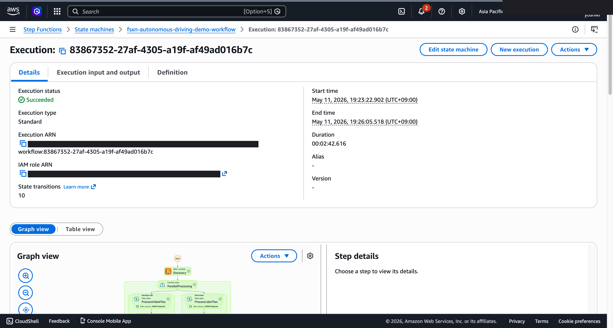

# Driving Data Preprocessing and Annotation — Demo Guide

🌐 **Language / 언어 / 语言 / 語言 / Langue / Sprache / Idioma**: [日本語](demo-guide.md) | English | [한국어](demo-guide.ko.md) | [简体中文](demo-guide.zh-CN.md) | [繁體中文](demo-guide.zh-TW.md) | [Français](demo-guide.fr.md) | [Deutsch](demo-guide.de.md) | [Español](demo-guide.es.md)

> Note: This translation is produced by Amazon Bedrock Claude. Contributions to improve translation quality are welcome.

## Executive Summary

This demo demonstrates a preprocessing and annotation pipeline for driving data in autonomous vehicle development. It automatically classifies and quality-checks large volumes of sensor data to efficiently build training datasets.

**Core Demo Message**: Automate quality validation and metadata tagging of driving data to accelerate AI training dataset construction.

**Estimated Duration**: 3–5 minutes

---

## Target Audience & Persona

| Item | Details |
|------|---------|
| **Role** | Data Engineer / ML Engineer |
| **Daily Work** | Driving data management, annotation, training dataset construction |
| **Challenge** | Unable to efficiently extract useful scenes from large volumes of driving data |
| **Expected Outcome** | Automated data quality validation and efficient scene classification |

### Persona: Ito-san (Data Engineer)

- TB-scale driving data accumulates daily
- Manual verification of camera, LiDAR, and radar synchronization
- "I want to automatically send only high-quality data to the training pipeline"

---

## Demo Scenario: Driving Data Batch Preprocessing

### Overall Workflow

```
Driving Data        Data Validation    Scene Classification    Dataset
(ROS bag, etc.)  →  Quality Check   →  Metadata            →  Catalog Generation
                    Sync Verification  Tagging (AI)
```

---

## Storyboard (5 Sections / 3–5 minutes)

### Section 1: Problem Statement (0:00–0:45)

**Narration Summary**:
> TB-scale driving data accumulates daily. Poor quality data (sensor loss, sync drift) is mixed in, making manual sorting impractical.

**Key Visual**: Driving data folder structure, data volume visualization

### Section 2: Pipeline Trigger (0:45–1:30)

**Narration Summary**:
> When new driving data is uploaded, the preprocessing pipeline automatically starts.

**Key Visual**: Data upload → Workflow automatic trigger

### Section 3: Quality Validation (1:30–2:30)

**Narration Summary**:
> Sensor data integrity check: automatically detects frame loss, timestamp synchronization, and data corruption.

**Key Visual**: Quality check results — health score by sensor

### Section 4: Scene Classification (2:30–3:45)

**Narration Summary**:
> AI automatically classifies scenes: intersections, highways, bad weather, nighttime, etc. Tagged as metadata.

**Key Visual**: Scene classification results table, distribution by category

### Section 5: Dataset Catalog (3:45–5:00)

**Narration Summary**:
> Automatically generates a catalog of quality-validated data. Available as a searchable dataset by scene conditions.

**Key Visual**: Dataset catalog, search interface

---

## Screen Capture Plan

| # | Screen | Section |
|---|--------|---------|
| 1 | Driving data folder structure | Section 1 |
| 2 | Pipeline launch screen | Section 2 |
| 3 | Quality check results | Section 3 |
| 4 | Scene classification results | Section 4 |
| 5 | Dataset catalog | Section 5 |

---

## Narration Outline

| Section | Time | Key Message |
|---------|------|-------------|
| Problem | 0:00–0:45 | "Manual selection of useful scenes from TB-scale data is impossible" |
| Trigger | 0:45–1:30 | "Preprocessing automatically starts on upload" |
| Validation | 1:30–2:30 | "Automatically detects sensor loss and sync drift" |
| Classification | 2:30–3:45 | "AI automatically classifies scenes and tags metadata" |
| Catalog | 3:45–5:00 | "Automatically generates searchable dataset catalog" |

---

## Sample Data Requirements

| # | Data | Purpose |
|---|------|---------|
| 1 | Normal driving data (5 sessions) | Baseline |
| 2 | Frame loss data (2 cases) | Quality check demo |
| 3 | Diverse scene data (intersection, highway, nighttime) | Classification demo |

---

## Timeline

### Achievable Within 1 Week

| Task | Time Required |
|------|---------------|
| Prepare sample driving data | 3 hours |
| Verify pipeline execution | 2 hours |
| Capture screenshots | 2 hours |
| Create narration script | 2 hours |
| Video editing | 4 hours |

### Future Enhancements

- Automatic 3D annotation generation
- Data selection via active learning
- Data versioning integration

---

## Technical Notes

| Component | Role |
|-----------|------|
| Step Functions | Workflow orchestration |
| Lambda (Python 3.13) | Sensor data quality validation, scene classification, catalog generation |
| Lambda SnapStart | Cold start reduction (opt-in with `EnableSnapStart=true`) |
| SageMaker (4-way routing) | Inference (Batch / Serverless / Provisioned / Inference Components) |
| SageMaker Inference Components | True scale-to-zero (`EnableInferenceComponents=true`) |
| Amazon Bedrock | Scene classification, annotation suggestions |
| Amazon Athena | Metadata search and aggregation |
| CloudFormation Guard Hooks | Enforce security policies at deployment |

### Local Testing (Phase 6A)

```bash
# SAM CLI でローカルテスト
sam local invoke \
  --template autonomous-driving/template-deploy.yaml \
  --event events/uc09-autonomous-driving/discovery-event.json \
  --env-vars events/env.json \
  DiscoveryFunction
```

### Fallback

| Scenario | Response |
|----------|----------|
| Large data processing delay | Run with subset |
| Insufficient classification accuracy | Display pre-classified results |

---

*This document is a production guide for demo videos for technical presentations.*

---

## About Output Destination: Selectable via OutputDestination (Pattern B)

UC9 autonomous-driving now supports the `OutputDestination` parameter as of the 2026-05-10 update
(see `docs/output-destination-patterns.md`).

**Target Workload**: ADAS / autonomous driving data (frame extraction, point cloud QC, annotation, inference)

**Two Modes**:

### STANDARD_S3 (default, traditional behavior)
Creates a new S3 bucket (`${AWS::StackName}-output-${AWS::AccountId}`) and
writes AI artifacts there.

```bash
aws cloudformation deploy \
  --template-file autonomous-driving/template-deploy.yaml \
  --stack-name fsxn-autonomous-driving-demo \
  --parameter-overrides \
    OutputDestination=STANDARD_S3 \
    ... (other required parameters)
```

### FSXN_S3AP ("no data movement" pattern)
Writes AI artifacts back to the **same FSx ONTAP volume** as the original data via FSxN S3 Access Point.
SMB/NFS users can directly view AI artifacts within the directory structure used in their daily work.
No standard S3 bucket is created.

```bash
aws cloudformation deploy \
  --template-file autonomous-driving/template-deploy.yaml \
  --stack-name fsxn-autonomous-driving-demo \
  --parameter-overrides \
    OutputDestination=FSXN_S3AP \
    OutputS3APPrefix=ai-outputs/ \
    S3AccessPointName=eda-demo-s3ap \
    ... (other required parameters)
```

**Notes**:

- Strongly recommend specifying `S3AccessPointName` (grant IAM permissions for both Alias and ARN formats)
- Objects over 5GB are not supported by FSxN S3AP (AWS specification), multipart upload required
- For AWS specification constraints, see
  [the "AWS Specification Constraints and Workarounds" section in the project README](../../README.md#aws-仕様上の制約と回避策)
  and [`docs/output-destination-patterns.md`](../../docs/output-destination-patterns.md)

---

## Verified UI/UX Screenshots

Following the same policy as Phase 7 UC15/16/17 and UC6/11/14 demos, target **UI/UX screens that end users actually see in their daily work**. Technical views (Step Functions graph, CloudFormation stack events, etc.) are consolidated in `docs/verification-results-*.md`.

### Verification Status for This Use Case

- ⚠️ **E2E Verification**: Partial functionality only (additional verification recommended in production)
- 📸 **UI/UX Capture**: ✅ SFN Graph completed (Phase 8 Theme D, commit 081cc66)

### Existing Screenshots (from Phase 1-6 where applicable)



### UI/UX Target Screens for Re-verification (Recommended Capture List)

- S3 output bucket (keyframes/, annotations/, qc/)
- Rekognition keyframe object detection results
- LiDAR point cloud quality check summary
- COCO-compatible annotation JSON

### Capture Guide

1. **Preparation**:
   - Verify prerequisites with `bash scripts/verify_phase7_prerequisites.sh` (check for shared VPC/S3 AP)
   - Package Lambda with `UC=autonomous-driving bash scripts/package_generic_uc.sh`
   - Deploy with `bash scripts/deploy_generic_ucs.sh UC9`

2. **Sample Data Placement**:
   - Upload sample files to `footage/` prefix via S3 AP Alias
   - Start Step Functions `fsxn-autonomous-driving-demo-workflow` (input `{}`)

3. **Capture** (close CloudShell/terminal, mask username in browser top-right):
   - Overview of S3 output bucket `fsxn-autonomous-driving-demo-output-<account>`
   - AI/ML output JSON preview (refer to `build/preview_*.html` format)
   - SNS email notification (if applicable)

4. **Masking**:
   - Auto-mask with `python3 scripts/mask_uc_demos.py autonomous-driving-demo`
   - Apply additional masking as needed per `docs/screenshots/MASK_GUIDE.md`

5. **Cleanup**:
   - Delete with `bash scripts/cleanup_generic_ucs.sh UC9`
   - VPC Lambda ENI release takes 15-30 minutes (AWS specification)
