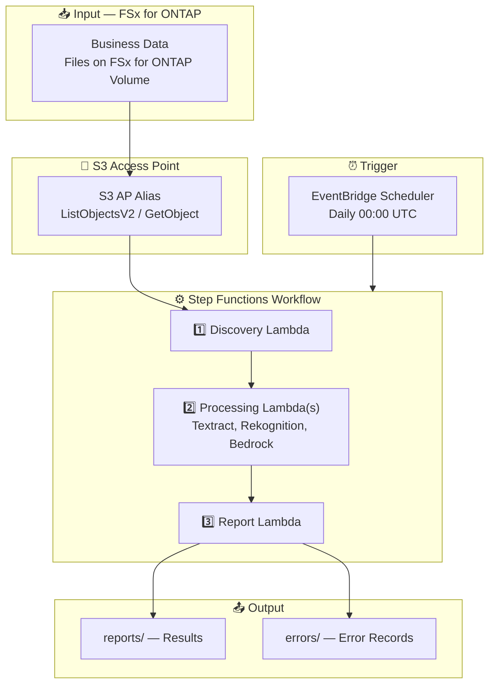

# UC28: 화학 및 소재 — SDS 위험 분류 추출 / GHS 검증 Architecture

🌐 **Language / 言語**: [日本語](architecture.md) | [English](architecture.en.md) | 한국어 | [简体中文](architecture.zh-CN.md) | [繁體中文](architecture.zh-TW.md) | [Français](architecture.fr.md) | [Deutsch](architecture.de.md) | [Español](architecture.es.md)

## Architecture Diagram

---

## AWS Services Used

| Service | Role |
|---------|------|
| FSx for ONTAP | File storage |
| S3 Access Points | Serverless access to ONTAP volumes |
| Lambda | Compute (Discovery, SDS Extractor, Labbook Analyzer, Report) |
| Amazon Textract | AI/ML processing |
| Amazon Rekognition | AI/ML processing |
| Amazon Bedrock | AI/ML processing |
| CloudWatch + X-Ray | Observability |
