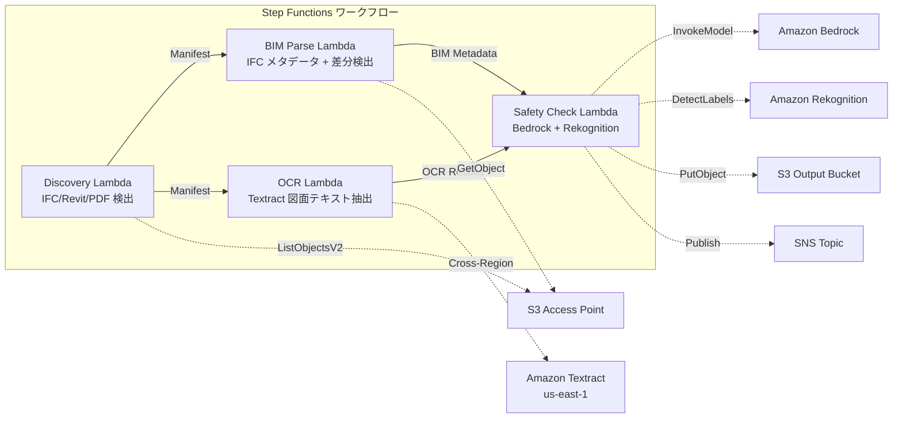

# UC10: Bau / AEC — BIM-Modellverwaltung, Plan-OCR, Sicherheitscompliance

🌐 **Language / 言語**: [日本語](README.md) | [English](README.en.md) | [한국어](README.ko.md) | [简体中文](README.zh-CN.md) | [繁體中文](README.zh-TW.md) | [Français](README.fr.md) | Deutsch | [Español](README.es.md)

## Übersicht
Serverlose Workflows zur Automatisierung der Versionskontrolle von BIM-Modellen (IFC/Revit), der OCR-Textextraktion aus Zeichnungs-PDFs und der Sicherheits-Compliance-Prüfung unter Verwendung der S3 Access Points von FSx for NetApp ONTAP.
### Fälle, in denen dieses Muster geeignet ist
- BIM-Modelle (IFC/Revit) und Zeichnungen in PDF-Format sind auf FSx ONTAP gespeichert
- Die Metadaten von IFC-Dateien (Projektname, Anzahl der Bauelemente, Stockwerke) sollen automatisch katalogisiert werden
- Unterschiede zwischen den Versionen der BIM-Modelle (Hinzufügen, Löschen, Ändern von Elementen) sollen automatisch erkannt werden
- Aus den Zeichnungen im PDF-Format sollen Text und Tabellen mit Textract extrahiert werden
- Es ist eine automatische Überprüfung der Sicherheits-Compliance-Regeln (Brandschutz, Fluchtwege, Strukturlasten, Materialstandards) erforderlich
### Fälle, für die dieses Muster nicht geeignet ist
- Echtzeit-BIM-Zusammenarbeit (Revit Server / BIM 360 ist geeignet)
- Vollständige strukturelle Analysesimulation (FEM-Software erforderlich)
- Großflächige 3D-Rendering-Verarbeitung (EC2/GPU-Instanzen sind geeignet)
- Umgebungen, in denen keine Netzwerkverbindung zur ONTAP REST API hergestellt werden kann
### Hauptfunktionen
- Automatische Erkennung von IFC/Revit/PDF-Dateien über S3 AP
- IFC-Metadatenextraktion (project_name, building_elements_count, floor_count, coordinate_system, ifc_schema_version)
- Versionsdifferenzerkennung (element additions, deletions, modifications)
- OCR-Text- und Tabellenextraktion von Zeichnungs-PDFs mit Textract (Cross-Region)
- Sicherheits-Compliance-Regelprüfung mit Bedrock
- Erkennung sicherheitsrelevanter visueller Elemente in Zeichnungsbildern mit Rekognition (Notausgänge, Feuerlöscher, Gefahrenbereiche)
## Architektur



### Workflowschritte
1. **Discovery**: .ifc-,.rvt- und.pdf-Dateien von S3 AP erkennen
2. **BIM Parse**: Metadatenextraktion aus IFC-Dateien und Erkennung von Versionsunterschieden
3. **OCR**: Text- und Tabellenextraktion aus Zeichnungen-PDF mit Textract (Cross-Region)
4. **Safety Check**: Sicherheits-Compliance-Regelprüfung mit Bedrock, visuelle Elementerkennung mit Rekognition
## Voraussetzungen
- AWS-Konto und geeignete IAM-Berechtigungen
- FSx for NetApp ONTAP-Dateisysteme (ONTAP 9.17.1P4D3 oder höher)
- S3 Access Point aktivierter Volume (BIM-Modelle/Zeichnungen speichern)
- VPC, private Subnetz
- Amazon Bedrock-Modellzugriff aktiviert (Claude / Nova)
- **Cross-Region**: Da Textract nicht in ap-northeast-1 verfügbar ist, ist ein Cross-Region-Aufruf nach us-east-1 erforderlich
## Bereitstellungsschritte

### 1. Überprüfung der grenzüberschreitenden Parameter
Da Textract nicht in der Tokyo-Region verfügbar ist, konfigurieren Sie den Cross-Region-Aufruf mit dem Parameter `CrossRegionTarget`.
### 2. CloudFormation-Bereitstellung

```bash
aws cloudformation deploy \
  --template-file construction-bim/template.yaml \
  --stack-name fsxn-construction-bim \
  --parameter-overrides \
    S3AccessPointAlias=<your-volume-ext-s3alias> \
    S3AccessPointName=<your-s3ap-name> \
    VpcId=<your-vpc-id> \
    PrivateSubnetIds=<subnet-1>,<subnet-2> \
    ScheduleExpression="rate(1 hour)" \
    NotificationEmail=<your-email@example.com> \
    CrossRegionTarget=us-east-1 \
    EnableVpcEndpoints=false \
    EnableCloudWatchAlarms=false \
  --capabilities CAPABILITY_IAM CAPABILITY_AUTO_EXPAND \
  --region ap-northeast-1
```

## Liste der Konfigurationsparameter

| パラメータ | 説明 | デフォルト | 必須 |
|-----------|------|----------|------|
| `S3AccessPointAlias` | FSx ONTAP S3 AP Alias（入力用） | — | ✅ |
| `S3AccessPointName` | S3 AP 名（ARN ベースの IAM 権限付与用。省略時は Alias ベースのみ） | `""` | ⚠️ 推奨 |
| `ScheduleExpression` | EventBridge Scheduler のスケジュール式 | `rate(1 hour)` | |
| `VpcId` | VPC ID | — | ✅ |
| `PrivateSubnetIds` | プライベートサブネット ID リスト | — | ✅ |
| `NotificationEmail` | SNS 通知先メールアドレス | — | ✅ |
| `CrossRegionTarget` | Textract のターゲットリージョン | `us-east-1` | |
| `MapConcurrency` | Map ステートの並列実行数 | `10` | |
| `LambdaMemorySize` | Lambda メモリサイズ (MB) | `1024` | |
| `LambdaTimeout` | Lambda タイムアウト (秒) | `300` | |
| `EnableVpcEndpoints` | Interface VPC Endpoints の有効化 | `false` | |
| `EnableCloudWatchAlarms` | CloudWatch Alarms の有効化 | `false` | |

## Bereinigung

```bash
aws s3 rm s3://fsxn-construction-bim-output-${AWS_ACCOUNT_ID} --recursive

aws cloudformation delete-stack \
  --stack-name fsxn-construction-bim \
  --region ap-northeast-1

aws cloudformation wait stack-delete-complete \
  --stack-name fsxn-construction-bim \
  --region ap-northeast-1
```

## Unterstützte Regionen
UC10 verwendet die folgenden Dienste:
| サービス | リージョン制約 |
|---------|-------------|
| Amazon Textract | ap-northeast-1 非対応。`TEXTRACT_REGION` パラメータで対応リージョン（us-east-1 等）を指定 |
| Amazon Bedrock | 対応リージョンを確認（[Bedrock 対応リージョン](https://docs.aws.amazon.com/general/latest/gr/bedrock.html)） |
| Amazon Rekognition | ほぼ全リージョンで利用可能 |
| AWS X-Ray | ほぼ全リージョンで利用可能 |
| CloudWatch EMF | ほぼ全リージョンで利用可能 |
> Rufen Sie die Textract API über den Cross-Region Client auf. Überprüfen Sie die Datenresidenzanforderungen. Weitere Informationen finden Sie in der [Regionskompatibilitätsmatrix](../docs/region-compatibility.md).
## Referenzlinks
- [FSx ONTAP S3 Access Points 概要](https://docs.aws.amazon.com/fsx/latest/ONTAPGuide/accessing-data-via-s3-access-points.html)
- [Amazon Textract-Dokumentation](https://docs.aws.amazon.com/textract/latest/dg/what-is.html)
- [IFC-Formatspezifikation (buildingSMART)](https://www.buildingsmart.org/standards/bsi-standards/industry-foundation-classes/)
- [Amazon Rekognition Label-Erkennung](https://docs.aws.amazon.com/rekognition/latest/dg/labels.html)