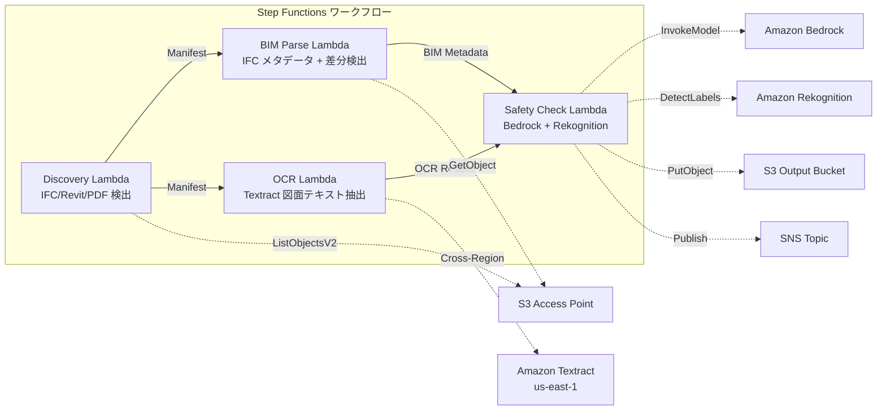

# UC10: Construction / AEC — BIM Model Management, Drawing OCR, Safety Compliance

🌐 **Language / 言語**: [日本語](README.md) | English | [한국어](README.ko.md) | [简体中文](README.zh-CN.md) | [繁體中文](README.zh-TW.md) | [Français](README.fr.md) | [Deutsch](README.de.md) | [Español](README.es.md)

📚 **Documentation**: [Architecture Diagram](docs/architecture.en.md) | [Demo Guide](docs/demo-guide.en.md)

## Overview
Utilizing S3 Access Points of FSx for NetApp ONTAP, this is a serverless workflow to automate version control of BIM models (IFC/Revit), OCR text extraction from drawing PDFs, and safety compliance checks.
### When this pattern is suitable
- BIM models (IFC/Revit) and drawing PDFs are stored on FSx for NetApp ONTAP
- We want to automatically catalog the metadata of IFC files (project name, number of architectural elements, number of floors)
- We want to automatically detect differences between versions of the BIM model (addition, deletion, or modification of elements)
- We want to extract text and tables from the drawing PDFs using Textract
- Automatic checks of safety compliance rules (fire prevention and evacuation, structural loads, material standards) are necessary
### Cases where this pattern is not suitable
- Real-time BIM collaboration (Revit Server / BIM 360 is suitable)
- Full structural analysis simulation (FEM software is required)
- Large-scale 3D rendering processing (EC2/GPU instances are suitable)
- Environments where network access to the ONTAP REST API cannot be ensured
### Main Features
- Automatic detection of IFC/Revit/PDF files via S3 AP
- IFC metadata extraction (project_name, building_elements_count, floor_count, coordinate_system, ifc_schema_version)
- Difference detection between versions (element additions, deletions, modifications)
- OCR text and table extraction from drawing PDFs by Textract (cross-region)
- Safety compliance rule check by Bedrock
- Detection of safety-related visual elements in drawing images (emergency exits, fire extinguishers, hazard areas) by Rekognition
## Architecture



### Workflow Steps
1. **Discovery**: Detect.ifc,.rvt, .pdf files from S3 AP
2. **BIM Parse**: Extract metadata from IFC files and detect differences between versions
3. **OCR**: Extract text and tables from drawing PDFs using Textract (cross-region)
4. **Safety Check**: Check safety compliance rules with Bedrock, detect visual elements with Rekognition
## Prerequisites
- AWS account and appropriate IAM permissions
- FSx for NetApp ONTAP file systems (ONTAP 9.17.1P4D3 or higher)
- S3 Access Point enabled volumes (to store BIM models and drawings)
- VPC, private subnets
- Amazon Bedrock model access enabled (Claude / Nova)
- **Cross-region**: Textract is not supported in ap-northeast-1, so a cross-region call to us-east-1 is necessary
## Deployment Steps

### 1. Check cross-region parameters
Textract is not supported in the Tokyo region, so set up a cross-region call with the `CrossRegionTarget` parameter.
### 2. CloudFormation Deployment

```bash
aws cloudformation deploy \
  --template-file construction-bim/template.yaml \
  --stack-name fsxn-construction-bim \
  --parameter-overrides \
    S3AccessPointAlias=<your-volume-ext-s3alias> \
    S3AccessPointName=<your-s3ap-name> \
    VpcId=<your-vpc-id> \
    PrivateSubnetIds=<subnet-1>,<subnet-2> \
    ScheduleExpression="rate(1 hour)" \
    NotificationEmail=<your-email@example.com> \
    CrossRegionTarget=us-east-1 \
    EnableVpcEndpoints=false \
    EnableCloudWatchAlarms=false \
  --capabilities CAPABILITY_IAM CAPABILITY_AUTO_EXPAND \
  --region ap-northeast-1
```

## List of Configuration Parameters

| パラメータ | 説明 | デフォルト | 必須 |
|-----------|------|----------|------|
| `S3AccessPointAlias` | FSx ONTAP S3 AP Alias（入力用） | — | ✅ |
| `S3AccessPointName` | S3 AP 名（ARN ベースの IAM 権限付与用。省略時は Alias ベースのみ） | `""` | ⚠️ 推奨 |
| `ScheduleExpression` | EventBridge Scheduler のスケジュール式 | `rate(1 hour)` | |
| `VpcId` | VPC ID | — | ✅ |
| `PrivateSubnetIds` | プライベートサブネット ID リスト | — | ✅ |
| `NotificationEmail` | SNS 通知先メールアドレス | — | ✅ |
| `CrossRegionTarget` | Textract のターゲットリージョン | `us-east-1` | |
| `MapConcurrency` | Map ステートの並列実行数 | `10` | |
| `LambdaMemorySize` | Lambda メモリサイズ (MB) | `1024` | |
| `LambdaTimeout` | Lambda タイムアウト (秒) | `300` | |
| `EnableVpcEndpoints` | Interface VPC Endpoints の有効化 | `false` | |
| `EnableCloudWatchAlarms` | CloudWatch Alarms の有効化 | `false` | |

## Cleanup

```bash
aws s3 rm s3://fsxn-construction-bim-output-${AWS_ACCOUNT_ID} --recursive

aws cloudformation delete-stack \
  --stack-name fsxn-construction-bim \
  --region ap-northeast-1

aws cloudformation wait stack-delete-complete \
  --stack-name fsxn-construction-bim \
  --region ap-northeast-1
```

## Supported Regions
UC10 uses the following services:
| サービス | リージョン制約 |
|---------|-------------|
| Amazon Textract | ap-northeast-1 非対応。`TEXTRACT_REGION` パラメータで対応リージョン（us-east-1 等）を指定 |
| Amazon Bedrock | 対応リージョンを確認（[Bedrock 対応リージョン](https://docs.aws.amazon.com/general/latest/gr/bedrock.html)） |
| Amazon Rekognition | ほぼ全リージョンで利用可能 |
| AWS X-Ray | ほぼ全リージョンで利用可能 |
| CloudWatch EMF | ほぼ全リージョンで利用可能 |
> Call the Textract API via the Cross-Region Client. Please verify the data residency requirements. For details, refer to the [Region Compatibility Matrix](../docs/region-compatibility.md).
## References
- [FSx ONTAP S3 Access Points Overview](https://docs.aws.amazon.com/fsx/latest/ONTAPGuide/accessing-data-via-s3-access-points.html)
- [Amazon Textract Documentation](https://docs.aws.amazon.com/textract/latest/dg/what-is.html)
- [IFC Format Specification (buildingSMART)](https://www.buildingsmart.org/standards/bsi-standards/industry-foundation-classes/)
- [Amazon Rekognition Label Detection](https://docs.aws.amazon.com/rekognition/latest/dg/labels.html)