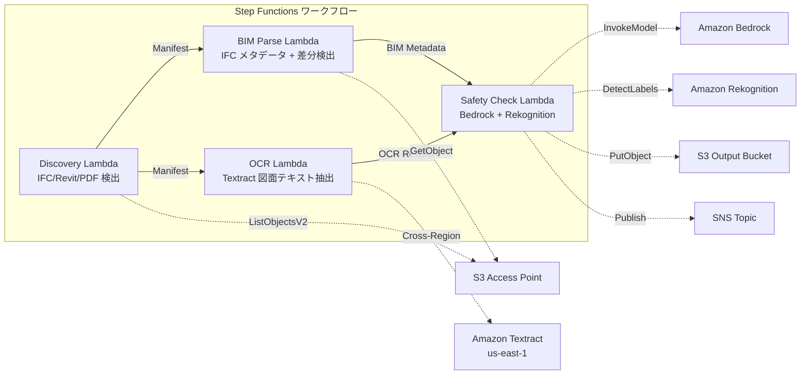

# UC10: Construcción / AEC — Gestión de modelos BIM, OCR de planos y cumplimiento de seguridad

🌐 **Language / 言語**: [日本語](README.md) | [English](README.en.md) | [한국어](README.ko.md) | [简体中文](README.zh-CN.md) | [繁體中文](README.zh-TW.md) | [Français](README.fr.md) | [Deutsch](README.de.md) | Español

## Resumen
Utilizando los Amazon S3 Access Points de FSx for NetApp ONTAP, es un flujo de trabajo sin servidor que automatiza la gestión de versiones de modelos BIM (IFC/Revit), la extracción de texto OCR de PDFs de planos y la comprobación de cumplimiento de seguridad.
### Casos en los que este patrón es adecuado
- Los modelos BIM (IFC/Revit) y los PDF de planos se están acumulando en FSx ONTAP
- Desea catalogar automáticamente los metadatos de los archivos IFC (nombre del proyecto, número de elementos arquitectónicos, número de pisos)
- Desea detectar automáticamente las diferencias entre versiones de modelos BIM (adición, eliminación o cambio de elementos)
- Desea extraer texto y tablas de los PDF de planos con Textract
- Se necesita una verificación automática de reglas de cumplimiento de seguridad (evacuación contra incendios, carga estructural, estándares de materiales)
### Casos donde este patrón no es apropiado
- Colaboración BIM en tiempo real (Revit Server / BIM 360 es apropiado)
- Simulación completa de análisis estructural (se necesita software FEM)
- Procesamiento de renderizado 3D a gran escala (las instancias EC2/GPU son apropiadas)
- Entornos donde no se puede garantizar el acceso a la red a la API REST de ONTAP
### Características principales
- Detección automática de archivos IFC/Revit/PDF a través de S3 AP
- Extracción de metadatos IFC (project_name, building_elements_count, floor_count, coordinate_system, ifc_schema_version)
- Detección de diferencias entre versiones (agregación de elementos, eliminaciones, modificaciones)
- Extracción de texto y tablas OCR de planos PDF mediante Textract (entre regiones)
- Comprobación de reglas de seguridad y cumplimiento mediante Bedrock
- Detección de elementos visuales relacionados con seguridad en imágenes de planos (salidas de emergencia, extintores, áreas peligrosas) mediante Rekognition
## Arquitectura



### Pasos del flujo de trabajo
1. **Descubrimiento**: Detección de archivos .ifc,.rvt,.pdf desde S3 AP
2. **Análisis BIM**: Extracción de metadatos de archivos IFC y detección de diferencias entre versiones
3. **OCR**: Extracción de texto y tablas de planos en PDF con Textract (cross-region) 
4. **Revisión de seguridad**: Comprobación de reglas de cumplimiento de seguridad con Bedrock, detección de elementos visuales con Rekognition
## Requisitos previos
- Cuenta de AWS y permisos IAM adecuados
- Sistema de archivos FSx for NetApp ONTAP (ONTAP 9.17.1P4D3 o superior)
- Puntos de acceso S3 habilitados en volúmenes (almacenamiento de modelos BIM y planos)
- VPC, subredes privadas
- Acceso a modelos de Amazon Bedrock habilitado (Claude / Nova)
- **Cross-region**: Debido a que Textract no es compatible con ap-northeast-1, se necesita una llamada cross-region a us-east-1
## Pasos de implementación

### 1. Verificación de parámetros entre regiones
Textract no es compatible con la región de Tokio, por lo que se configura una llamada entre regiones con el parámetro `CrossRegionTarget`.
### 2. Despliegue de CloudFormation

```bash
aws cloudformation deploy \
  --template-file construction-bim/template.yaml \
  --stack-name fsxn-construction-bim \
  --parameter-overrides \
    S3AccessPointAlias=<your-volume-ext-s3alias> \
    S3AccessPointName=<your-s3ap-name> \
    VpcId=<your-vpc-id> \
    PrivateSubnetIds=<subnet-1>,<subnet-2> \
    ScheduleExpression="rate(1 hour)" \
    NotificationEmail=<your-email@example.com> \
    CrossRegionTarget=us-east-1 \
    EnableVpcEndpoints=false \
    EnableCloudWatchAlarms=false \
  --capabilities CAPABILITY_IAM CAPABILITY_AUTO_EXPAND \
  --region ap-northeast-1
```

## Lista de parámetros de configuración

| パラメータ | 説明 | デフォルト | 必須 |
|-----------|------|----------|------|
| `S3AccessPointAlias` | FSx ONTAP S3 AP Alias（入力用） | — | ✅ |
| `S3AccessPointName` | S3 AP 名（ARN ベースの IAM 権限付与用。省略時は Alias ベースのみ） | `""` | ⚠️ 推奨 |
| `ScheduleExpression` | EventBridge Scheduler のスケジュール式 | `rate(1 hour)` | |
| `VpcId` | VPC ID | — | ✅ |
| `PrivateSubnetIds` | プライベートサブネット ID リスト | — | ✅ |
| `NotificationEmail` | SNS 通知先メールアドレス | — | ✅ |
| `CrossRegionTarget` | Textract のターゲットリージョン | `us-east-1` | |
| `MapConcurrency` | Map ステートの並列実行数 | `10` | |
| `LambdaMemorySize` | Lambda メモリサイズ (MB) | `1024` | |
| `LambdaTimeout` | Lambda タイムアウト (秒) | `300` | |
| `EnableVpcEndpoints` | Interface VPC Endpoints の有効化 | `false` | |
| `EnableCloudWatchAlarms` | CloudWatch Alarms の有効化 | `false` | |
| `EnableSnapStart` | Habilitar Lambda SnapStart (reducción de arranque en frío) | `false` | |

## Limpieza

```bash
aws s3 rm s3://fsxn-construction-bim-output-${AWS_ACCOUNT_ID} --recursive

aws cloudformation delete-stack \
  --stack-name fsxn-construction-bim \
  --region ap-northeast-1

aws cloudformation wait stack-delete-complete \
  --stack-name fsxn-construction-bim \
  --region ap-northeast-1
```

## Regiones compatibles
UC10 utiliza los siguientes servicios:
| サービス | リージョン制約 |
|---------|-------------|
| Amazon Textract | ap-northeast-1 非対応。`TEXTRACT_REGION` パラメータで対応リージョン（us-east-1 等）を指定 |
| Amazon Bedrock | 対応リージョンを確認（[Bedrock 対応リージョン](https://docs.aws.amazon.com/general/latest/gr/bedrock.html)） |
| Amazon Rekognition | ほぼ全リージョンで利用可能 |
| AWS X-Ray | ほぼ全リージョンで利用可能 |
| CloudWatch EMF | ほぼ全リージョンで利用可能 |
> Llame a la API de Textract a través del Cliente de Región Cruzada. Verifique los requisitos de residencia de datos. Para más detalles, consulte la [Matriz de Compatibilidad de Regiones](../docs/region-compatibility.md).
## Enlaces de referencia
- [Puntos de acceso a Amazon S3 de FSx ONTAP](https://docs.aws.amazon.com/fsx/latest/ONTAPGuide/accessing-data-via-s3-access-points.html)
- [Documentación de Amazon Textract](https://docs.aws.amazon.com/textract/latest/dg/what-is.html)
- [Especificaciones del formato IFC (buildingSMART)](https://www.buildingsmart.org/standards/bsi-standards/industry-foundation-classes/)
- [Detección de etiquetas de Amazon Rekognition](https://docs.aws.amazon.com/rekognition/latest/dg/labels.html)