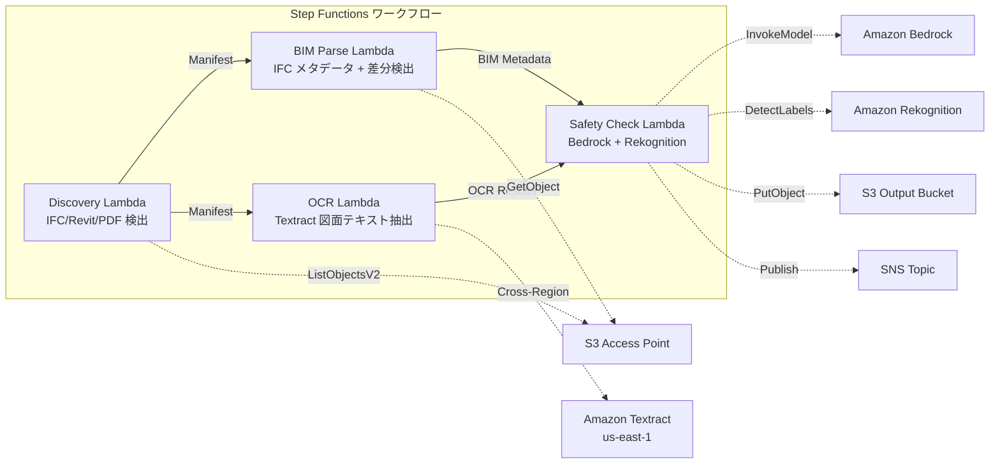

# UC10 : Construction / AEC — Gestion des modèles BIM, OCR des plans et conformité sécurité

🌐 **Language / 言語**: [日本語](README.md) | [English](README.en.md) | [한국어](README.ko.md) | [简体中文](README.zh-CN.md) | [繁體中文](README.zh-TW.md) | Français | [Deutsch](README.de.md) | [Español](README.es.md)

## Aperçu
FSx for NetApp ONTAP utilise les points d'accès S3 pour automatiser les flux de travail sans serveur de gestion des versions des modèles BIM (IFC/Revit), d'extraction de texte OCR des PDF de plans et de vérification de conformité sécurité.
### Cas où ce schéma est approprié
- Les modèles BIM (IFC/Revit) et les PDF de plans sont stockés sur FSx ONTAP
- Je souhaite cataloguer automatiquement les métadonnées des fichiers IFC (nom du projet, nombre d'éléments architecturaux, nombre d'étages)
- Je souhaite détecter automatiquement les différences entre les versions des modèles BIM (ajout, suppression ou modification d'éléments)
- Je souhaite extraire le texte et les tableaux des PDF de plans à l'aide de Textract
- Un contrôle automatique des règles de sécurité et de conformité (évacuation en cas d'incendie, charges structurelles, normes de matériaux) est nécessaire
### Cas où ce modèle ne convient pas
- Collaboration BIM en temps réel (Revit Server / BIM 360 est approprié)
- Simulation complète d'analyse structurelle (logiciel FEM requis)
- Traitement de rendu 3D à grande échelle (des instances EC2/GPU sont appropriées)
- Environnements ne pouvant pas assurer la connectivité réseau vers l'API REST ONTAP
### Principales fonctionnalités
- Détection automatique des fichiers IFC/Revit/PDF via S3 AP
- Extraction des métadonnées IFC (project_name, building_elements_count, floor_count, coordinate_system, ifc_schema_version)
- Détection des différences entre versions (ajouts d'éléments, suppressions, modifications)
- Extraction de texte et de tableaux OCR des plans PDF avec Textract (croisement de régions)
- Vérification des règles de conformité de sécurité avec Bedrock
- Détection des éléments visuels liés à la sécurité sur les images de plans (sorties de secours, extincteurs, zones de danger) avec Rekognition
## Architecture



### Étapes du workflow
1. **Découverte** : Détection des fichiers .ifc,.rvt, .pdf depuis S3 AP
2. **Analyse BIM** : Extraction des métadonnées des fichiers IFC et détection des différences entre versions
3. **OCR** : Extraction de texte et de tableaux à partir de PDF de plans avec Textract (inter-régions)
4. **Vérification de sécurité** : Vérification des règles de conformité sécurité avec Bedrock, détection des éléments visuels avec Rekognition
## Prérequis
- Compte AWS et permissions IAM appropriées
- Système de fichiers FSx for NetApp ONTAP (ONTAP 9.17.1P4D3 ou supérieur)
- Point d'accès S3 activé pour le volume (stockage des modèles BIM et des dessins)
- VPC, sous-réseaux privés
- Accès au modèle Amazon Bedrock activé (Claude / Nova)
- **Cross-region** : Textract n'est pas pris en charge par ap-northeast-1, un appel cross-region vers us-east-1 est nécessaire
## Étapes de déploiement

### 1. Vérification des paramètres de régions croisées
Textract n'est pas pris en charge dans la région Tokyo, donc configurez un appel inter-régions avec le paramètre `CrossRegionTarget`.
### 2. Déploiement CloudFormation

```bash
aws cloudformation deploy \
  --template-file construction-bim/template.yaml \
  --stack-name fsxn-construction-bim \
  --parameter-overrides \
    S3AccessPointAlias=<your-volume-ext-s3alias> \
    S3AccessPointName=<your-s3ap-name> \
    VpcId=<your-vpc-id> \
    PrivateSubnetIds=<subnet-1>,<subnet-2> \
    ScheduleExpression="rate(1 hour)" \
    NotificationEmail=<your-email@example.com> \
    CrossRegionTarget=us-east-1 \
    EnableVpcEndpoints=false \
    EnableCloudWatchAlarms=false \
  --capabilities CAPABILITY_IAM CAPABILITY_AUTO_EXPAND \
  --region ap-northeast-1
```

## Liste des paramètres de configuration

| パラメータ | 説明 | デフォルト | 必須 |
|-----------|------|----------|------|
| `S3AccessPointAlias` | FSx ONTAP S3 AP Alias（入力用） | — | ✅ |
| `S3AccessPointName` | S3 AP 名（ARN ベースの IAM 権限付与用。省略時は Alias ベースのみ） | `""` | ⚠️ 推奨 |
| `ScheduleExpression` | EventBridge Scheduler のスケジュール式 | `rate(1 hour)` | |
| `VpcId` | VPC ID | — | ✅ |
| `PrivateSubnetIds` | プライベートサブネット ID リスト | — | ✅ |
| `NotificationEmail` | SNS 通知先メールアドレス | — | ✅ |
| `CrossRegionTarget` | Textract のターゲットリージョン | `us-east-1` | |
| `MapConcurrency` | Map ステートの並列実行数 | `10` | |
| `LambdaMemorySize` | Lambda メモリサイズ (MB) | `1024` | |
| `LambdaTimeout` | Lambda タイムアウト (秒) | `300` | |
| `EnableVpcEndpoints` | Interface VPC Endpoints の有効化 | `false` | |
| `EnableCloudWatchAlarms` | CloudWatch Alarms の有効化 | `false` | |

## Nettoyage

```bash
aws s3 rm s3://fsxn-construction-bim-output-${AWS_ACCOUNT_ID} --recursive

aws cloudformation delete-stack \
  --stack-name fsxn-construction-bim \
  --region ap-northeast-1

aws cloudformation wait stack-delete-complete \
  --stack-name fsxn-construction-bim \
  --region ap-northeast-1
```

## Régions prises en charge
UC10 utilise les services suivants :
| サービス | リージョン制約 |
|---------|-------------|
| Amazon Textract | ap-northeast-1 非対応。`TEXTRACT_REGION` パラメータで対応リージョン（us-east-1 等）を指定 |
| Amazon Bedrock | 対応リージョンを確認（[Bedrock 対応リージョン](https://docs.aws.amazon.com/general/latest/gr/bedrock.html)） |
| Amazon Rekognition | ほぼ全リージョンで利用可能 |
| AWS X-Ray | ほぼ全リージョンで利用可能 |
| CloudWatch EMF | ほぼ全リージョンで利用可能 |
> Appelez l'API Textract via le client inter-régions. Vérifiez les exigences de résidence des données. Pour plus de détails, consultez la [matrice de compatibilité des régions](../docs/region-compatibility.md).
## Liens de référence
- [FSx ONTAP S3 Access Points 概要](https://docs.aws.amazon.com/fsx/latest/ONTAPGuide/accessing-data-via-s3-access-points.html)
- [Documentation Amazon Textract](https://docs.aws.amazon.com/textract/latest/dg/what-is.html)
- [Spécifications du format IFC (buildingSMART)](https://www.buildingsmart.org/standards/bsi-standards/industry-foundation-classes/)
- [Détection de labels Amazon Rekognition](https://docs.aws.amazon.com/rekognition/latest/dg/labels.html)