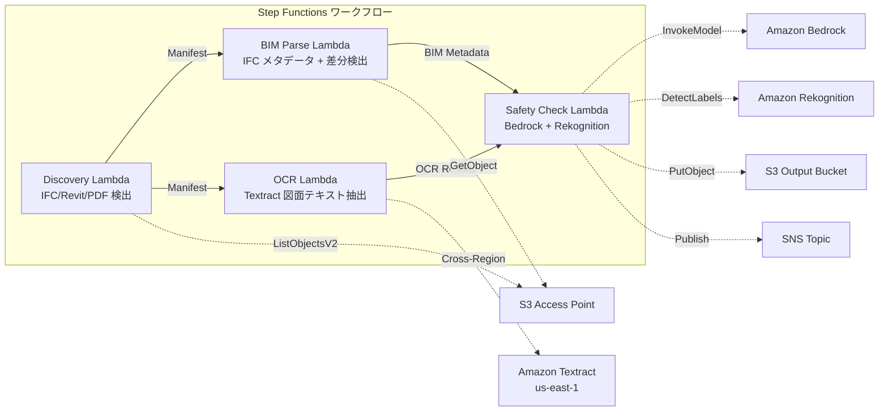

# UC10: 건설 / AEC — BIM 모델 관리 및 도면 OCR, 안전 컴플라이언스

🌐 **Language / 言語**: [日本語](README.md) | [English](README.en.md) | 한국어 | [简体中文](README.zh-CN.md) | [繁體中文](README.zh-TW.md) | [Français](README.fr.md) | [Deutsch](README.de.md) | [Español](README.es.md)

## 개요
FSx for NetApp ONTAP의 S3 Access Points를 활용하여 BIM 모델(IFC/Revit)의 버전 관리, 도면 PDF의 OCR 텍스트 추출, 안전 컴플라이언스 체크를 자동화하는 서버리스 워크플로우입니다.
### 이 패턴이 적합한 경우
- BIM 모델(IFC/Revit)과 도면 PDF가 FSx ONTAP에 저장되어 있습니다
- IFC 파일의 메타데이터(프로젝트 이름, 건축 요소 수, 층 수)를 자동으로 카탈로그화하고 싶습니다
- BIM 모델 버전 간 차이(요소 추가, 삭제, 변경)를 자동으로 감지하고 싶습니다
- 도면 PDF에서 Textract를 사용하여 텍스트와 테이블을 추출하고 싶습니다
- 안전 규정 준수 규칙(화재 탈출, 구조 하중, 자재 기준)의 자동 검사가 필요합니다
### 이 패턴이 적합하지 않은 경우
- 실시간 BIM 협업 (Revit Server / BIM 360이 적합)
- 완전한 구조 해석 시뮬레이션 (FEM 소프트웨어 필요)
- 대규모 3D 렌더링 처리 (EC2/GPU 인스턴스가 적합)
- ONTAP REST API에 대한 네트워크 접근이 불가능한 환경
### 주요 기능
- S3 AP를 통한 IFC/Revit/PDF 파일 자동 검출
- IFC 메타데이터 추출(project_name, building_elements_count, floor_count, coordinate_system, ifc_schema_version)
- 버전 간 차이 검출(element additions, deletions, modifications)
- Textract(크로스 리전)을 통한 도면 PDF의 OCR 텍스트 및 테이블 추출
- Bedrock을 통한 안전 규정 준수 규칙 체크
- Rekognition을 통한 도면 이미지의 안전 관련 시각 요소 검출(비상구, 소화기, 위험 구역)
## 아키텍처



### 워크플로우 단계
1. **Discovery**: S3 AP에서.ifc,.rvt,.pdf 파일 검색
2. **BIM Parse**: IFC 파일 메타데이터 추출 및 버전 간 차이점 검색
3. **OCR**: Textract(크로스리전)를 사용하여 도면 PDF에서 텍스트 및 테이블 추출
4. **Safety Check**: Bedrock에서 안전 규정 준수 규칙 검사, Rekognition으로 시각 요소 검출
## 전제 조건
- AWS 계정과 적절한 IAM 권한
- NetApp ONTAP용 FSx 파일 시스템(ONTAP 9.17.1P4D3 이상)
- S3 액세스 포인트가 활성화된 볼륨(BIM 모델 및 도면 저장)
- VPC, 프라이빗 서브넷
- Amazon Bedrock 모델 액세스 활성화(Claude / Nova)
- **크로스 리전**: Textract는 ap-northeast-1을 지원하지 않으므로 us-east-1로의 크로스 리전 호출 필요
## 배포 절차

### 1. 크로스 리전 파라미터 확인
Textract는 도쿄 리전을 지원하지 않으므로, `CrossRegionTarget` 파라미터로 크로스 리전 호출을 설정합니다.
### 2. CloudFormation 배포

```bash
aws cloudformation deploy \
  --template-file construction-bim/template.yaml \
  --stack-name fsxn-construction-bim \
  --parameter-overrides \
    S3AccessPointAlias=<your-volume-ext-s3alias> \
    S3AccessPointName=<your-s3ap-name> \
    VpcId=<your-vpc-id> \
    PrivateSubnetIds=<subnet-1>,<subnet-2> \
    ScheduleExpression="rate(1 hour)" \
    NotificationEmail=<your-email@example.com> \
    CrossRegionTarget=us-east-1 \
    EnableVpcEndpoints=false \
    EnableCloudWatchAlarms=false \
  --capabilities CAPABILITY_IAM CAPABILITY_AUTO_EXPAND \
  --region ap-northeast-1
```

## 설정 매개변수 목록

| パラメータ | 説明 | デフォルト | 必須 |
|-----------|------|----------|------|
| `S3AccessPointAlias` | FSx ONTAP S3 AP Alias（入力用） | — | ✅ |
| `S3AccessPointName` | S3 AP 名（ARN ベースの IAM 権限付与用。省略時は Alias ベースのみ） | `""` | ⚠️ 推奨 |
| `ScheduleExpression` | EventBridge Scheduler のスケジュール式 | `rate(1 hour)` | |
| `VpcId` | VPC ID | — | ✅ |
| `PrivateSubnetIds` | プライベートサブネット ID リスト | — | ✅ |
| `NotificationEmail` | SNS 通知先メールアドレス | — | ✅ |
| `CrossRegionTarget` | Textract のターゲットリージョン | `us-east-1` | |
| `MapConcurrency` | Map ステートの並列実行数 | `10` | |
| `LambdaMemorySize` | Lambda メモリサイズ (MB) | `1024` | |
| `LambdaTimeout` | Lambda タイムアウト (秒) | `300` | |
| `EnableVpcEndpoints` | Interface VPC Endpoints の有効化 | `false` | |
| `EnableCloudWatchAlarms` | CloudWatch Alarms の有効化 | `false` | |
| `EnableSnapStart` | Lambda SnapStart 활성화 (콜드 스타트 단축) | `false` | |

## 정리

```bash
aws s3 rm s3://fsxn-construction-bim-output-${AWS_ACCOUNT_ID} --recursive

aws cloudformation delete-stack \
  --stack-name fsxn-construction-bim \
  --region ap-northeast-1

aws cloudformation wait stack-delete-complete \
  --stack-name fsxn-construction-bim \
  --region ap-northeast-1
```

## 지원되는 리전
UC10은 다음 서비스를 사용합니다:
| サービス | リージョン制約 |
|---------|-------------|
| Amazon Textract | ap-northeast-1 非対応。`TEXTRACT_REGION` パラメータで対応リージョン（us-east-1 等）を指定 |
| Amazon Bedrock | 対応リージョンを確認（[Bedrock 対応リージョン](https://docs.aws.amazon.com/general/latest/gr/bedrock.html)） |
| Amazon Rekognition | ほぼ全リージョンで利用可能 |
| AWS X-Ray | ほぼ全リージョンで利用可能 |
| CloudWatch EMF | ほぼ全リージョンで利用可能 |
> Cross-Region Client을 통해 Textract API를 호출합니다. 데이터 레지던시 요건을 확인하세요. 자세한 내용은 [리전 호환성 매트릭스](../docs/region-compatibility.md)를 참조하세요.
## 참조 링크
- [FSx ONTAP S3 액세스 포인트 개요](https://docs.aws.amazon.com/fsx/latest/ONTAPGuide/accessing-data-via-s3-access-points.html)
- [Amazon Textract 문서](https://docs.aws.amazon.com/textract/latest/dg/what-is.html)
- [IFC 형식 사양 (buildingSMART)](https://www.buildingsmart.org/standards/bsi-standards/industry-foundation-classes/)
- [Amazon Rekognition 레이블 감지](https://docs.aws.amazon.com/rekognition/latest/dg/labels.html)