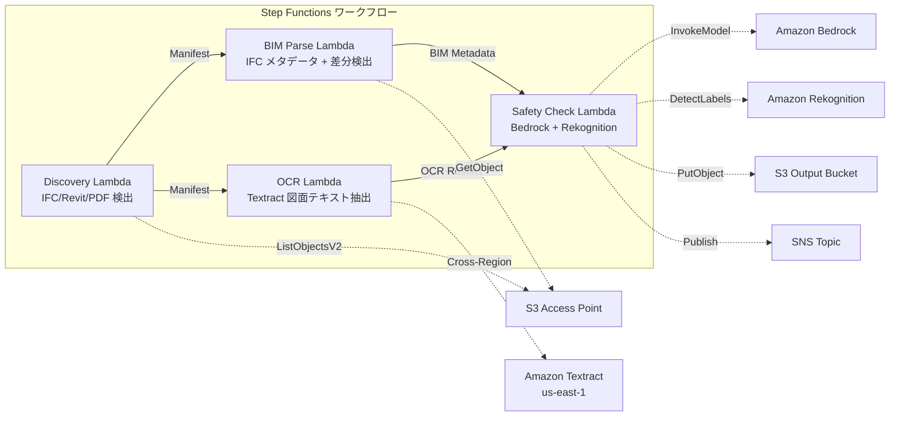

# UC10: 建設 / AEC — BIM モデル管理・図面 OCR・安全コンプライアンス

## 概要

FSx for NetApp ONTAP の S3 Access Points を活用し、BIM モデル（IFC/Revit）のバージョン管理、図面 PDF の OCR テキスト抽出、安全コンプライアンスチェックを自動化するサーバーレスワークフローです。

### このパターンが適しているケース

- BIM モデル（IFC/Revit）や図面 PDF が FSx ONTAP 上に蓄積されている
- IFC ファイルのメタデータ（プロジェクト名、建築要素数、階数）を自動カタログ化したい
- BIM モデルのバージョン間差分（要素の追加・削除・変更）を自動検出したい
- 図面 PDF から Textract でテキスト・テーブルを抽出したい
- 安全コンプライアンスルール（防火避難、構造荷重、材料基準）の自動チェックが必要

### このパターンが適さないケース

- リアルタイムの BIM コラボレーション（Revit Server / BIM 360 が適切）
- 完全な構造解析シミュレーション（FEM ソフトウェアが必要）
- 大規模な 3D レンダリング処理（EC2/GPU インスタンスが適切）
- ONTAP REST API へのネットワーク到達性が確保できない環境

### 主な機能

- S3 AP 経由で IFC/Revit/PDF ファイルを自動検出
- IFC メタデータ抽出（project_name, building_elements_count, floor_count, coordinate_system, ifc_schema_version）
- バージョン間差分検出（element additions, deletions, modifications）
- Textract（クロスリージョン）による図面 PDF の OCR テキスト・テーブル抽出
- Bedrock による安全コンプライアンスルールチェック
- Rekognition による図面画像の安全関連視覚要素検出（非常口、消火器、危険区域）

## アーキテクチャ



### ワークフローステップ

1. **Discovery**: S3 AP から .ifc, .rvt, .pdf ファイルを検出
2. **BIM Parse**: IFC ファイルのメタデータ抽出とバージョン間差分検出
3. **OCR**: Textract（クロスリージョン）で図面 PDF からテキスト・テーブル抽出
4. **Safety Check**: Bedrock で安全コンプライアンスルールチェック、Rekognition で視覚要素検出

## 前提条件

- AWS アカウントと適切な IAM 権限
- FSx for NetApp ONTAP ファイルシステム（ONTAP 9.17.1P4D3 以上）
- S3 Access Point が有効化されたボリューム（BIM モデル・図面を格納）
- VPC、プライベートサブネット
- Amazon Bedrock モデルアクセスが有効（Claude / Nova）
- **クロスリージョン**: Textract は ap-northeast-1 非対応のため、us-east-1 へのクロスリージョン呼び出しが必要

## デプロイ手順

### 1. クロスリージョンパラメータの確認

Textract は東京リージョン非対応のため、`CrossRegionTarget` パラメータでクロスリージョン呼び出しを設定します。

### 2. CloudFormation デプロイ

```bash
aws cloudformation deploy \
  --template-file construction-bim/template.yaml \
  --stack-name fsxn-construction-bim \
  --parameter-overrides \
    S3AccessPointAlias=<your-volume-ext-s3alias> \
    VpcId=<your-vpc-id> \
    PrivateSubnetIds=<subnet-1>,<subnet-2> \
    ScheduleExpression="rate(1 hour)" \
    NotificationEmail=<your-email@example.com> \
    CrossRegionTarget=us-east-1 \
    EnableVpcEndpoints=false \
    EnableCloudWatchAlarms=false \
  --capabilities CAPABILITY_IAM CAPABILITY_AUTO_EXPAND \
  --region ap-northeast-1
```

## 設定パラメータ一覧

| パラメータ | 説明 | デフォルト | 必須 |
|-----------|------|----------|------|
| `S3AccessPointAlias` | FSx ONTAP S3 AP Alias（入力用） | — | ✅ |
| `ScheduleExpression` | EventBridge Scheduler のスケジュール式 | `rate(1 hour)` | |
| `VpcId` | VPC ID | — | ✅ |
| `PrivateSubnetIds` | プライベートサブネット ID リスト | — | ✅ |
| `NotificationEmail` | SNS 通知先メールアドレス | — | ✅ |
| `CrossRegionTarget` | Textract のターゲットリージョン | `us-east-1` | |
| `MapConcurrency` | Map ステートの並列実行数 | `10` | |
| `LambdaMemorySize` | Lambda メモリサイズ (MB) | `1024` | |
| `LambdaTimeout` | Lambda タイムアウト (秒) | `300` | |
| `EnableVpcEndpoints` | Interface VPC Endpoints の有効化 | `false` | |
| `EnableCloudWatchAlarms` | CloudWatch Alarms の有効化 | `false` | |

## クリーンアップ

```bash
aws s3 rm s3://fsxn-construction-bim-output-${AWS_ACCOUNT_ID} --recursive

aws cloudformation delete-stack \
  --stack-name fsxn-construction-bim \
  --region ap-northeast-1

aws cloudformation wait stack-delete-complete \
  --stack-name fsxn-construction-bim \
  --region ap-northeast-1
```

## Supported Regions

UC10 は以下のサービスを使用します:

| サービス | リージョン制約 |
|---------|-------------|
| Amazon Textract | ap-northeast-1 非対応。`TEXTRACT_REGION` パラメータで対応リージョン（us-east-1 等）を指定 |
| Amazon Bedrock | 対応リージョンを確認（[Bedrock 対応リージョン](https://docs.aws.amazon.com/general/latest/gr/bedrock.html)） |
| Amazon Rekognition | ほぼ全リージョンで利用可能 |
| AWS X-Ray | ほぼ全リージョンで利用可能 |
| CloudWatch EMF | ほぼ全リージョンで利用可能 |

> Cross-Region Client 経由で Textract API を呼び出します。データレジデンシー要件を確認してください。詳細は [リージョン互換性マトリックス](../docs/region-compatibility.md) を参照。

## 参考リンク

- [FSx ONTAP S3 Access Points 概要](https://docs.aws.amazon.com/fsx/latest/ONTAPGuide/accessing-data-via-s3-access-points.html)
- [Amazon Textract ドキュメント](https://docs.aws.amazon.com/textract/latest/dg/what-is.html)
- [IFC フォーマット仕様 (buildingSMART)](https://www.buildingsmart.org/standards/bsi-standards/industry-foundation-classes/)
- [Amazon Rekognition ラベル検出](https://docs.aws.amazon.com/rekognition/latest/dg/labels.html)
