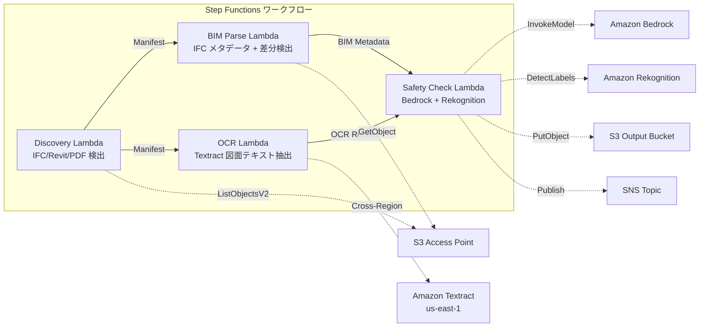

# UC10: 建筑 / AEC — BIM 模型管理・图纸 OCR・安全合规

🌐 **Language / 言語**: [日本語](README.md) | [English](README.en.md) | [한국어](README.ko.md) | 简体中文 | [繁體中文](README.zh-TW.md) | [Français](README.fr.md) | [Deutsch](README.de.md) | [Español](README.es.md)

## 概述
利用 FSx for NetApp ONTAP 的 S3 Access Points，实现无服务器工作流程，用于 BIM 模型（IFC/Revit）的版本管理、图纸 PDF 的 OCR 文本提取以及安全合规性检查的自动化。
### 适用于这种模式的情况
- BIM 模型（IFC/Revit）和图纸 PDF 已经存储在 FSx ONTAP 上
- 希望自动编目 IFC 文件的元数据（项目名称、建筑元素数量、楼层数）
- 希望自动检测 BIM 模型的版本差异（元素的添加、删除、修改）
- 希望从图纸 PDF 中使用 Textract 提取文本和表格
- 需要自动检查安全合规性规则（防火疏散、结构荷载、材料标准）
### 不适合的情况
- 实时 BIM 协作（适合使用 Revit Server / BIM 360）
- 完整的结构分析模拟（需要 FEM 软件）
- 大规模 3D 渲染处理（适合使用 EC2/GPU 实例）
- 环境中无法确保对 ONTAP REST API 的网络访问
### 主要功能
- 通过 S3 AP 自动检测 IFC/Revit/PDF 文件
- IFC 元数据提取（project_name, building_elements_count, floor_count, coordinate_system, ifc_schema_version）
- 版本差异检测（element additions, deletions, modifications）
- 使用 Textract（跨地区）从图纸 PDF 中提取 OCR 文本和表格
- 使用 Bedrock 检查安全合规性规则
- 使用 Rekognition 从图纸图像中检测安全相关的视觉元素（紧急出口、灭火器、危险区域）
## 架构



### 工作流程步骤

使用 Amazon Bedrock 和 AWS Step Functions 来创建自定义工作流。确保在 Amazon S3 中存储输入数据，并使用 AWS Lambda 处理数据。为了监控整个流程，可以使用 Amazon CloudWatch。所有资源可以通过 AWS CloudFormation 进行管理。使用 Amazon FSx for NetApp ONTAP 来处理文件存储需求，并利用 Amazon Athena 进行数据分析。
1. **发现**：从 S3 AP 检测.ifc、.rvt、.pdf 文件
2. **BIM 解析**：IFC 文件元数据提取和版本差异检测
3. **OCR**：使用 Textract（跨区域）从图纸 PDF 中提取文本和表格
4. **安全检查**：使用 Bedrock 检查安全合规性规则，使用 Rekognition 检测视觉元素
## 前提条件
- AWS 账户和适当的 IAM 权限
- FSx for NetApp ONTAP 文件系统（ONTAP 9.17.1P4D3 及以上版本）
- 已启用 S3 Access Point 的卷（存储 BIM 模型和图纸）
- VPC、私有子网
- Amazon Bedrock 模型访问已启用（Claude / Nova）
- **跨区域**: 由于 Textract 不支持 ap-northeast-1，因此需要跨区域调用 us-east-1
## 部署步骤

### 1. 跨区域参数的确认
Textract 不支持东京区域，因此使用 `CrossRegionTarget` 参数来设置跨区域调用。
### 2. CloudFormation 部署

```bash
aws cloudformation deploy \
  --template-file construction-bim/template.yaml \
  --stack-name fsxn-construction-bim \
  --parameter-overrides \
    S3AccessPointAlias=<your-volume-ext-s3alias> \
    S3AccessPointName=<your-s3ap-name> \
    VpcId=<your-vpc-id> \
    PrivateSubnetIds=<subnet-1>,<subnet-2> \
    ScheduleExpression="rate(1 hour)" \
    NotificationEmail=<your-email@example.com> \
    CrossRegionTarget=us-east-1 \
    EnableVpcEndpoints=false \
    EnableCloudWatchAlarms=false \
  --capabilities CAPABILITY_IAM CAPABILITY_AUTO_EXPAND \
  --region ap-northeast-1
```

## 设置参数列表

| パラメータ | 説明 | デフォルト | 必須 |
|-----------|------|----------|------|
| `S3AccessPointAlias` | FSx ONTAP S3 AP Alias（入力用） | — | ✅ |
| `S3AccessPointName` | S3 AP 名（ARN ベースの IAM 権限付与用。省略時は Alias ベースのみ） | `""` | ⚠️ 推奨 |
| `ScheduleExpression` | EventBridge Scheduler のスケジュール式 | `rate(1 hour)` | |
| `VpcId` | VPC ID | — | ✅ |
| `PrivateSubnetIds` | プライベートサブネット ID リスト | — | ✅ |
| `NotificationEmail` | SNS 通知先メールアドレス | — | ✅ |
| `CrossRegionTarget` | Textract のターゲットリージョン | `us-east-1` | |
| `MapConcurrency` | Map ステートの並列実行数 | `10` | |
| `LambdaMemorySize` | Lambda メモリサイズ (MB) | `1024` | |
| `LambdaTimeout` | Lambda タイムアウト (秒) | `300` | |
| `EnableVpcEndpoints` | Interface VPC Endpoints の有効化 | `false` | |
| `EnableCloudWatchAlarms` | CloudWatch Alarms の有効化 | `false` | |

## 清理

```bash
aws s3 rm s3://fsxn-construction-bim-output-${AWS_ACCOUNT_ID} --recursive

aws cloudformation delete-stack \
  --stack-name fsxn-construction-bim \
  --region ap-northeast-1

aws cloudformation wait stack-delete-complete \
  --stack-name fsxn-construction-bim \
  --region ap-northeast-1
```

## 支持的区域
UC10 使用以下服务：
| サービス | リージョン制約 |
|---------|-------------|
| Amazon Textract | ap-northeast-1 非対応。`TEXTRACT_REGION` パラメータで対応リージョン（us-east-1 等）を指定 |
| Amazon Bedrock | 対応リージョンを確認（[Bedrock 対応リージョン](https://docs.aws.amazon.com/general/latest/gr/bedrock.html)） |
| Amazon Rekognition | ほぼ全リージョンで利用可能 |
| AWS X-Ray | ほぼ全リージョンで利用可能 |
| CloudWatch EMF | ほぼ全リージョンで利用可能 |
> 通过跨区域客户端调用 Textract API。请确认数据驻留要求。有关详细信息，请参阅 [区域兼容性矩阵](../docs/region-compatibility.md)。
## 参考链接
- [FSx ONTAP S3 访问点概述](https://docs.aws.amazon.com/fsx/latest/ONTAPGuide/accessing-data-via-s3-access-points.html)
- [Amazon Textract 文档](https://docs.aws.amazon.com/textract/latest/dg/what-is.html)
- [IFC 格式规范 (buildingSMART)](https://www.buildingsmart.org/standards/bsi-standards/industry-foundation-classes/)
- [Amazon Rekognition 标签检测](https://docs.aws.amazon.com/rekognition/latest/dg/labels.html)