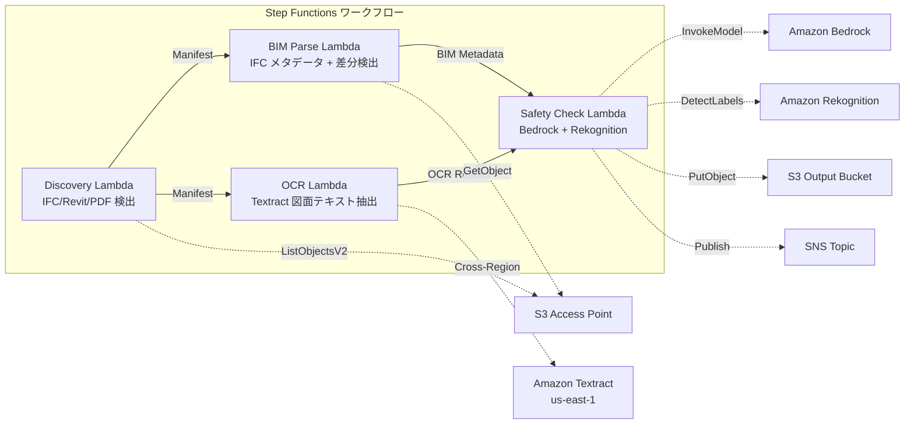

# UC10：建築 / AEC — BIM 模型管理・圖面 OCR・安全合規

🌐 **Language / 言語**: [日本語](README.md) | [English](README.en.md) | [한국어](README.ko.md) | [简体中文](README.zh-CN.md) | 繁體中文 | [Français](README.fr.md) | [Deutsch](README.de.md) | [Español](README.es.md)

## 概述
利用 NetApp ONTAP 的 FSx 的 S3 Access Points，無伺服器工作流程可自動化 BIM 模型（IFC/Revit）的版本控制、圖紙 PDF 的 OCR 文字提取和安全合規性檢查。
### 適用這種模式的情況
- BIM 模型（IFC/Revit）和圖紙 PDF 已在 FSx ONTAP 上儲存
- 希望自動編目 IFC 文件的元數據（項目名稱、建築元數、樓層數）
- 希望自動檢測 BIM 模型的版本差異（元素的新增、刪除、修改）
- 希望使用 Textract 從圖紙 PDF 中提取文本和表格
- 需要自動檢查安全合規規則（防火疏散、結構負荷、材料標準）
### 不适用的情况
- 實時 BIM 協作（適合 Revit Server / BIM 360）
- 完整的結構分析模擬（需要 FEM 軟體）
- 大規模 3D 渲染處理（適合 EC2/GPU 執行個體）
- 環境無法確保到 ONTAP REST API 的網路連接
### 主要功能
- 通過 S3 AP 自動檢測 IFC/Revit/PDF 檔案
- IFC 元數據抽取（project_name、building_elements_count、floor_count、coordinate_system、ifc_schema_version）
- 版本間差異檢測（element additions、deletions、modifications）
- 透過 Textract（跨區域）從圖紙 PDF 提取 OCR 文本和表格
- 通過 Bedrock 進行安全合規規則檢查
- 使用 Rekognition 從圖紙圖像中檢測安全相關的視覺元素（出口、滅火器、危險區域）
## 架構



### 工作流程步驟
1. **探索**：從 S3 AP 中檢測.ifc、.rvt、.pdf 檔案
2. **BIM 解析**：從 IFC 檔案中提取元數據並檢測版本間差異
3. **OCR**：使用 Textract（跨區域）從圖紙 PDF 中提取文字和表格
4. **安全檢查**：使用 Bedrock 檢查安全合規規則，使用 Rekognition 檢測視覺元素
## 前提條件
- AWS 帳戶和適當的 IAM 權限
- FSx for NetApp ONTAP 文件系統（ONTAP 9.17.1P4D3 及以上版本）
- 已啟用的 S3 Access Point 的卷（用於存儲 BIM 模型和圖紙）
- VPC、私有子網
- Amazon Bedrock 模型訪問已啟用（Claude / Nova）
- **跨區域**: Textract 不支援 ap-northeast-1，因此需要跨區域呼叫 us-east-1
## 部署步驟

### 1. 確認跨區域參數
Textract 不支援東京區域，因此要在 `CrossRegionTarget` 參數中設定跨區域呼叫。
### 2. CloudFormation 部署

```bash
aws cloudformation deploy \
  --template-file construction-bim/template.yaml \
  --stack-name fsxn-construction-bim \
  --parameter-overrides \
    S3AccessPointAlias=<your-volume-ext-s3alias> \
    S3AccessPointName=<your-s3ap-name> \
    VpcId=<your-vpc-id> \
    PrivateSubnetIds=<subnet-1>,<subnet-2> \
    ScheduleExpression="rate(1 hour)" \
    NotificationEmail=<your-email@example.com> \
    CrossRegionTarget=us-east-1 \
    EnableVpcEndpoints=false \
    EnableCloudWatchAlarms=false \
  --capabilities CAPABILITY_IAM CAPABILITY_AUTO_EXPAND \
  --region ap-northeast-1
```

## 設定參數清單

| パラメータ | 説明 | デフォルト | 必須 |
|-----------|------|----------|------|
| `S3AccessPointAlias` | FSx ONTAP S3 AP Alias（入力用） | — | ✅ |
| `S3AccessPointName` | S3 AP 名（ARN ベースの IAM 権限付与用。省略時は Alias ベースのみ） | `""` | ⚠️ 推奨 |
| `ScheduleExpression` | EventBridge Scheduler のスケジュール式 | `rate(1 hour)` | |
| `VpcId` | VPC ID | — | ✅ |
| `PrivateSubnetIds` | プライベートサブネット ID リスト | — | ✅ |
| `NotificationEmail` | SNS 通知先メールアドレス | — | ✅ |
| `CrossRegionTarget` | Textract のターゲットリージョン | `us-east-1` | |
| `MapConcurrency` | Map ステートの並列実行数 | `10` | |
| `LambdaMemorySize` | Lambda メモリサイズ (MB) | `1024` | |
| `LambdaTimeout` | Lambda タイムアウト (秒) | `300` | |
| `EnableVpcEndpoints` | Interface VPC Endpoints の有効化 | `false` | |
| `EnableCloudWatchAlarms` | CloudWatch Alarms の有効化 | `false` | |

## 清理

```bash
aws s3 rm s3://fsxn-construction-bim-output-${AWS_ACCOUNT_ID} --recursive

aws cloudformation delete-stack \
  --stack-name fsxn-construction-bim \
  --region ap-northeast-1

aws cloudformation wait stack-delete-complete \
  --stack-name fsxn-construction-bim \
  --region ap-northeast-1
```

## 支援的區域
UC10 使用以下服務：
| サービス | リージョン制約 |
|---------|-------------|
| Amazon Textract | ap-northeast-1 非対応。`TEXTRACT_REGION` パラメータで対応リージョン（us-east-1 等）を指定 |
| Amazon Bedrock | 対応リージョンを確認（[Bedrock 対応リージョン](https://docs.aws.amazon.com/general/latest/gr/bedrock.html)） |
| Amazon Rekognition | ほぼ全リージョンで利用可能 |
| AWS X-Ray | ほぼ全リージョンで利用可能 |
| CloudWatch EMF | ほぼ全リージョンで利用可能 |
> 透過跨區域用戶端呼叫 Textract API。請確認資料駐留要求。詳細資訊請參閱 [區域相容性矩陣](../docs/region-compatibility.md)。
## 參考連結
- [FSx ONTAP S3 存取點概觀](https://docs.aws.amazon.com/fsx/latest/ONTAPGuide/accessing-data-via-s3-access-points.html)
- [Amazon Textract 文件](https://docs.aws.amazon.com/textract/latest/dg/what-is.html)
- [IFC 格式規範 (buildingSMART)](https://www.buildingsmart.org/standards/bsi-standards/industry-foundation-classes/)
- [Amazon Rekognition 標籤偵測](https://docs.aws.amazon.com/rekognition/latest/dg/labels.html)