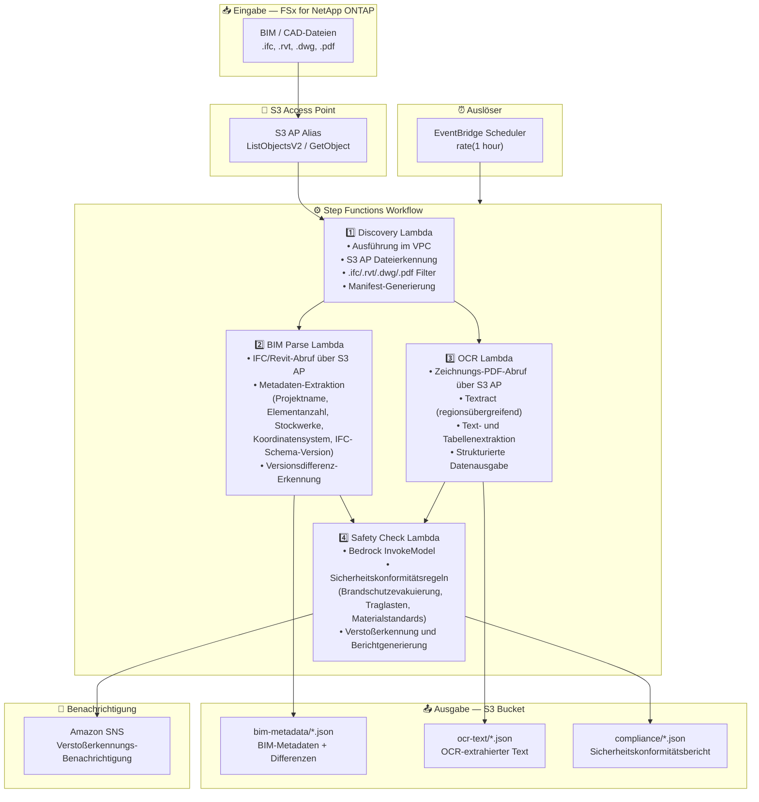

# UC10: Bauwesen/AEC — BIM-Modellverwaltung, Zeichnungs-OCR & Sicherheitskonformität

🌐 **Language / 言語**: [日本語](architecture.md) | [English](architecture.en.md) | [한국어](architecture.ko.md) | [简体中文](architecture.zh-CN.md) | [繁體中文](architecture.zh-TW.md) | [Français](architecture.fr.md) | Deutsch | [Español](architecture.es.md)

## End-to-End-Architektur (Eingabe → Ausgabe)

---

## Architekturdiagramm

---

## Datenfluss im Detail

### Eingabe
| Element | Beschreibung |
|---------|--------------|
| **Quelle** | FSx for NetApp ONTAP Volume |
| **Dateitypen** | .ifc, .rvt, .dwg, .pdf (BIM-Modelle, CAD-Zeichnungen, Zeichnungs-PDFs) |
| **Zugriffsmethode** | S3 Access Point (ListObjectsV2 + GetObject) |
| **Lesestrategie** | Vollständiger Dateiabruf (erforderlich für Metadaten-Extraktion und OCR) |

### Verarbeitung
| Schritt | Service | Funktion |
|---------|---------|----------|
| Erkennung | Lambda (VPC) | BIM/CAD-Dateien über S3 AP erkennen, Manifest generieren |
| BIM-Analyse | Lambda | IFC/Revit-Metadaten-Extraktion, Versionsdifferenz-Erkennung |
| OCR | Lambda + Textract | Zeichnungs-PDF Text- und Tabellenextraktion (regionsübergreifend) |
| Sicherheitsprüfung | Lambda + Bedrock | Sicherheitskonformitätsregeln prüfen, Verstoßerkennung |

### Ausgabe
| Artefakt | Format | Beschreibung |
|----------|--------|--------------|
| BIM-Metadaten | `bim-metadata/YYYY/MM/DD/{stem}.json` | Metadaten + Versionsdifferenzen |
| OCR-Text | `ocr-text/YYYY/MM/DD/{stem}.json` | Textract-extrahierter Text und Tabellen |
| Konformitätsbericht | `compliance/YYYY/MM/DD/{stem}_safety.json` | Sicherheitskonformitätsbericht |
| SNS-Benachrichtigung | Email / Slack | Sofortige Benachrichtigung bei Verstoßerkennung |

---

## Wichtige Designentscheidungen

1. **S3 AP statt NFS** — Kein NFS-Mount von Lambda erforderlich; BIM/CAD-Dateien werden über die S3-API abgerufen
2. **BIM Parse + OCR parallele Ausführung** — IFC-Metadaten-Extraktion und Zeichnungs-OCR laufen parallel, beide Ergebnisse werden für die Sicherheitsprüfung aggregiert
3. **Textract regionsübergreifend** — Regionsübergreifender Aufruf für Regionen, in denen Textract nicht verfügbar ist
4. **Bedrock für Sicherheitskonformität** — LLM-basierte Regelprüfung für Brandschutzevakuierung, Traglasten und Materialstandards
5. **Versionsdifferenz-Erkennung** — Automatische Erkennung von Element-Hinzufügungen/-Löschungen/-Änderungen in IFC-Modellen für effizientes Änderungsmanagement
6. **Polling (nicht ereignisgesteuert)** — S3 AP unterstützt keine Ereignisbenachrichtigungen, daher wird eine periodische geplante Ausführung verwendet

---

## Verwendete AWS-Services

| Service | Rolle |
|---------|-------|
| FSx for NetApp ONTAP | BIM/CAD-Projektspeicher |
| S3 Access Points | Serverloser Zugriff auf ONTAP-Volumes |
| EventBridge Scheduler | Periodischer Auslöser |
| Step Functions | Workflow-Orchestrierung |
| Lambda | Compute (Discovery, BIM Parse, OCR, Safety Check) |
| Amazon Textract | Zeichnungs-PDF OCR Text- und Tabellenextraktion |
| Amazon Bedrock | Sicherheitskonformitätsprüfung (Claude / Nova) |
| SNS | Verstoßerkennungs-Benachrichtigung |
| Secrets Manager | ONTAP REST API Anmeldedatenverwaltung |
| CloudWatch + X-Ray | Observability |
