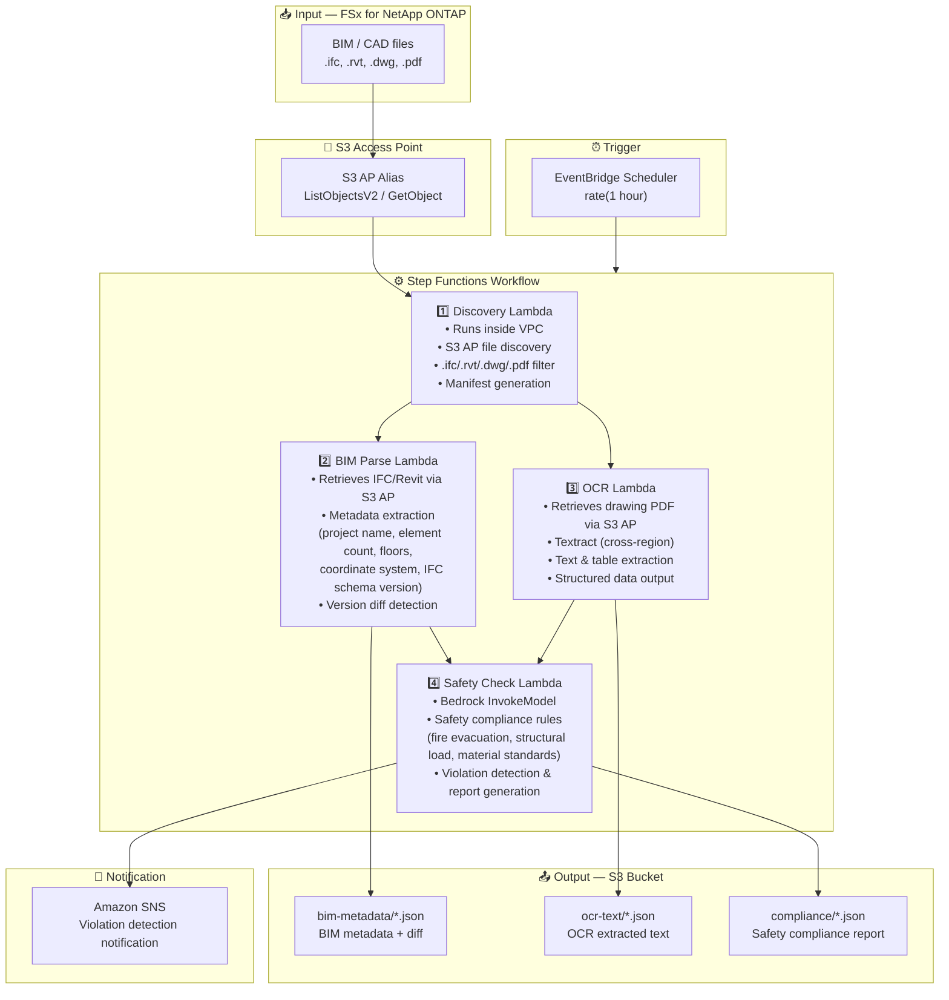

# UC10: Construction / AEC — BIM Model Management, Drawing OCR & Safety Compliance

🌐 **Language / 言語**: [日本語](architecture.md) | English | [한국어](architecture.ko.md) | [简体中文](architecture.zh-CN.md) | [繁體中文](architecture.zh-TW.md) | [Français](architecture.fr.md) | [Deutsch](architecture.de.md) | [Español](architecture.es.md)

## End-to-End Architecture (Input → Output)

---

## High-Level Flow

```
┌─────────────────────────────────────────────────────────────────────────────┐
│                         FSx for NetApp ONTAP                                 │
│                                                                              │
│  /vol/bim_projects/                                                          │
│  ├── models/building_A_v3.ifc         (IFC BIM model)                        │
│  ├── models/building_A_v3.rvt         (Revit file)                           │
│  ├── drawings/floor_plan_1F.dwg       (AutoCAD drawing)                      │
│  └── drawings/safety_plan.pdf         (Safety plan drawing PDF)              │
│                                                                              │
└──────────────────────────────────┬───────────────────────────────────────────┘
                                   │
                                   ▼
┌──────────────────────────────────────────────────────────────────────────────┐
│                      S3 Access Point (Data Path)                              │
│                                                                              │
│  Alias: fsxn-bim-vol-ext-s3alias                                             │
│  • ListObjectsV2 (BIM/CAD file discovery)                                    │
│  • GetObject (IFC/RVT/DWG/PDF retrieval)                                     │
│  • No NFS/SMB mount required from Lambda                                     │
│                                                                              │
└──────────────────────────────────┬───────────────────────────────────────────┘
                                   │
                                   ▼
┌──────────────────────────────────────────────────────────────────────────────┐
│                    EventBridge Scheduler (Trigger)                            │
│                                                                              │
│  Schedule: rate(1 hour) — configurable                                       │
│  Target: Step Functions State Machine                                        │
│                                                                              │
└──────────────────────────────────┬───────────────────────────────────────────┘
                                   │
                                   ▼
┌──────────────────────────────────────────────────────────────────────────────┐
│                    AWS Step Functions (Orchestration)                         │
│                                                                              │
│  ┌───────────┐  ┌──────────────┐  ┌──────────────┐  ┌──────────────────┐   │
│  │ Discovery  │─▶│ BIM Parse    │─▶│    OCR       │─▶│  Safety Check    │   │
│  │ Lambda     │  │ Lambda       │  │ Lambda       │  │  Lambda          │   │
│  │           │  │             │  │             │  │                 │   │
│  │ • VPC内    │  │ • IFC meta- │  │ • Textract   │  │ • Bedrock        │   │
│  │ • S3 AP   │  │   data      │  │ • Drawing    │  │ • Safety         │   │
│  │ • IFC/RVT │  │   extraction│  │   text       │  │   compliance     │   │
│  │   /DWG/PDF│  │ • Version   │  │   extraction │  │   check          │   │
│  └───────────┘  │   diff      │  │             │  │                 │   │
│                  └──────────────┘  └──────────────┘  └──────────────────┘   │
│                                                                              │
└──────────────────────────────────────────────────────────────────────────────┘
                                   │
                                   ▼
┌──────────────────────────────────────────────────────────────────────────────┐
│                         Output (S3 Bucket)                                    │
│                                                                              │
│  s3://{stack}-output-{account}/                                              │
│  ├── bim-metadata/YYYY/MM/DD/                                                │
│  │   └── building_A_v3.json          ← BIM metadata + diff                  │
│  ├── ocr-text/YYYY/MM/DD/                                                    │
│  │   └── safety_plan.json            ← OCR extracted text & tables          │
│  └── compliance/YYYY/MM/DD/                                                  │
│      └── building_A_v3_safety.json   ← Safety compliance report             │
│                                                                              │
└──────────────────────────────────────────────────────────────────────────────┘
```

---

## Mermaid Diagram



---

## Data Flow Detail

### Input
| Item | Description |
|------|-------------|
| **Source** | FSx for NetApp ONTAP volume |
| **File Types** | .ifc, .rvt, .dwg, .pdf (BIM models, CAD drawings, drawing PDFs) |
| **Access Method** | S3 Access Point (ListObjectsV2 + GetObject) |
| **Read Strategy** | Full file retrieval (required for metadata extraction & OCR) |

### Processing
| Step | Service | Function |
|------|---------|----------|
| Discovery | Lambda (VPC) | Discover BIM/CAD files via S3 AP, generate manifest |
| BIM Parse | Lambda | IFC/Revit metadata extraction, version diff detection |
| OCR | Lambda + Textract | Drawing PDF text & table extraction (cross-region) |
| Safety Check | Lambda + Bedrock | Safety compliance rule checking, violation detection |

### Output
| Artifact | Format | Description |
|----------|--------|-------------|
| BIM Metadata | `bim-metadata/YYYY/MM/DD/{stem}.json` | Metadata + version diff |
| OCR Text | `ocr-text/YYYY/MM/DD/{stem}.json` | Textract extracted text & tables |
| Compliance Report | `compliance/YYYY/MM/DD/{stem}_safety.json` | Safety compliance report |
| SNS Notification | Email / Slack | Immediate notification on violation detection |

---

## Key Design Decisions

1. **S3 AP over NFS** — No NFS mount needed from Lambda; BIM/CAD files retrieved via S3 API
2. **BIM Parse + OCR parallel execution** — IFC metadata extraction and drawing OCR run in parallel, both results aggregated for Safety Check
3. **Textract cross-region** — Cross-region invocation for regions where Textract is not available
4. **Bedrock for safety compliance** — LLM-based rule checking for fire evacuation, structural load, and material standards
5. **Version diff detection** — Automatic detection of element additions/deletions/changes in IFC models for efficient change management
6. **Polling (not event-driven)** — S3 AP does not support event notifications, so periodic scheduled execution is used

---

## AWS Services Used

| Service | Role |
|---------|------|
| FSx for NetApp ONTAP | BIM/CAD project storage |
| S3 Access Points | Serverless access to ONTAP volumes |
| EventBridge Scheduler | Periodic trigger |
| Step Functions | Workflow orchestration |
| Lambda | Compute (Discovery, BIM Parse, OCR, Safety Check) |
| Amazon Textract | Drawing PDF OCR text & table extraction |
| Amazon Bedrock | Safety compliance check (Claude / Nova) |
| SNS | Violation detection notification |
| Secrets Manager | ONTAP REST API credential management |
| CloudWatch + X-Ray | Observability |
