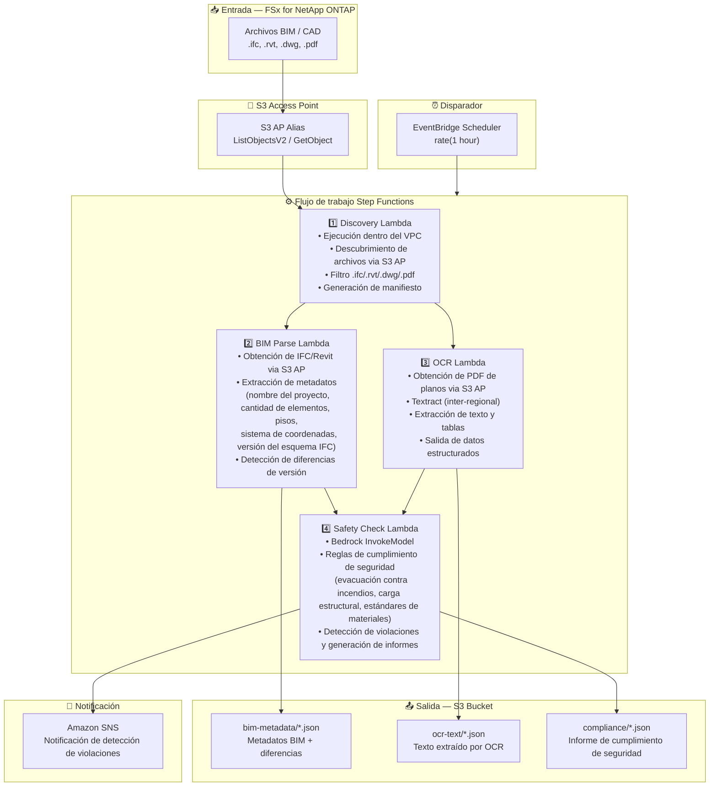

# UC10: Construcción/AEC — Gestión BIM, OCR de planos y cumplimiento de seguridad

🌐 **Language / 言語**: [日本語](architecture.md) | [English](architecture.en.md) | [한국어](architecture.ko.md) | [简体中文](architecture.zh-CN.md) | [繁體中文](architecture.zh-TW.md) | [Français](architecture.fr.md) | [Deutsch](architecture.de.md) | Español

## Arquitectura de extremo a extremo (Entrada → Salida)

---

## Flujo de alto nivel

```
┌─────────────────────────────────────────────────────────────────────────────┐
│                         FSx for NetApp ONTAP                                 │
│                                                                              │
│  /vol/bim_projects/                                                          │
│  ├── models/building_A_v3.ifc         (IFC BIM model)                        │
│  ├── models/building_A_v3.rvt         (Revit file)                           │
│  ├── drawings/floor_plan_1F.dwg       (AutoCAD drawing)                      │
│  └── drawings/safety_plan.pdf         (Safety plan drawing PDF)              │
│                                                                              │
└──────────────────────────────────┬───────────────────────────────────────────┘
                                   │
                                   ▼
┌──────────────────────────────────────────────────────────────────────────────┐
│                      S3 Access Point (Data Path)                              │
│                                                                              │
│  Alias: fsxn-bim-vol-ext-s3alias                                             │
│  • ListObjectsV2 (BIM/CAD file discovery)                                    │
│  • GetObject (IFC/RVT/DWG/PDF retrieval)                                     │
│  • No NFS/SMB mount required from Lambda                                     │
│                                                                              │
└──────────────────────────────────┬───────────────────────────────────────────┘
                                   │
                                   ▼
┌──────────────────────────────────────────────────────────────────────────────┐
│                    EventBridge Scheduler (Trigger)                            │
│                                                                              │
│  Schedule: rate(1 hour) — configurable                                       │
│  Target: Step Functions State Machine                                        │
│                                                                              │
└──────────────────────────────────┬───────────────────────────────────────────┘
                                   │
                                   ▼
┌──────────────────────────────────────────────────────────────────────────────┐
│                    AWS Step Functions (Orchestration)                         │
│                                                                              │
│  ┌───────────┐  ┌──────────────┐  ┌──────────────┐  ┌──────────────────┐   │
│  │ Discovery  │─▶│ BIM Parse    │─▶│    OCR       │─▶│  Safety Check    │   │
│  │ Lambda     │  │ Lambda       │  │ Lambda       │  │  Lambda          │   │
│  │           │  │             │  │             │  │                 │   │
│  │ • VPC内    │  │ • IFC meta- │  │ • Textract   │  │ • Bedrock        │   │
│  │ • S3 AP   │  │   data      │  │ • Drawing    │  │ • Safety         │   │
│  │ • IFC/RVT │  │   extraction│  │   text       │  │   compliance     │   │
│  │   /DWG/PDF│  │ • Version   │  │   extraction │  │   check          │   │
│  └───────────┘  │   diff      │  │             │  │                 │   │
│                  └──────────────┘  └──────────────┘  └──────────────────┘   │
│                                                                              │
└──────────────────────────────────────────────────────────────────────────────┘
                                   │
                                   ▼
┌──────────────────────────────────────────────────────────────────────────────┐
│                         Output (S3 Bucket)                                    │
│                                                                              │
│  s3://{stack}-output-{account}/                                              │
│  ├── bim-metadata/YYYY/MM/DD/                                                │
│  │   └── building_A_v3.json          ← BIM metadata + diff                  │
│  ├── ocr-text/YYYY/MM/DD/                                                    │
│  │   └── safety_plan.json            ← OCR extracted text & tables          │
│  └── compliance/YYYY/MM/DD/                                                  │
│      └── building_A_v3_safety.json   ← Safety compliance report             │
│                                                                              │
└──────────────────────────────────────────────────────────────────────────────┘
```

---

## Diagrama Mermaid



---

## Detalle del flujo de datos

### Entrada
| Elemento | Descripción |
|----------|-------------|
| **Origen** | Volumen FSx for NetApp ONTAP |
| **Tipos de archivo** | .ifc, .rvt, .dwg, .pdf (modelos BIM, dibujos CAD, PDFs de planos) |
| **Método de acceso** | S3 Access Point (ListObjectsV2 + GetObject) |
| **Estrategia de lectura** | Obtención completa del archivo (necesaria para extracción de metadatos y OCR) |

### Procesamiento
| Paso | Servicio | Función |
|------|----------|---------|
| Descubrimiento | Lambda (VPC) | Descubrir archivos BIM/CAD via S3 AP, generar manifiesto |
| Análisis BIM | Lambda | Extracción de metadatos IFC/Revit, detección de diferencias de versión |
| OCR | Lambda + Textract | Extracción de texto y tablas de PDFs de planos (inter-regional) |
| Verificación de seguridad | Lambda + Bedrock | Verificación de reglas de cumplimiento de seguridad, detección de violaciones |

### Salida
| Artefacto | Formato | Descripción |
|-----------|---------|-------------|
| Metadatos BIM | `bim-metadata/YYYY/MM/DD/{stem}.json` | Metadatos + diferencias de versión |
| Texto OCR | `ocr-text/YYYY/MM/DD/{stem}.json` | Texto y tablas extraídos por Textract |
| Informe de cumplimiento | `compliance/YYYY/MM/DD/{stem}_safety.json` | Informe de cumplimiento de seguridad |
| Notificación SNS | Email / Slack | Notificación inmediata al detectar violaciones |

---

## Decisiones de diseño clave

1. **S3 AP en lugar de NFS** — No se requiere montaje NFS desde Lambda; los archivos BIM/CAD se obtienen a través de la API S3
2. **Ejecución paralela BIM Parse + OCR** — La extracción de metadatos IFC y el OCR de planos se ejecutan en paralelo, ambos resultados se agregan para la verificación de seguridad
3. **Textract inter-regional** — Invocación inter-regional para regiones donde Textract no está disponible
4. **Bedrock para cumplimiento de seguridad** — Verificación de reglas basada en LLM para evacuación contra incendios, carga estructural y estándares de materiales
5. **Detección de diferencias de versión** — Detección automática de adiciones/eliminaciones/cambios de elementos en modelos IFC para una gestión eficiente de cambios
6. **Sondeo periódico (no basado en eventos)** — S3 AP no admite notificaciones de eventos, por lo que se utiliza ejecución programada periódica

---

## Servicios AWS utilizados

| Servicio | Rol |
|----------|-----|
| FSx for NetApp ONTAP | Almacenamiento de proyectos BIM/CAD |
| S3 Access Points | Acceso serverless a volúmenes ONTAP |
| EventBridge Scheduler | Disparador periódico |
| Step Functions | Orquestación del flujo de trabajo |
| Lambda | Cómputo (Discovery, BIM Parse, OCR, Safety Check) |
| Amazon Textract | Extracción OCR de texto y tablas de PDFs de planos |
| Amazon Bedrock | Verificación de cumplimiento de seguridad (Claude / Nova) |
| SNS | Notificación de detección de violaciones |
| Secrets Manager | Gestión de credenciales de la API REST ONTAP |
| CloudWatch + X-Ray | Observabilidad |
