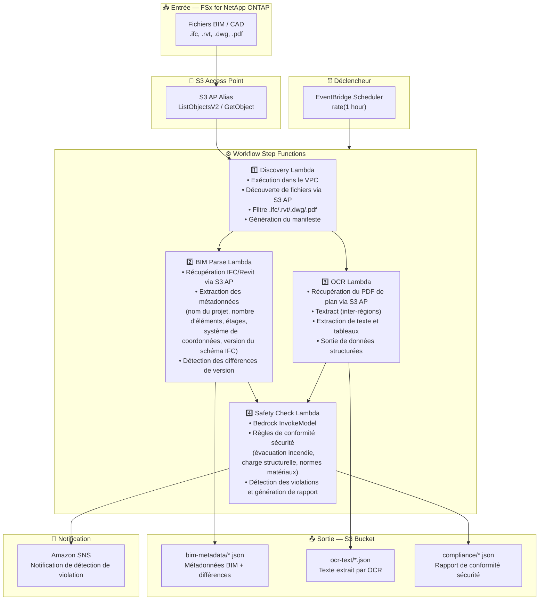

# UC10: Construction/AEC — Gestion BIM, OCR de plans et conformité sécurité

🌐 **Language / 言語**: [日本語](architecture.md) | [English](architecture.en.md) | [한국어](architecture.ko.md) | [简体中文](architecture.zh-CN.md) | [繁體中文](architecture.zh-TW.md) | Français | [Deutsch](architecture.de.md) | [Español](architecture.es.md)

## Architecture de bout en bout (Entrée → Sortie)

---

## Diagramme d'architecture

---

## Détail du flux de données

### Entrée
| Élément | Description |
|---------|-------------|
| **Source** | Volume FSx for NetApp ONTAP |
| **Types de fichiers** | .ifc, .rvt, .dwg, .pdf (modèles BIM, dessins CAD, PDF de plans) |
| **Méthode d'accès** | S3 Access Point (ListObjectsV2 + GetObject) |
| **Stratégie de lecture** | Récupération complète du fichier (nécessaire pour l'extraction de métadonnées et l'OCR) |

### Traitement
| Étape | Service | Fonction |
|-------|---------|----------|
| Découverte | Lambda (VPC) | Découverte des fichiers BIM/CAD via S3 AP, génération du manifeste |
| Analyse BIM | Lambda | Extraction des métadonnées IFC/Revit, détection des différences de version |
| OCR | Lambda + Textract | Extraction de texte et tableaux des PDF de plans (inter-régions) |
| Vérification sécurité | Lambda + Bedrock | Vérification des règles de conformité sécurité, détection des violations |

### Sortie
| Artefact | Format | Description |
|----------|--------|-------------|
| Métadonnées BIM | `bim-metadata/YYYY/MM/DD/{stem}.json` | Métadonnées + différences de version |
| Texte OCR | `ocr-text/YYYY/MM/DD/{stem}.json` | Texte et tableaux extraits par Textract |
| Rapport de conformité | `compliance/YYYY/MM/DD/{stem}_safety.json` | Rapport de conformité sécurité |
| Notification SNS | Email / Slack | Notification immédiate lors de la détection de violations |

---

## Décisions de conception clés

1. **S3 AP plutôt que NFS** — Pas de montage NFS nécessaire depuis Lambda ; les fichiers BIM/CAD sont récupérés via l'API S3
2. **Exécution parallèle BIM Parse + OCR** — L'extraction de métadonnées IFC et l'OCR des plans s'exécutent en parallèle, les résultats sont agrégés pour la vérification de sécurité
3. **Textract inter-régions** — Invocation inter-régions pour les régions où Textract n'est pas disponible
4. **Bedrock pour la conformité sécurité** — Vérification des règles basée sur LLM pour l'évacuation incendie, la charge structurelle et les normes de matériaux
5. **Détection des différences de version** — Détection automatique des ajouts/suppressions/modifications d'éléments dans les modèles IFC pour une gestion efficace des changements
6. **Interrogation périodique (non événementielle)** — S3 AP ne prend pas en charge les notifications d'événements, donc une exécution planifiée périodique est utilisée

---

## Services AWS utilisés

| Service | Rôle |
|---------|------|
| FSx for NetApp ONTAP | Stockage des projets BIM/CAD |
| S3 Access Points | Accès serverless aux volumes ONTAP |
| EventBridge Scheduler | Déclenchement périodique |
| Step Functions | Orchestration du workflow |
| Lambda | Calcul (Discovery, BIM Parse, OCR, Safety Check) |
| Amazon Textract | Extraction OCR de texte et tableaux des PDF de plans |
| Amazon Bedrock | Vérification de conformité sécurité (Claude / Nova) |
| SNS | Notification de détection de violations |
| Secrets Manager | Gestion des identifiants de l'API REST ONTAP |
| CloudWatch + X-Ray | Observabilité |
