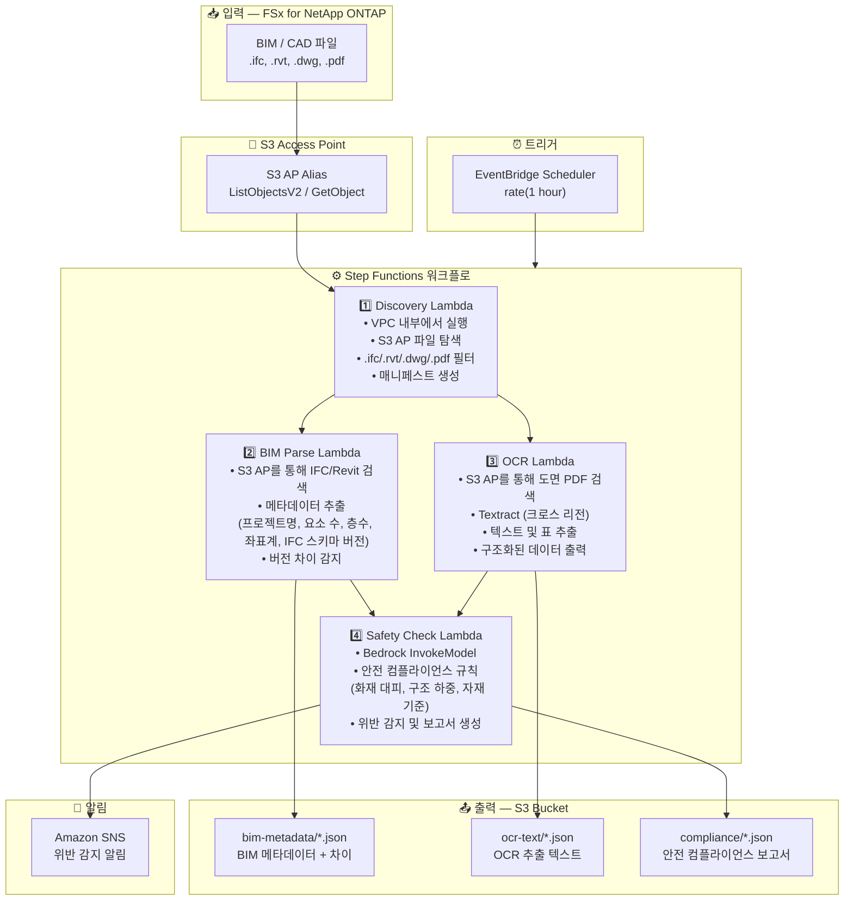

# UC10: 건설 / AEC — BIM 모델 관리, 도면 OCR 및 안전 컴플라이언스

🌐 **Language / 言語**: [日本語](architecture.md) | [English](architecture.en.md) | 한국어 | [简体中文](architecture.zh-CN.md) | [繁體中文](architecture.zh-TW.md) | [Français](architecture.fr.md) | [Deutsch](architecture.de.md) | [Español](architecture.es.md)

## 엔드투엔드 아키텍처 (입력 → 출력)

---

## 상위 수준 흐름

```
┌─────────────────────────────────────────────────────────────────────────────┐
│                         FSx for NetApp ONTAP                                 │
│                                                                              │
│  /vol/bim_projects/                                                          │
│  ├── models/building_A_v3.ifc         (IFC BIM model)                        │
│  ├── models/building_A_v3.rvt         (Revit file)                           │
│  ├── drawings/floor_plan_1F.dwg       (AutoCAD drawing)                      │
│  └── drawings/safety_plan.pdf         (Safety plan drawing PDF)              │
│                                                                              │
└──────────────────────────────────┬───────────────────────────────────────────┘
                                   │
                                   ▼
┌──────────────────────────────────────────────────────────────────────────────┐
│                      S3 Access Point (Data Path)                              │
│                                                                              │
│  Alias: fsxn-bim-vol-ext-s3alias                                             │
│  • ListObjectsV2 (BIM/CAD file discovery)                                    │
│  • GetObject (IFC/RVT/DWG/PDF retrieval)                                     │
│  • No NFS/SMB mount required from Lambda                                     │
│                                                                              │
└──────────────────────────────────┬───────────────────────────────────────────┘
                                   │
                                   ▼
┌──────────────────────────────────────────────────────────────────────────────┐
│                    EventBridge Scheduler (Trigger)                            │
│                                                                              │
│  Schedule: rate(1 hour) — configurable                                       │
│  Target: Step Functions State Machine                                        │
│                                                                              │
└──────────────────────────────────┬───────────────────────────────────────────┘
                                   │
                                   ▼
┌──────────────────────────────────────────────────────────────────────────────┐
│                    AWS Step Functions (Orchestration)                         │
│                                                                              │
│  ┌───────────┐  ┌──────────────┐  ┌──────────────┐  ┌──────────────────┐   │
│  │ Discovery  │─▶│ BIM Parse    │─▶│    OCR       │─▶│  Safety Check    │   │
│  │ Lambda     │  │ Lambda       │  │ Lambda       │  │  Lambda          │   │
│  │           │  │             │  │             │  │                 │   │
│  │ • VPC内    │  │ • IFC meta- │  │ • Textract   │  │ • Bedrock        │   │
│  │ • S3 AP   │  │   data      │  │ • Drawing    │  │ • Safety         │   │
│  │ • IFC/RVT │  │   extraction│  │   text       │  │   compliance     │   │
│  │   /DWG/PDF│  │ • Version   │  │   extraction │  │   check          │   │
│  └───────────┘  │   diff      │  │             │  │                 │   │
│                  └──────────────┘  └──────────────┘  └──────────────────┘   │
│                                                                              │
└──────────────────────────────────────────────────────────────────────────────┘
                                   │
                                   ▼
┌──────────────────────────────────────────────────────────────────────────────┐
│                         Output (S3 Bucket)                                    │
│                                                                              │
│  s3://{stack}-output-{account}/                                              │
│  ├── bim-metadata/YYYY/MM/DD/                                                │
│  │   └── building_A_v3.json          ← BIM metadata + diff                  │
│  ├── ocr-text/YYYY/MM/DD/                                                    │
│  │   └── safety_plan.json            ← OCR extracted text & tables          │
│  └── compliance/YYYY/MM/DD/                                                  │
│      └── building_A_v3_safety.json   ← Safety compliance report             │
│                                                                              │
└──────────────────────────────────────────────────────────────────────────────┘
```

---

## Mermaid 다이어그램



---

## 데이터 흐름 상세

### 입력
| 항목 | 설명 |
|------|------|
| **소스** | FSx for NetApp ONTAP 볼륨 |
| **파일 유형** | .ifc, .rvt, .dwg, .pdf (BIM 모델, CAD 도면, 도면 PDF) |
| **접근 방식** | S3 Access Point (ListObjectsV2 + GetObject) |
| **읽기 전략** | 전체 파일 검색 (메타데이터 추출 및 OCR에 필요) |

### 처리
| 단계 | 서비스 | 기능 |
|------|--------|------|
| Discovery | Lambda (VPC) | S3 AP를 통해 BIM/CAD 파일 탐색, 매니페스트 생성 |
| BIM Parse | Lambda | IFC/Revit 메타데이터 추출, 버전 차이 감지 |
| OCR | Lambda + Textract | 도면 PDF 텍스트 및 표 추출 (크로스 리전) |
| Safety Check | Lambda + Bedrock | 안전 컴플라이언스 규칙 검사, 위반 감지 |

### 출력
| 산출물 | 형식 | 설명 |
|--------|------|------|
| BIM 메타데이터 | `bim-metadata/YYYY/MM/DD/{stem}.json` | 메타데이터 + 버전 차이 |
| OCR 텍스트 | `ocr-text/YYYY/MM/DD/{stem}.json` | Textract 추출 텍스트 및 표 |
| 컴플라이언스 보고서 | `compliance/YYYY/MM/DD/{stem}_safety.json` | 안전 컴플라이언스 보고서 |
| SNS 알림 | 이메일 / Slack | 위반 감지 시 즉시 알림 |

---

## 주요 설계 결정

1. **NFS 대신 S3 AP** — Lambda에서 NFS 마운트 불필요; S3 API를 통해 BIM/CAD 파일 검색
2. **BIM Parse + OCR 병렬 실행** — IFC 메타데이터 추출과 도면 OCR을 병렬 실행, 두 결과를 Safety Check에 집계
3. **Textract 크로스 리전** — Textract를 사용할 수 없는 리전에서의 크로스 리전 호출
4. **Bedrock 안전 컴플라이언스** — 화재 대피, 구조 하중, 자재 기준에 대한 LLM 기반 규칙 검사
5. **버전 차이 감지** — IFC 모델의 요소 추가/삭제/변경을 자동 감지하여 효율적인 변경 관리
6. **폴링 (이벤트 기반 아님)** — S3 AP는 이벤트 알림을 지원하지 않으므로 주기적 스케줄 실행 사용

---

## 사용 AWS 서비스

| 서비스 | 역할 |
|--------|------|
| FSx for NetApp ONTAP | BIM/CAD 프로젝트 스토리지 |
| S3 Access Points | ONTAP 볼륨에 대한 서버리스 접근 |
| EventBridge Scheduler | 주기적 트리거 |
| Step Functions | 워크플로 오케스트레이션 |
| Lambda | 컴퓨팅 (Discovery, BIM Parse, OCR, Safety Check) |
| Amazon Textract | 도면 PDF OCR 텍스트 및 표 추출 |
| Amazon Bedrock | 안전 컴플라이언스 검사 (Claude / Nova) |
| SNS | 위반 감지 알림 |
| Secrets Manager | ONTAP REST API 자격 증명 관리 |
| CloudWatch + X-Ray | 관측 가능성 |
