# UC10: 建設 / AEC — BIM モデル管理・図面 OCR・安全コンプライアンス

🌐 **Language / 言語**: 日本語 | [English](architecture.en.md) | [한국어](architecture.ko.md) | [简体中文](architecture.zh-CN.md) | [繁體中文](architecture.zh-TW.md) | [Français](architecture.fr.md) | [Deutsch](architecture.de.md) | [Español](architecture.es.md)

## End-to-End Architecture (Input → Output)

---

## Architecture Diagram

```mermaid
flowchart TB
    subgraph INPUT["📥 Input — FSx for NetApp ONTAP"]
        BIM["BIM / CAD ファイル<br/>.ifc, .rvt, .dwg, .pdf"]
    end

    subgraph S3AP["🔗 S3 Access Point"]
        ALIAS["S3 AP Alias<br/>ListObjectsV2 / GetObject"]
    end

    subgraph TRIGGER["⏰ Trigger"]
        EB["EventBridge Scheduler<br/>rate(1 hour)"]
    end

    subgraph SFN["⚙️ Step Functions Workflow"]
        DISC["1️⃣ Discovery Lambda<br/>• VPC内実行<br/>• S3 AP ファイル検出<br/>• .ifc/.rvt/.dwg/.pdf フィルタ<br/>• Manifest 生成"]
        BP["2️⃣ BIM Parse Lambda<br/>• S3 AP 経由で IFC/Revit 取得<br/>• メタデータ抽出<br/>  (プロジェクト名, 要素数, 階数,<br/>   座標系, IFC スキーマバージョン)<br/>• バージョン間差分検出"]
        OCR["3️⃣ OCR Lambda<br/>• S3 AP 経由で図面 PDF 取得<br/>• Textract (クロスリージョン)<br/>• テキスト・テーブル抽出<br/>• 構造化データ出力"]
        SC["4️⃣ Safety Check Lambda<br/>• Bedrock InvokeModel<br/>• 安全コンプライアンスルール<br/>  (防火避難, 構造荷重, 材料基準)<br/>• 違反検出・レポート生成"]
    end

    subgraph OUTPUT["📤 Output — S3 Bucket"]
        META["bim-metadata/*.json<br/>BIM メタデータ + 差分"]
        TEXT["ocr-text/*.json<br/>OCR 抽出テキスト"]
        COMP["compliance/*.json<br/>安全コンプライアンスレポート"]
    end

    subgraph NOTIFY["📧 Notification"]
        SNS["Amazon SNS<br/>違反検出通知"]
    end

    BIM --> ALIAS
    ALIAS --> DISC
    EB --> SFN
    DISC --> BP
    DISC --> OCR
    BP --> SC
    OCR --> SC
    BP --> META
    OCR --> TEXT
    SC --> COMP
    SC --> SNS
```

---

## Data Flow Detail

### Input
| Item | Description |
|------|-------------|
| **Source** | FSx for NetApp ONTAP volume |
| **File Types** | .ifc, .rvt, .dwg, .pdf (BIM モデル、CAD 図面、図面 PDF) |
| **Access Method** | S3 Access Point (ListObjectsV2 + GetObject) |
| **Read Strategy** | ファイル全体を取得（メタデータ抽出・OCR に必要） |

### Processing
| Step | Service | Function |
|------|---------|----------|
| Discovery | Lambda (VPC) | S3 AP で BIM/CAD ファイル検出、Manifest 生成 |
| BIM Parse | Lambda | IFC/Revit メタデータ抽出、バージョン間差分検出 |
| OCR | Lambda + Textract | 図面 PDF のテキスト・テーブル抽出（クロスリージョン） |
| Safety Check | Lambda + Bedrock | 安全コンプライアンスルールチェック、違反検出 |

### Output
| Artifact | Format | Description |
|----------|--------|-------------|
| BIM Metadata | `bim-metadata/YYYY/MM/DD/{stem}.json` | メタデータ + バージョン差分 |
| OCR Text | `ocr-text/YYYY/MM/DD/{stem}.json` | Textract 抽出テキスト・テーブル |
| Compliance Report | `compliance/YYYY/MM/DD/{stem}_safety.json` | 安全コンプライアンスレポート |
| SNS Notification | Email / Slack | 違反検出時の即時通知 |

---

## Key Design Decisions

1. **S3 AP over NFS** — Lambda から NFS マウント不要、S3 API で BIM/CAD ファイル取得
2. **BIM Parse + OCR 並列実行** — IFC メタデータ抽出と図面 OCR を並列処理し、両結果を Safety Check に集約
3. **Textract クロスリージョン** — Textract 非対応リージョンでもクロスリージョン呼び出しで対応
4. **Bedrock による安全コンプライアンス** — 防火避難、構造荷重、材料基準のルールベースチェックを LLM で実行
5. **バージョン差分検出** — IFC モデルの要素追加・削除・変更を自動検出し、変更管理を効率化
6. **ポーリングベース** — S3 AP はイベント通知非対応のため、定期スケジュール実行

---

## AWS Services Used

| Service | Role |
|---------|------|
| FSx for NetApp ONTAP | BIM/CAD プロジェクトストレージ |
| S3 Access Points | ONTAP ボリュームへのサーバーレスアクセス |
| EventBridge Scheduler | 定期トリガー |
| Step Functions | ワークフローオーケストレーション |
| Lambda | コンピュート（Discovery, BIM Parse, OCR, Safety Check） |
| Amazon Textract | 図面 PDF の OCR テキスト・テーブル抽出 |
| Amazon Bedrock | 安全コンプライアンスチェック (Claude / Nova) |
| SNS | 違反検出通知 |
| Secrets Manager | ONTAP REST API 認証情報管理 |
| CloudWatch + X-Ray | オブザーバビリティ |
