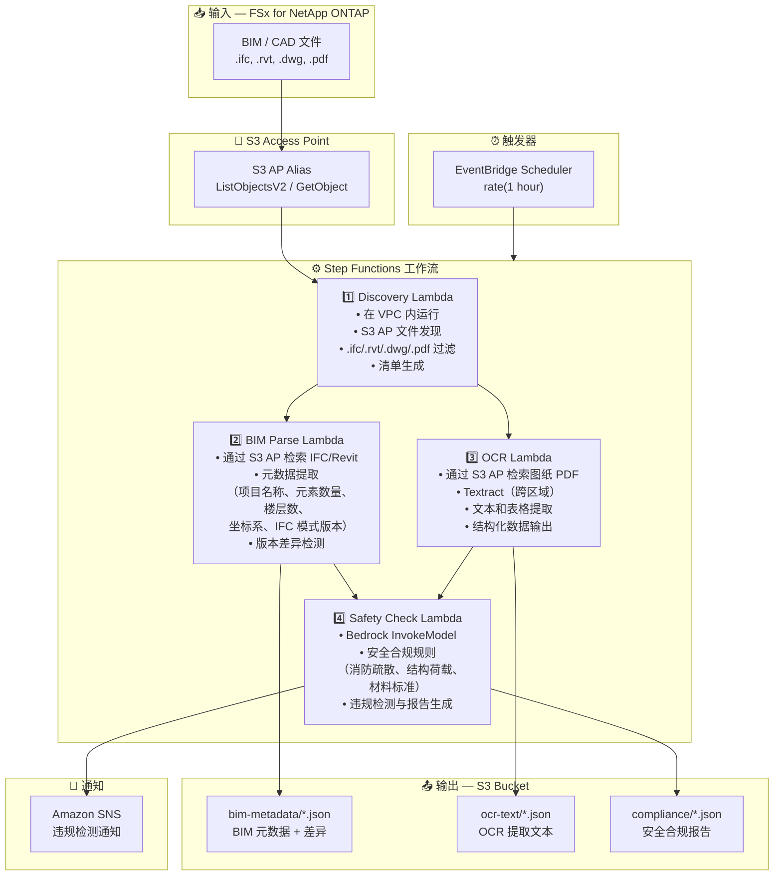

# UC10: 建筑 / AEC — BIM 模型管理、图纸 OCR 与安全合规

🌐 **Language / 言語**: [日本語](architecture.md) | [English](architecture.en.md) | [한국어](architecture.ko.md) | 简体中文 | [繁體中文](architecture.zh-TW.md) | [Français](architecture.fr.md) | [Deutsch](architecture.de.md) | [Español](architecture.es.md)

## 端到端架构（输入 → 输出）

---

## 架构图

---

## 数据流详情

### 输入
| 项目 | 说明 |
|------|------|
| **来源** | FSx for NetApp ONTAP 卷 |
| **文件类型** | .ifc, .rvt, .dwg, .pdf（BIM 模型、CAD 图纸、图纸 PDF） |
| **访问方式** | S3 Access Point（ListObjectsV2 + GetObject） |
| **读取策略** | 完整文件检索（元数据提取和 OCR 所需） |

### 处理
| 步骤 | 服务 | 功能 |
|------|------|------|
| Discovery | Lambda（VPC） | 通过 S3 AP 发现 BIM/CAD 文件，生成清单 |
| BIM Parse | Lambda | IFC/Revit 元数据提取，版本差异检测 |
| OCR | Lambda + Textract | 图纸 PDF 文本和表格提取（跨区域） |
| Safety Check | Lambda + Bedrock | 安全合规规则检查，违规检测 |

### 输出
| 产出物 | 格式 | 说明 |
|--------|------|------|
| BIM 元数据 | `bim-metadata/YYYY/MM/DD/{stem}.json` | 元数据 + 版本差异 |
| OCR 文本 | `ocr-text/YYYY/MM/DD/{stem}.json` | Textract 提取的文本和表格 |
| 合规报告 | `compliance/YYYY/MM/DD/{stem}_safety.json` | 安全合规报告 |
| SNS 通知 | 电子邮件 / Slack | 检测到违规时立即通知 |

---

## 关键设计决策

1. **S3 AP 优于 NFS** — Lambda 无需 NFS 挂载；通过 S3 API 检索 BIM/CAD 文件
2. **BIM Parse + OCR 并行执行** — IFC 元数据提取和图纸 OCR 并行运行，两个结果汇总到 Safety Check
3. **Textract 跨区域** — 在 Textract 不可用的区域进行跨区域调用
4. **Bedrock 安全合规** — 基于 LLM 的消防疏散、结构荷载和材料标准规则检查
5. **版本差异检测** — 自动检测 IFC 模型中元素的添加/删除/变更，实现高效变更管理
6. **轮询（非事件驱动）** — S3 AP 不支持事件通知，因此使用定期计划执行

---

## 使用的 AWS 服务

| 服务 | 角色 |
|------|------|
| FSx for NetApp ONTAP | BIM/CAD 项目存储 |
| S3 Access Points | 对 ONTAP 卷的无服务器访问 |
| EventBridge Scheduler | 定期触发器 |
| Step Functions | 工作流编排 |
| Lambda | 计算（Discovery、BIM Parse、OCR、Safety Check） |
| Amazon Textract | 图纸 PDF OCR 文本和表格提取 |
| Amazon Bedrock | 安全合规检查（Claude / Nova） |
| SNS | 违规检测通知 |
| Secrets Manager | ONTAP REST API 凭证管理 |
| CloudWatch + X-Ray | 可观测性 |
