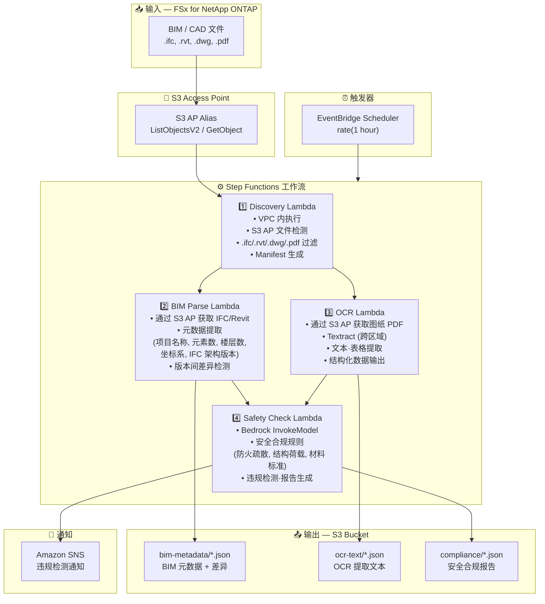

# UC10: 建设 / AEC — BIM 模型管理·图纸 OCR·安全合规

🌐 **Language / 언어 / 语言 / 語言 / Langue / Sprache / Idioma**: [日本語](architecture.md) | [English](architecture.en.md) | [한국어](architecture.ko.md) | 简体中文 | [繁體中文](architecture.zh-TW.md) | [Français](architecture.fr.md) | [Deutsch](architecture.de.md) | [Español](architecture.es.md)

> 注意：此翻译由 Amazon Bedrock Claude 生成。欢迎对翻译质量提出改进建议。

## 端到端架构（输入 → 输出）

---

## 架构图

---

## 数据流详情

### 输入
| 项目 | 说明 |
|------|-------------|
| **来源** | FSx for NetApp ONTAP 卷 |
| **文件类型** | .ifc, .rvt, .dwg, .pdf（BIM 模型、CAD 图纸、图纸 PDF） |
| **访问方法** | S3 Access Point (ListObjectsV2 + GetObject) |
| **读取策略** | 获取完整文件（元数据提取·OCR 所需） |

### 处理
| 步骤 | 服务 | 功能 |
|------|---------|----------|
| Discovery | Lambda (VPC) | 通过 S3 AP 检测 BIM/CAD 文件，生成 Manifest |
| BIM Parse | Lambda | IFC/Revit 元数据提取，版本间差异检测 |
| OCR | Lambda + Textract | 图纸 PDF 的文本·表格提取（跨区域） |
| Safety Check | Lambda + Bedrock | 安全合规规则检查，违规检测 |

### 输出
| 产物 | 格式 | 说明 |
|----------|--------|-------------|
| BIM Metadata | `bim-metadata/YYYY/MM/DD/{stem}.json` | 元数据 + 版本差异 |
| OCR Text | `ocr-text/YYYY/MM/DD/{stem}.json` | Textract 提取文本·表格 |
| Compliance Report | `compliance/YYYY/MM/DD/{stem}_safety.json` | 安全合规报告 |
| SNS Notification | Email / Slack | 违规检测时的即时通知 |

---

## 关键设计决策

1. **S3 AP 优于 NFS** — 无需从 Lambda 挂载 NFS，通过 S3 API 获取 BIM/CAD 文件
2. **BIM Parse + OCR 并行执行** — IFC 元数据提取和图纸 OCR 并行处理，将两个结果汇总到 Safety Check
3. **Textract 跨区域** — 即使在 Textract 不支持的区域也可通过跨区域调用实现
4. **通过 Bedrock 进行安全合规** — 使用 LLM 执行防火疏散、结构荷载、材料标准的基于规则的检查
5. **版本差异检测** — 自动检测 IFC 模型的元素添加·删除·变更，提高变更管理效率
6. **基于轮询** — 由于 S3 AP 不支持事件通知，采用定期调度执行

---

## 使用的 AWS 服务

| 服务 | 角色 |
|---------|------|
| FSx for NetApp ONTAP | BIM/CAD 项目存储 |
| S3 Access Points | 对 ONTAP 卷的无服务器访问 |
| EventBridge Scheduler | 定期触发器 |
| Step Functions | 工作流编排 |
| Lambda | 计算（Discovery, BIM Parse, OCR, Safety Check） |
| Amazon Textract | 图纸 PDF 的 OCR 文本·表格提取 |
| Amazon Bedrock | 安全合规检查 (Claude / Nova) |
| SNS | 违规检测通知 |
| Secrets Manager | ONTAP REST API 凭证管理 |
| CloudWatch + X-Ray | 可观测性 |
