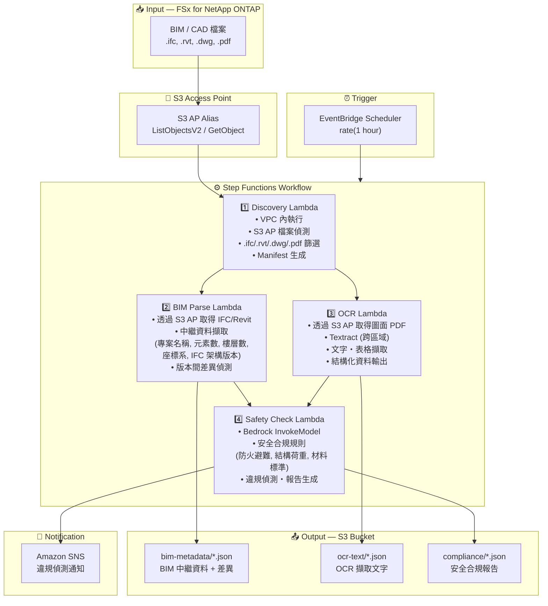

# UC10: 建設 / AEC — BIM 模型管理・圖面 OCR・安全合規性

🌐 **Language / 언어 / 语言 / 語言 / Langue / Sprache / Idioma**: [日本語](architecture.md) | [English](architecture.en.md) | [한국어](architecture.ko.md) | [简体中文](architecture.zh-CN.md) | 繁體中文 | [Français](architecture.fr.md) | [Deutsch](architecture.de.md) | [Español](architecture.es.md)

> 注意：此翻譯由 Amazon Bedrock Claude 產生。歡迎對翻譯品質提出改進建議。

## End-to-End Architecture (Input → Output)

---

## Architecture Diagram

---

## Data Flow Detail

### Input
| Item | Description |
|------|-------------|
| **Source** | FSx for NetApp ONTAP volume |
| **File Types** | .ifc, .rvt, .dwg, .pdf (BIM 模型、CAD 圖面、圖面 PDF) |
| **Access Method** | S3 Access Point (ListObjectsV2 + GetObject) |
| **Read Strategy** | 取得完整檔案（中繼資料擷取・OCR 所需） |

### Processing
| Step | Service | Function |
|------|---------|----------|
| Discovery | Lambda (VPC) | 透過 S3 AP 偵測 BIM/CAD 檔案、生成 Manifest |
| BIM Parse | Lambda | IFC/Revit 中繼資料擷取、版本間差異偵測 |
| OCR | Lambda + Textract | 圖面 PDF 的文字・表格擷取（跨區域） |
| Safety Check | Lambda + Bedrock | 安全合規規則檢查、違規偵測 |

### Output
| Artifact | Format | Description |
|----------|--------|-------------|
| BIM Metadata | `bim-metadata/YYYY/MM/DD/{stem}.json` | 中繼資料 + 版本差異 |
| OCR Text | `ocr-text/YYYY/MM/DD/{stem}.json` | Textract 擷取文字・表格 |
| Compliance Report | `compliance/YYYY/MM/DD/{stem}_safety.json` | 安全合規報告 |
| SNS Notification | Email / Slack | 違規偵測時的即時通知 |

---

## Key Design Decisions

1. **S3 AP over NFS** — Lambda 無需掛載 NFS，透過 S3 API 取得 BIM/CAD 檔案
2. **BIM Parse + OCR 並行執行** — IFC 中繼資料擷取與圖面 OCR 並行處理，將兩者結果彙整至 Safety Check
3. **Textract 跨區域** — 即使在 Textract 不支援的區域也可透過跨區域呼叫對應
4. **Bedrock 安全合規** — 透過 LLM 執行防火避難、結構荷重、材料標準的規則檢查
5. **版本差異偵測** — 自動偵測 IFC 模型的元素新增・刪除・變更，提升變更管理效率
6. **輪詢機制** — 由於 S3 AP 不支援事件通知，採用定期排程執行

---

## AWS Services Used

| Service | Role |
|---------|------|
| FSx for NetApp ONTAP | BIM/CAD 專案儲存 |
| S3 Access Points | ONTAP 磁碟區的無伺服器存取 |
| EventBridge Scheduler | 定期觸發 |
| Step Functions | 工作流程編排 |
| Lambda | 運算（Discovery, BIM Parse, OCR, Safety Check） |
| Amazon Textract | 圖面 PDF 的 OCR 文字・表格擷取 |
| Amazon Bedrock | 安全合規檢查 (Claude / Nova) |
| SNS | 違規偵測通知 |
| Secrets Manager | ONTAP REST API 認證資訊管理 |
| CloudWatch + X-Ray | 可觀測性 |
