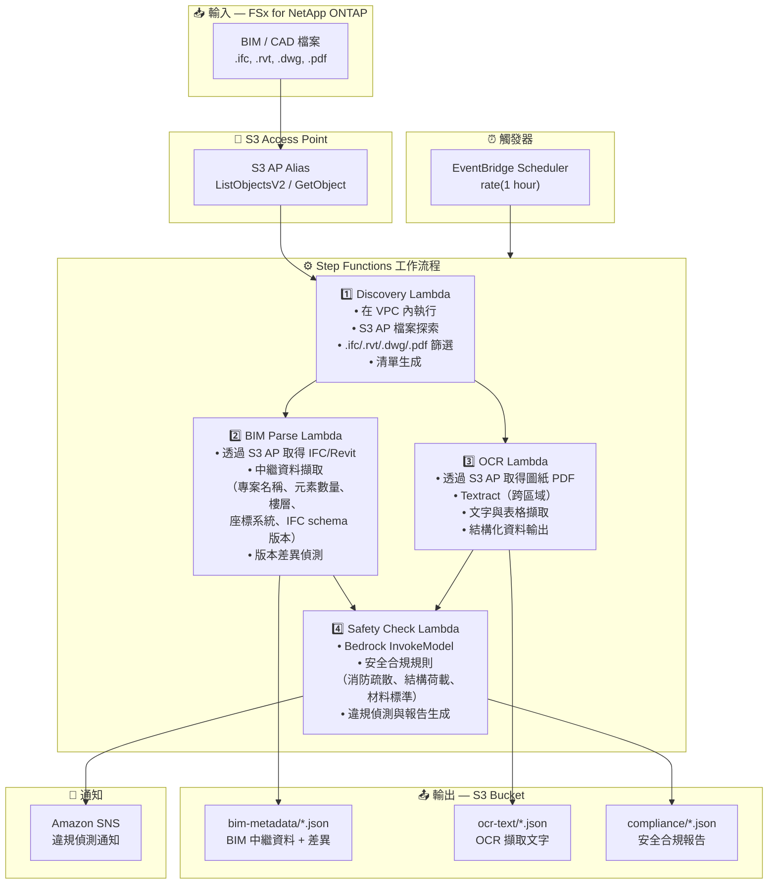

# UC10: 建築/AEC — BIM模型管理、圖紙OCR與安全合規

🌐 **Language / 言語**: [日本語](architecture.md) | [English](architecture.en.md) | [한국어](architecture.ko.md) | [简体中文](architecture.zh-CN.md) | 繁體中文 | [Français](architecture.fr.md) | [Deutsch](architecture.de.md) | [Español](architecture.es.md)

## 端到端架構（輸入 → 輸出）

---

## 架構圖

---

## 資料流程詳細說明

### 輸入
| 項目 | 說明 |
|------|------|
| **來源** | FSx for NetApp ONTAP 磁碟區 |
| **檔案類型** | .ifc, .rvt, .dwg, .pdf（BIM 模型、CAD 圖紙、圖紙 PDF） |
| **存取方式** | S3 Access Point（ListObjectsV2 + GetObject） |
| **讀取策略** | 完整檔案取得（中繼資料擷取與 OCR 所需） |

### 處理
| 步驟 | 服務 | 功能 |
|------|------|------|
| 探索 | Lambda（VPC） | 透過 S3 AP 探索 BIM/CAD 檔案，生成清單 |
| BIM 解析 | Lambda | IFC/Revit 中繼資料擷取，版本差異偵測 |
| OCR | Lambda + Textract | 圖紙 PDF 文字與表格擷取（跨區域） |
| 安全檢查 | Lambda + Bedrock | 安全合規規則檢查，違規偵測 |

### 輸出
| 產出物 | 格式 | 說明 |
|--------|------|------|
| BIM 中繼資料 | `bim-metadata/YYYY/MM/DD/{stem}.json` | 中繼資料 + 版本差異 |
| OCR 文字 | `ocr-text/YYYY/MM/DD/{stem}.json` | Textract 擷取文字與表格 |
| 合規報告 | `compliance/YYYY/MM/DD/{stem}_safety.json` | 安全合規報告 |
| SNS 通知 | Email / Slack | 違規偵測時即時通知 |

---

## 關鍵設計決策

1. **S3 AP 優於 NFS** — Lambda 無需 NFS 掛載；BIM/CAD 檔案透過 S3 API 取得
2. **BIM 解析 + OCR 並行執行** — IFC 中繼資料擷取與圖紙 OCR 並行執行，兩者結果彙總後進行安全檢查
3. **Textract 跨區域** — 在 Textract 不可用的區域進行跨區域呼叫
4. **Bedrock 安全合規** — 基於 LLM 的規則檢查，涵蓋消防疏散、結構荷載和材料標準
5. **版本差異偵測** — 自動偵測 IFC 模型中元素的新增/刪除/變更，實現高效變更管理
6. **輪詢（非事件驅動）** — S3 AP 不支援事件通知，因此採用定期排程執行

---

## 使用的 AWS 服務

| 服務 | 角色 |
|------|------|
| FSx for NetApp ONTAP | BIM/CAD 專案儲存 |
| S3 Access Points | 對 ONTAP 磁碟區的無伺服器存取 |
| EventBridge Scheduler | 定期觸發 |
| Step Functions | 工作流程編排 |
| Lambda | 運算（Discovery、BIM Parse、OCR、Safety Check） |
| Amazon Textract | 圖紙 PDF OCR 文字與表格擷取 |
| Amazon Bedrock | 安全合規檢查（Claude / Nova） |
| SNS | 違規偵測通知 |
| Secrets Manager | ONTAP REST API 憑證管理 |
| CloudWatch + X-Ray | 可觀測性 |
