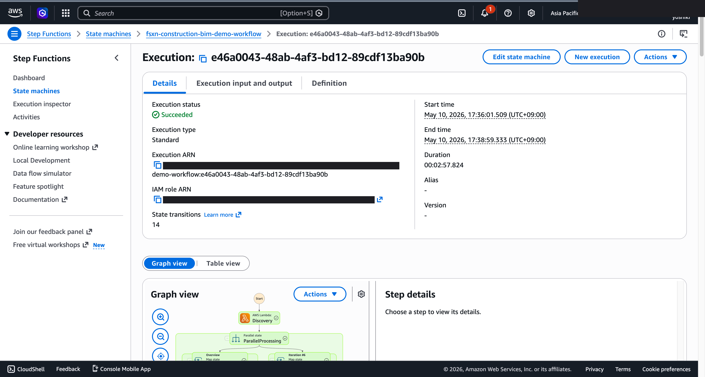
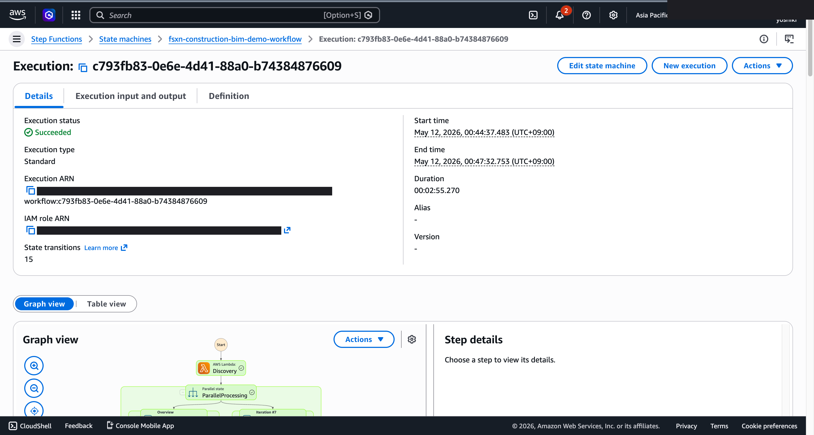
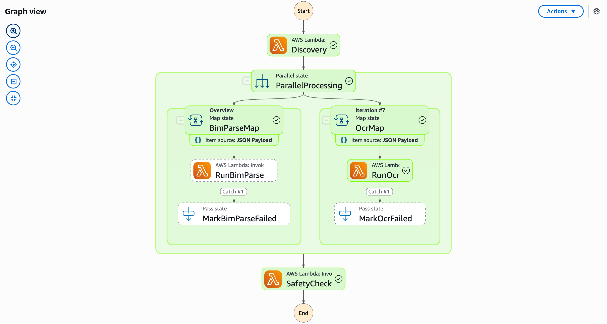

# BIM 模型变更检测与安全合规 — Demo Guide

🌐 **Language / 언어 / 语言 / 語言 / Langue / Sprache / Idioma**: [日本語](demo-guide.md) | [English](demo-guide.en.md) | [한국어](demo-guide.ko.md) | 简体中文 | [繁體中文](demo-guide.zh-TW.md) | [Français](demo-guide.fr.md) | [Deutsch](demo-guide.de.md) | [Español](demo-guide.es.md)

> 注意：此翻译由 Amazon Bedrock Claude 生成。欢迎对翻译质量提出改进建议。

## Executive Summary

本演示展示了 BIM 模型变更检测与安全合规检查流水线。自动检测设计变更，验证建筑标准的符合性。

**演示核心信息**：自动追踪 BIM 模型变更，即时检测安全标准违规。缩短设计审查周期。

**预计时间**：3～5 分钟

---

## Target Audience & Persona

| 项目 | 详细 |
|------|------|
| **职位** | BIM 经理 / 结构设计工程师 |
| **日常业务** | BIM 模型管理、设计变更审查、合规确认 |
| **课题** | 追踪多团队设计变更并确认标准符合性困难 |
| **期待成果** | 变更自动检测与安全标准检查的效率化 |

### Persona：木村先生（BIM 经理）

- 大规模建设项目中 20+ 设计团队并行作业
- 需要确认日常设计变更不影响安全标准
- "希望变更发生时自动运行安全检查"

---

## Demo Scenario：设计变更的自动检测与安全验证

### 工作流全貌

```
BIM 模型更新     变更检测        合规检查         审查报告
(IFC/RVT)    →   差异解析    →   规则比对     →    AI 生成
                  要素比较        安全标准检查
```

---

## Storyboard（5 个部分 / 3～5 分钟）

### Section 1: Problem Statement（0:00–0:45）

**解说要旨**:
> 大规模项目中 20 个团队并行更新 BIM 模型。手动确认无法跟上变更是否违反安全标准。

**Key Visual**：BIM 模型文件列表、多团队更新历史

### Section 2: Change Detection（0:45–1:30）

**解说要旨**:
> 检测模型文件更新，自动解析与前版本的差异。识别变更的要素（结构构件、设备配置等）。

**Key Visual**：变更检测触发、差异解析开始

### Section 3: Compliance Check（1:30–2:30）

**解说要旨**:
> 对变更的要素自动比对安全标准规则。验证抗震标准、防火分区、疏散路径等的符合性。

**Key Visual**：规则比对处理中、检查项目列表

### Section 4: Results Analysis（2:30–3:45）

**解说要旨**:
> 确认验证结果。列表显示违规项目、影响范围、重要度。

**Key Visual**：违规检测结果表格、按重要度分类

### Section 5: Review Report（3:45–5:00）

**解说要旨**:
> AI 生成设计审查报告。提示违规详情、纠正方案、受影响的其他设计要素。

**Key Visual**：AI 生成审查报告

---

## Screen Capture Plan

| # | 画面 | 部分 |
|---|------|-----------|
| 1 | BIM 模型文件列表 | Section 1 |
| 2 | 变更检测·差异显示 | Section 2 |
| 3 | 合规检查进度 | Section 3 |
| 4 | 违规检测结果 | Section 4 |
| 5 | AI 审查报告 | Section 5 |

---

## Narration Outline

| 部分 | 时间 | 关键信息 |
|-----------|------|--------------|
| Problem | 0:00–0:45 | "并行作业的变更追踪与安全确认跟不上" |
| Detection | 0:45–1:30 | "自动检测模型更新并解析差异" |
| Compliance | 1:30–2:30 | "自动比对安全标准规则" |
| Results | 2:30–3:45 | "即时掌握违规项目与影响范围" |
| Report | 3:45–5:00 | "AI 提示纠正方案与影响分析" |

---

## Sample Data Requirements

| # | 数据 | 用途 |
|---|--------|------|
| 1 | 基础 BIM 模型（IFC 格式） | 比较源 |
| 2 | 变更后模型（含结构变更） | 差异检测演示 |
| 3 | 安全标准违规模型（3 件） | 合规演示 |

---

## Timeline

### 1 周内可达成

| 任务 | 所需时间 |
|--------|---------|
| 准备样本 BIM 数据 | 3 小时 |
| 确认流水线执行 | 2 小时 |
| 获取屏幕截图 | 2 小时 |
| 创建解说稿 | 2 小时 |
| 视频编辑 | 4 小时 |

### Future Enhancements

- 3D 可视化联动
- 实时变更通知
- 与施工阶段的一致性检查

---

## Technical Notes

| 组件 | 角色 |
|--------------|------|
| Step Functions | 工作流编排 |
| Lambda (Change Detector) | BIM 模型差异解析 |
| Lambda (Compliance Checker) | 安全标准规则比对 |
| Lambda (Report Generator) | 通过 Bedrock 生成审查报告 |
| Amazon Athena | 变更历史·违规数据汇总 |

### 回退方案

| 场景 | 对应 |
|---------|------|
| IFC 解析失败 | 使用预解析数据 |
| 规则比对延迟 | 显示预验证结果 |

---

*本文档是技术演示视频的制作指南。*

---

## 关于输出目标：可通过 OutputDestination 选择（Pattern B）

UC10 construction-bim 在 2026-05-10 更新中支持了 `OutputDestination` 参数
（参见 `docs/output-destination-patterns.md`）。

**目标工作负载**：建设 BIM / 图纸 OCR / 安全合规检查

**2 种模式**：

### STANDARD_S3（默认，与以往相同）
创建新的 S3 存储桶（`${AWS::StackName}-output-${AWS::AccountId}`），
将 AI 成果物写入其中。

```bash
aws cloudformation deploy \
  --template-file construction-bim/template-deploy.yaml \
  --stack-name fsxn-construction-bim-demo \
  --parameter-overrides \
    OutputDestination=STANDARD_S3 \
    ... (其他必需参数)
```

### FSXN_S3AP（"no data movement" 模式）
通过 FSxN S3 Access Point 将 AI 成果物写回到与原始数据**相同的 FSx ONTAP 卷**。
SMB/NFS 用户可以在业务使用的目录结构内直接查看 AI 成果物。
不创建标准 S3 存储桶。

```bash
aws cloudformation deploy \
  --template-file construction-bim/template-deploy.yaml \
  --stack-name fsxn-construction-bim-demo \
  --parameter-overrides \
    OutputDestination=FSXN_S3AP \
    OutputS3APPrefix=ai-outputs/ \
    S3AccessPointName=eda-demo-s3ap \
    ... (其他必需参数)
```

**注意事项**：

- 强烈建议指定 `S3AccessPointName`（在 Alias 格式和 ARN 格式中都进行 IAM 授权）
- 超过 5GB 的对象在 FSxN S3AP 中不可用（AWS 规范），必须使用分段上传
- AWS 规范上的限制请参见
  [项目 README 的"AWS 规范上的限制与规避措施"部分](../../README.md#aws-仕様上の制約と回避策)
  以及 [`docs/output-destination-patterns.md`](../../docs/output-destination-patterns.md)

---

## 已验证的 UI/UX 截图

与 Phase 7 UC15/16/17 和 UC6/11/14 演示相同方针，以**最终用户在日常业务中实际
看到的 UI/UX 画面**为对象。面向技术人员的视图（Step Functions 图、CloudFormation
堆栈事件等）汇总在 `docs/verification-results-*.md` 中。

### 本用例的验证状态

- ✅ **E2E 执行**：Phase 1-6 已确认（参见根 README）
- 📸 **UI/UX 重新拍摄**：✅ 2026-05-10 重新部署验证时已拍摄（确认 UC10 Step Functions 图、Lambda 执行成功）
- 🔄 **重现方法**：参见本文档末尾的"拍摄指南"

### 2026-05-10 重新部署验证时拍摄（以 UI/UX 为中心）

#### UC10 Step Functions Graph view（SUCCEEDED）



Step Functions Graph view 是用颜色可视化各 Lambda / Parallel / Map 状态执行情况的
最终用户最重要画面。

### 现有截图（来自 Phase 1-6 的相关部分）





### 重新验证时的 UI/UX 目标画面（推荐拍摄列表）

- S3 输出存储桶（drawings-ocr/、bim-metadata/、safety-reports/）
- Textract 图纸 OCR 结果（跨区域）
- BIM 版本差异报告
- Bedrock 安全合规检查

### 拍摄指南

1. **事前准备**：
   - 使用 `bash scripts/verify_phase7_prerequisites.sh` 确认前提（共用 VPC/S3 AP 有无）
   - 使用 `UC=construction-bim bash scripts/package_generic_uc.sh` 打包 Lambda
   - 使用 `bash scripts/deploy_generic_ucs.sh UC10` 部署

2. **配置样本数据**：
   - 通过 S3 AP Alias 将样本文件上传到 `drawings/` 前缀
   - 启动 Step Functions `fsxn-construction-bim-demo-workflow`（输入 `{}`）

3. **拍摄**（关闭 CloudShell·终端，涂黑浏览器右上角的用户名）：
   - S3 输出存储桶 `fsxn-construction-bim-demo-output-<account>` 的俯瞰图
   - AI/ML 输出 JSON 的预览（参考 `build/preview_*.html` 格式）
   - SNS 邮件通知（如适用）

4. **遮罩处理**：
   - 使用 `python3 scripts/mask_uc_demos.py construction-bim-demo` 自动遮罩
   - 根据 `docs/screenshots/MASK_GUIDE.md` 进行额外遮罩（如需要）

5. **清理**：
   - 使用 `bash scripts/cleanup_generic_ucs.sh UC10` 删除
   - VPC Lambda ENI 释放需要 15-30 分钟（AWS 规范）
