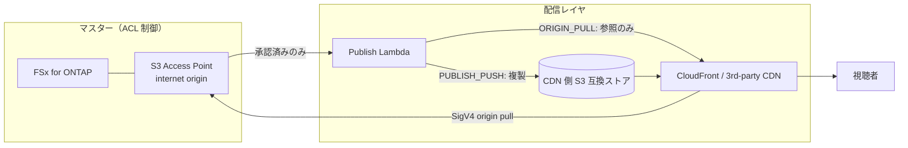

# Content Edge Delivery — FSx for ONTAP S3 AP × CDN/エッジ配信（ベンダー非依存）

🌐 **Language / 言語**: [日本語](README.md) | [English](README.en.md) | [한국어](README.ko.md) | [简体中文](README.zh-CN.md) | [繁體中文](README.zh-TW.md) | [Français](README.fr.md) | [Deutsch](README.de.md) | [Español](README.es.md)

## 概要

FSx for NetApp ONTAP を **Single Source of Truth（マスター）** として残し、S3 Access Points (S3 AP)
上の **配信承認済みレンディション** を CDN/エッジ配信ネットワークから配信可能にする、
**配信ベンダー非依存** のサーバーレスパターンです。

統合メカニズム・各配信網の実現可否（CloudFront / Akamai / Fastly / Cloudflare / Bunny.net /
Google Media CDN ほか）の技術比較は **[docs/cdn-comparison.md](../docs/cdn-comparison.md)** を参照してください。

> 本パターンは reference implementation（参照実装）です。配信ベンダーの選定や権利処理・地域制限・
> コンプライアンスは顧客が判断します。

> **TL;DR（30秒）**: ONTAP/NAS のマスターを動かさず、**承認済みの配信用成果物だけ**を CloudFront や
> サードパーティ CDN から配信する。初手は検証リスク最小の `PUBLISH_PUSH`（M3）。SigV4 直引き（ORIGIN_PULL）は
> [検証チェックリスト](../docs/cdn-origin-verification-checklist.md)で実測してから採用。

## ビジネス成果と導入（Outcome / Adoption）

「デプロイできた」ではなく **業務成果** で評価します。

| 区分 | 定義（Outcome / Metric / 測定方法） |
|---|---|
| Business Outcome | マスターを二重持ちせずにエッジ配信を実現（配信用コピーは承認済み成果物のみ） |
| Metric | 配信レイヤへ流出するマスター件数 = 0 / 承認証跡 `unrecorded` 件数 |
| 測定方法 | publish マニフェストの `provenance` と `skipped`/`published` を集計 |

- **安全な実験境界**: `DemoMode=true` で FSx/外部CDN 無しに動作確認（試行錯誤が許される範囲）。
- **Business Sponsor**: 配信オーナー（メディア/配信基盤チーム）を任命し、Go/No-Go を承認。
- **Go/No-Go チェックリスト**:
  - [ ] `ApprovedPrefix` 外が配信対象に含まれない（権限境界）
  - [ ] 承認証跡（誰が承認したか）が記録される
  - [ ] 視聴者トークンが CDN ネイティブ機構で動作
  - [ ] ORIGIN_PULL 採用時は SigV4×alias の実測が PASS
- 将来作業は「未完成」ではなく **エビデンス拡張**（実機検証で TBV を実測値へ）と位置づける。

## Partner/SI 利用ガイド

- **最初の顧客質問**: 「既存の NAS/ONTAP 資産を、コピーせずにエッジ配信へつなげたいか。配信は CloudFront か、
  既存契約の CDN（Akamai 等）か」
- **PoC 成果物**: DemoMode デモ → 承認済みレンディションの配信マニフェスト →（任意）実機 SigV4 検証結果。
- 配信網選定は [CDN 比較](../docs/cdn-comparison.md) を顧客会話でそのまま使用可能。

## 解決する課題

- ONTAP/NAS 上の制作・管理データを、コピー二重持ちせずにエッジ配信へ繋ぎたい
- 配信は ONTAP の NFS/SMB ACL を経由しないため、**配信対象を承認済み成果物に限定**したい
- 特定 CDN にロックインせず、CloudFront / サードパーティ CDN を差し替え可能にしたい

## アーキテクチャ（2つの統合メカニズム）



- **ORIGIN_PULL**: オブジェクトを複製せず、CDN が S3 AP を SigV4 で直接取得する前提の
  オリジン参照マニフェストを生成。CloudFront は OAC で対応（リファレンス実装）。
  サードパーティ CDN の SigV4 オリジン署名は **要検証**（[比較ドキュメント](../docs/cdn-comparison.md)参照）。
- **PUBLISH_PUSH**: 承認済みレンディションを CDN 側 S3 互換ストアへ複製。オリジン認証問題を回避でき、
  CDN 非依存。検証リスクが最も低い初手。

## 主要コンポーネント

| コンポーネント | 役割 |
|---|---|
| `functions/publish/handler.py` | 承認済みレンディションを配信レイヤへ反映し、配信マニフェストを S3 AP に書き戻す |
| `functions/delivery_log_sync/handler.py` | CDN 配信ログを正規化（IP マスク）し、S3 AP へ書き戻して制作データと突合可能にする |
| Step Functions | Publish → SNS 通知 |
| CloudFront (任意) | ORIGIN_PULL のリファレンス配信（OAC + SigV4） |

## パラメータ

| パラメータ | 説明 | デフォルト |
|---|---|---|
| `S3AccessPointAlias` | 入力 S3 AP Alias（Internet-origin） | — |
| `S3AccessPointOutputAlias` | マニフェスト/ログ書き戻し用 S3 AP Alias | — |
| `DeliveryMode` | `ORIGIN_PULL` / `PUBLISH_PUSH` | `PUBLISH_PUSH` |
| `CDNTarget` | `CLOUDFRONT`/`AKAMAI`/`FASTLY`/`CLOUDFLARE`/`OTHER` | `CLOUDFRONT` |
| `ApprovedPrefix` | 配信承認済みプレフィックス（permission-aware） | `delivery-approved/` |
| `SuffixFilter` | 配信対象拡張子（カンマ区切り） | `""` |
| `DemoMode` | 外部 push をスキップ（FSx/外部CDN無しで検証） | `true` |
| `ExternalStoreEndpoint` | PUBLISH_PUSH の S3 互換エンドポイント | `""` |
| `ExternalStoreBucket` | PUBLISH_PUSH の配信先バケット | `""` |
| `EnableCloudFront` | CloudFront 配信を有効化 | `false` |
| `RedactClientIp` | 配信ログの IP マスク | `true` |
| `TriggerMode` | `POLLING`/`EVENT_DRIVEN`/`HYBRID` | `POLLING` |

## デプロイ

```bash
sam build --template content-edge-delivery/template.yaml
sam deploy --guided \
  --template content-edge-delivery/template.yaml \
  --stack-name fsxn-content-edge-delivery
```

DemoMode の確認は [docs/demo-guide.md](docs/demo-guide.md) を参照。

## セキュリティ / ガバナンス

- **permission-aware**: 配信対象は `ApprovedPrefix` 配下に限定。ACL 制御下のマスターを直接配信しない。
- **配信承認の監査証跡**: publish マニフェストに `provenance`（source_key / approver / approval_id /
  published_at / execution_id）を記録。承認元はオブジェクトのユーザーメタデータ
  （`x-amz-meta-approved-by` / `x-amz-meta-approval-id`）から取得し、未記録時は `unrecorded` として
  可視化（配信は止めず運用で検知）。durable な追跡が必要な場合は `shared/lineage.py`（DynamoDB）への
  記録に拡張可能。
- **データ所在地 / 地域制限**: CDN はグローバル配信のため、リージョン外配信が許容されないデータは
  承認対象から除外、または CDN の geo-blocking で制御する。
- **視聴者認証**: S3 Presigned URL 非対応のため、CDN ネイティブのトークン機構を使用。
- **PII**: 配信ログ書き戻し時にクライアント IP をマスク（`RedactClientIp=true`）。
- **最小権限**: Publish/LogSync は対象 S3 AP の必要 Action のみ。配信用 Lambda は Internet-origin S3 AP
  アクセスのため **VPC 外**で実行。

> **Governance Note**: 配信は ONTAP のファイル権限を強制適用しません。配信境界の担保は
> 「承認済み成果物のみ配信」という運用ルールと、承認証跡の記録、配信先のアクセス制御で行います。

### 責任分担（RACI / Public Sector 観点）

| ロール | 責任 |
|---|---|
| データ所有者（Data Owner） | 配信対象データの分類・所在地・公開可否の最終責任 |
| 配信承認者（Approver） | `ApprovedPrefix` への配置承認。承認証跡（approved-by / approval-id）の付与 |
| 監査証跡レビュア（Audit Reviewer） | publish マニフェストの `provenance` と配信ログを定期レビュー |
| 運用オーナー（Ops Owner） | アラーム受信・障害対応・ロールバック実行 |

- AI/自動判定は**補助シグナル**であり、公開配信の可否は人間（Data Owner / Approver）が決定する。
- 検証用データは**非機密の合成/サンプル**を使用（本番個人データを検証に流用しない）。
- 技術的検証は法務・コンプライアンス・プライバシー評価を**代替しない**。

## Scaffold の制約（明示）

- `TriggerMode=EVENT_DRIVEN` / `HYBRID` は**パラメータとして定義済みだが、本雛形では FPolicy 連携・
  冪等化（idempotency）を未実装**。HYBRID の重複排除が必要な場合は `shared/idempotency_checker.py` を
  publish 経路に組み込むこと。現状の動作確認は `POLLING` で行う。
- `PUBLISH_PUSH` の外部ストアへの実 push はエンドポイント/バケット設定時のみ有効（DemoMode はスキップ記録）。
- ORIGIN_PULL の SigV4 オリジン直引きはサードパーティ CDN で**要検証**（[比較ドキュメント](../docs/cdn-comparison.md) 4.1 参照）。

## 運用 / Runbook（Reliability/Ops）

- **アラーム**: `EnableCloudWatchAlarms=true` で Lambda エラー（publish / log-sync）と Step Functions 失敗を
  SNS 通知。`NotificationEmail` で受信。
- **障害対応**:
  - publish エラー → CloudWatch Logs `/aws/lambda/<stack>-publish` を確認。S3 AP 認可（IAM + AP policy +
    ONTAP ID）と外部ストア認証（Secrets Manager）を切り分け。
  - 外部 push 失敗 → `ExternalStoreSecretName` の認証情報・エンドポイント・バケットを確認。
  - 配信境界の疑い（権限外配信）→ [インシデント対応 Playbook](../docs/incident-response-playbook.md)。
- **ロールバック**: 配信は承認済み成果物の publish のみ。誤公開時は配信先（CDN ストア/Distribution）から該当
  オブジェクトを除去し、`ApprovedPrefix` から取り下げて再 publish。
- **外部ストア認証**: PUBLISH_PUSH で Akamai/R2/Fastly 等へ複製する場合、AWS 既定認証は通用しないため
  `ExternalStoreSecretName`（Secrets Manager, `{"access_key_id","secret_access_key"}`）が必要。

## Success Metrics（PoC Go/No-Go 観点）

| 区分 | 指標 | 目安 |
|---|---|---|
| Business Outcome | マスター二重持ちの回避 | 配信用コピーは承認済み成果物のみ |
| Technical KPI | publish 成功率 | DemoMode で SUCCEEDED |
| Quality KPI | 配信対象の限定 | ApprovedPrefix 外が配信されないこと |
| Cost KPI | 配信ストア容量 | 承認済みレンディション分のみ |
| Go/No-Go | SigV4 オリジン直引き | サードパーティ CDN は実機検証で判定 |

## 関連ドキュメント

- [CDN/エッジ配信統合比較](../docs/cdn-comparison.md) / [English](../docs/cdn-comparison.en.md)
- [ORIGIN_PULL SigV4 検証チェックリスト](../docs/cdn-origin-verification-checklist.md)（実機検証手順）
- [代替アーキテクチャ比較](../docs/comparison-alternatives.md)
- [S3AP 互換性ノート](../docs/s3ap-compatibility-notes.md)
- [インシデント対応 Playbook](../docs/incident-response-playbook.md)（権限外配信・誤公開時の対応導線）
