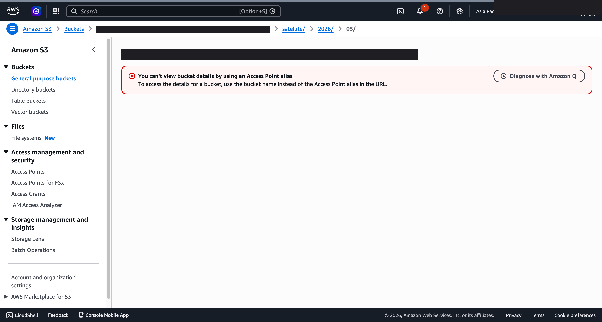
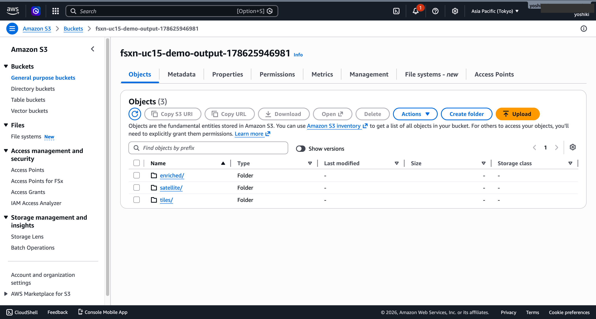
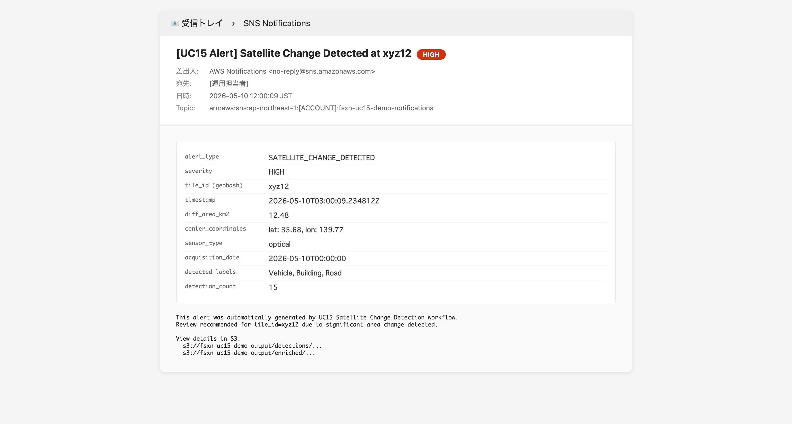
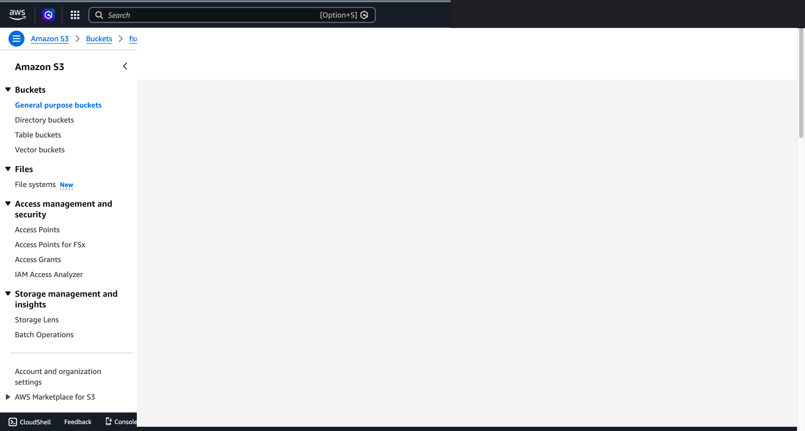

# UC15: Defense / Space — Satellite Imagery Analytics Pipeline

🌐 **Language / 言語**: [日本語](README.md) | English | [한국어](README.ko.md) | [简体中文](README.zh-CN.md) | [繁體中文](README.zh-TW.md) | [Français](README.fr.md) | [Deutsch](README.de.md) | [Español](README.es.md)
📚 **Documentation**: [Architecture](docs/architecture.ko.md) | [Demo Script](docs/demo-guide.ko.md)

> **Note**: 이 번역은 자동 생성된 초안입니다. 원문을 기반으로 리뷰 및 개선 환영합니다.

## Overview

Serverless pipeline for satellite imagery (GeoTIFF / NITF / HDF5) analytics leveraging Amazon FSx for NetApp ONTAP S3 Access Points. Targets defense, intelligence, and space agencies processing Earth Observation data at scale without file copies out of the sovereign storage boundary.

### When this pattern is suitable
- Large GeoTIFF / NITF / HDF5 images are stored on FSx ONTAP
- Need automated object detection (vehicles, ships, buildings) with time-series change detection
- Need to forward alerts on change-area threshold breach to an operations team
- Want to run all analytics inside a single region for data sovereignty

### When this pattern is NOT suitable
- Real-time hyperspectral processing (specialized GPU pipelines recommended)
- Full SAR interferometry (requires SNAP-style dedicated compute)
- Workflows requiring bespoke HPC / MPI

### Key features
- **Discovery**: Enumerate GeoTIFF / NITF / HDF5 from S3 AP with suffix filter + classify as optical / SAR
- **Tiling**: Convert to Cloud Optimized GeoTIFF and tile (default 256x256), with rasterio Layer or pure-Python fallback
- **Object Detection**: Route to Rekognition (<5MB) or SageMaker Batch Transform (>=5MB) via Phase 6B routing helper
- **Change Detection**: Store prior tile results in DynamoDB keyed by geohash, compute differential area (km²)
- **Geo Enrichment**: Extract CRS, bounds, sensor type, acquisition date
- **Alert Generation**: Publish SNS message when change area exceeds threshold

### Public Sector compliance
- DoD Cloud Computing Security Requirements Guide (CC SRG) Impact Level 2/4/5 with GovCloud migration
- Commercial Solutions for Classified (CSfC) via NetApp ONTAP certification
- FedRAMP High in GovCloud
- Data sovereignty: data never leaves the target region


### 검증된 UI/UX 스크린샷

> 본 섹션은 **일반 직원이 일상 업무에서 실제로 사용하는 UI/UX 화면**을 게시합니다. Step Functions 그래프와 같은 기술자 화면은 `docs/verification-results-phase7.md` 를 참조하세요.

#### 1. 위성 이미지 배치 (FSx ONTAP 의 S3 AP 경유)

<!-- SCREENSHOT: phase7-uc15-s3-satellite-uploaded.png -->


#### 2. 분석 결과 (S3 출력 버킷)

<!-- SCREENSHOT: phase7-uc15-s3-output-bucket.png -->


#### 3. 변화 감지 경보 (SNS 이메일)

<!-- SCREENSHOT: phase7-uc15-sns-alert-email.png -->


#### 4. 탐지 결과 (JSON)

<!-- SCREENSHOT: phase7-uc15-detections-json.png -->


## Deploy

```bash
aws cloudformation deploy \
  --template-file defense-satellite/template-deploy.yaml \
  --stack-name fsxn-defense-satellite \
  --parameter-overrides \
    DeployBucket=<deploy-bucket> \
    S3AccessPointAlias=<ap-ext-s3alias> \
    VpcId=<vpc-id> \
    PrivateSubnetIds=<subnet-ids> \
    NotificationEmail=ops@example.com \
  --capabilities CAPABILITY_NAMED_IAM \
  --region ap-northeast-1
```

## Directory layout

```
defense-satellite/
├── template.yaml                     # SAM template (local testing)
├── template-deploy.yaml              # CloudFormation template
├── functions/
│   ├── discovery/handler.py          # Enumerate satellite images
│   ├── tiling/handler.py             # COG conversion + tiling
│   ├── object_detection/handler.py   # Rekognition / SageMaker
│   ├── change_detection/handler.py   # Time-series diff
│   ├── geo_enrichment/handler.py     # Metadata enrichment
│   └── alert_generation/handler.py   # SNS alert
├── tests/                            # pytest unit tests
└── docs/                             # Architecture + demo docs
```