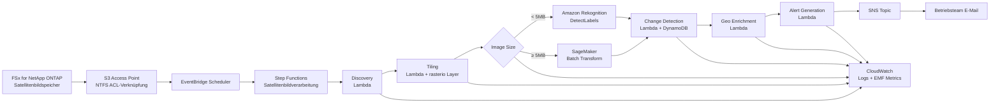

# UC15: Verteidigung und Raumfahrt — Satellitenbildanalyse-Architektur

🌐 **Language / 언어 / 语言 / 語言 / Langue / Sprache / Idioma**: [日本語](architecture.md) | [English](architecture.en.md) | [한국어](architecture.ko.md) | [简体中文](architecture.zh-CN.md) | [繁體中文](architecture.zh-TW.md) | [Français](architecture.fr.md) | Deutsch | [Español](architecture.es.md)

> Hinweis: Diese Übersetzung wurde von Amazon Bedrock Claude erstellt. Beiträge zur Verbesserung der Übersetzungsqualität sind willkommen.

## Übersicht

Automatisierte Analysepipeline für Satellitenbilder (GeoTIFF / NITF / HDF5) unter Verwendung von FSx for NetApp ONTAP S3 Access Points. Führt Objekterkennung, Zeitreihenänderungen und Alarmgenerierung aus großvolumigen Bildern durch, die von Verteidigungs-, Nachrichten- und Raumfahrtbehörden gehalten werden.

## Architekturdiagramm

## Datenfluss

1. **Discovery**: Scannen des `satellite/`-Präfixes über S3 AP, Aufzählung von GeoTIFF/NITF/HDF5
2. **Tiling**: Konvertierung großer Bilder in COG (Cloud Optimized GeoTIFF), Aufteilung in 256x256-Kacheln
3. **Object Detection**: Routenauswahl nach Bildgröße
   - `< 5 MB` → Rekognition DetectLabels (Fahrzeuge, Gebäude, Schiffe)
   - `≥ 5 MB` → SageMaker Batch Transform (dediziertes Modell)
4. **Change Detection**: Abruf der vorherigen Kachel aus DynamoDB mit geohash als Schlüssel, Berechnung der Differenzfläche
5. **Geo Enrichment**: Extraktion von Koordinaten, Erfassungszeit und Sensortyp aus Bild-Header
6. **Alert Generation**: SNS-Veröffentlichung bei Schwellenwertüberschreitung

## IAM-Matrix

| Principal | Permission | Resource |
|-----------|------------|----------|
| Discovery Lambda | `s3:ListBucket`, `s3:GetObject`, `s3:PutObject` | S3 AP Alias |
| Processing Lambdas | `rekognition:DetectLabels` | `*` |
| Processing Lambdas | `sagemaker:InvokeEndpoint` | Account endpoints |
| Processing Lambdas | `dynamodb:Query/PutItem` | ChangeHistoryTable |
| Processing Lambdas | `sns:Publish` | Notification Topic |
| Step Functions | `lambda:InvokeFunction` | Nur UC15 Lambdas |
| EventBridge Scheduler | `states:StartExecution` | State Machine ARN |

## Kostenmodell (monatlich, Schätzung Region Tokio)

| Service | Angenommener Preis | Geschätzte monatliche Kosten |
|----------|----------|----------|
| Lambda (6 Funktionen, 1 Million Anfragen/Monat) | $0.20/1M Anfragen + $0.0000166667/GB-s | $15 - $50 |
| Rekognition DetectLabels | $1.00 / 1000 Bilder | $10 / 10K Bilder |
| SageMaker Batch Transform | $0.134/Stunde (ml.m5.large) | $50 - $200 |
| DynamoDB (PPR, Änderungsverlauf) | $1.25 / 1M WRU, $0.25 / 1M RRU | $5 - $20 |
| S3 (Output-Bucket) | $0.023/GB-Monat | $5 - $30 |
| SNS Email | $0.50 / 1000 Benachrichtigungen | $1 |
| CloudWatch Logs + Metrics | $0.50/GB + $0.30/Metrik | $10 - $40 |
| **Gesamt (geringe Last)** | | **$96 - $391** |

SageMaker Endpoint ist standardmäßig deaktiviert (`EnableSageMaker=false`). Nur bei kostenpflichtiger Validierung aktivieren.

## Public Sector Compliance

### DoD Cloud Computing Security Requirements Guide (CC SRG)
- **Impact Level 2** (Public, Non-CUI): Betrieb in AWS Commercial möglich
- **Impact Level 4** (CUI): Migration zu AWS GovCloud (US)
- **Impact Level 5** (CUI Higher Sensitivity): AWS GovCloud (US) + zusätzliche Kontrollen
- FSx for NetApp ONTAP ist für alle oben genannten Impact Levels zugelassen

### Commercial Solutions for Classified (CSfC)
- NetApp ONTAP entspricht NSA CSfC Capability Package
- Datenverschlüsselung (Data-at-Rest, Data-in-Transit) in 2 Schichten implementierbar

### FedRAMP
- AWS GovCloud (US) entspricht FedRAMP High
- FSx ONTAP, S3 Access Points, Lambda, Step Functions alle abgedeckt

### Datensouveränität
- Daten verbleiben innerhalb der Region (ap-northeast-1 / us-gov-west-1)
- Keine regionsübergreifende Kommunikation (gesamte AWS-interne VPC-Kommunikation)

## Skalierbarkeit

- Parallele Ausführung mit Step Functions Map State (`MapConcurrency=10` Standard)
- Verarbeitung von 1000 Bildern pro Stunde möglich (Lambda-Parallelität + Rekognition-Route)
- SageMaker-Route skaliert mit Batch Transform (Batch-Job)

## Guard Hooks-Konformität (Phase 6B)

- ✅ `encryption-required`: SSE-KMS für alle S3-Buckets
- ✅ `iam-least-privilege`: Keine Wildcard-Berechtigungen (Rekognition `*` ist API-Einschränkung)
- ✅ `logging-required`: LogGroup für alle Lambda-Funktionen konfiguriert
- ✅ `dynamodb-encryption`: SSE für alle Tabellen aktiviert
- ✅ `sns-encryption`: KmsMasterKeyId konfiguriert

## Ausgabeziel (OutputDestination) — Pattern B

UC15 unterstützt seit dem Update vom 11.05.2026 den Parameter `OutputDestination`.

| Modus | Ausgabeziel | Erstellte Ressourcen | Anwendungsfall |
|-------|-------|-------------------|------------|
| `STANDARD_S3` (Standard) | Neuer S3-Bucket | `AWS::S3::Bucket` | Wie bisher: Speicherung von AI-Artefakten in separatem S3-Bucket |
| `FSXN_S3AP` | FSxN S3 Access Point | Keine (Rückschreiben in bestehendes FSx-Volume) | Analysten können AI-Artefakte über SMB/NFS im selben Verzeichnis wie die Original-Satellitenbilder einsehen |

**Betroffene Lambda-Funktionen**: Tiling, ObjectDetection, GeoEnrichment (3 Funktionen).  
**Nicht betroffene Lambda-Funktionen**: Discovery (Manifest wird weiterhin direkt in S3AP geschrieben), ChangeDetection (nur DynamoDB), AlertGeneration (nur SNS).

Details siehe [`docs/output-destination-patterns.md`](../../docs/output-destination-patterns.md).
