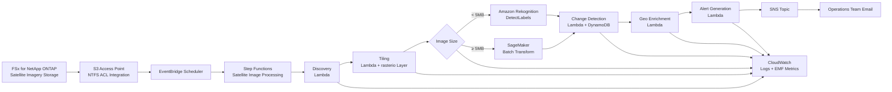

# UC15: Defense & Space — Satellite Image Analysis Architecture

🌐 **Language / 언어 / 语言 / 語言 / Langue / Sprache / Idioma**: [日本語](architecture.md) | English | [한국어](architecture.ko.md) | [简体中文](architecture.zh-CN.md) | [繁體中文](architecture.zh-TW.md) | [Français](architecture.fr.md) | [Deutsch](architecture.de.md) | [Español](architecture.es.md)

> Note: This translation is produced by Amazon Bedrock Claude. Contributions to improve translation quality are welcome.

## Overview

An automated analysis pipeline for satellite imagery (GeoTIFF / NITF / HDF5) leveraging FSx for NetApp ONTAP S3 Access Points. Executes object detection, time-series change analysis, and alert generation from large-scale imagery held by defense, intelligence, and space agencies.

## Architecture Diagram

## Data Flow

1. **Discovery**: Scan `satellite/` prefix via S3 AP, enumerate GeoTIFF/NITF/HDF5
2. **Tiling**: Convert large images to COG (Cloud Optimized GeoTIFF), split into 256x256 tiles
3. **Object Detection**: Route selection by image size
   - `< 5 MB` → Rekognition DetectLabels (vehicles, buildings, ships)
   - `≥ 5 MB` → SageMaker Batch Transform (custom model)
4. **Change Detection**: Retrieve previous tile from DynamoDB using geohash as key, calculate difference area
5. **Geo Enrichment**: Extract coordinates, acquisition time, sensor type from image header
6. **Alert Generation**: Publish to SNS when threshold exceeded

## IAM Matrix

| Principal | Permission | Resource |
|-----------|------------|----------|
| Discovery Lambda | `s3:ListBucket`, `s3:GetObject`, `s3:PutObject` | S3 AP Alias |
| Processing Lambdas | `rekognition:DetectLabels` | `*` |
| Processing Lambdas | `sagemaker:InvokeEndpoint` | Account endpoints |
| Processing Lambdas | `dynamodb:Query/PutItem` | ChangeHistoryTable |
| Processing Lambdas | `sns:Publish` | Notification Topic |
| Step Functions | `lambda:InvokeFunction` | UC15 Lambdas only |
| EventBridge Scheduler | `states:StartExecution` | State Machine ARN |

## Cost Model (Monthly, Tokyo Region Estimate)

| Service | Unit Price Estimate | Monthly Estimate |
|----------|----------|----------|
| Lambda (6 functions, 1 million req/month) | $0.20/1M req + $0.0000166667/GB-s | $15 - $50 |
| Rekognition DetectLabels | $1.00 / 1000 img | $10 / 10K images |
| SageMaker Batch Transform | $0.134/hour (ml.m5.large) | $50 - $200 |
| DynamoDB (PPR, change history) | $1.25 / 1M WRU, $0.25 / 1M RRU | $5 - $20 |
| S3 (output bucket) | $0.023/GB-month | $5 - $30 |
| SNS Email | $0.50 / 1000 notifications | $1 |
| CloudWatch Logs + Metrics | $0.50/GB + $0.30/metric | $10 - $40 |
| **Total (Light Load)** | | **$96 - $391** |

SageMaker Endpoint is disabled by default (`EnableSageMaker=false`). Enable only during paid validation.

## Public Sector Regulatory Compliance

### DoD Cloud Computing Security Requirements Guide (CC SRG)
- **Impact Level 2** (Public, Non-CUI): Operate on AWS Commercial
- **Impact Level 4** (CUI): Migrate to AWS GovCloud (US)
- **Impact Level 5** (CUI Higher Sensitivity): AWS GovCloud (US) + additional controls
- FSx for NetApp ONTAP is approved for all Impact Levels above

### Commercial Solutions for Classified (CSfC)
- NetApp ONTAP complies with NSA CSfC Capability Package
- Data encryption (Data-at-Rest, Data-in-Transit) implemented in 2 layers

### FedRAMP
- AWS GovCloud (US) complies with FedRAMP High
- FSx ONTAP, S3 Access Points, Lambda, Step Functions all covered

### Data Sovereignty
- Data remains within region (ap-northeast-1 / us-gov-west-1)
- No cross-region communication (all AWS internal VPC communication)

## Scalability

- Parallel execution with Step Functions Map State (`MapConcurrency=10` default)
- Process 1000 images per hour (Lambda parallel + Rekognition route)
- SageMaker route scales with Batch Transform (batch jobs)

## Guard Hooks Compliance (Phase 6B)

- ✅ `encryption-required`: SSE-KMS on all S3 buckets
- ✅ `iam-least-privilege`: No wildcard permissions (Rekognition `*` is API constraint)
- ✅ `logging-required`: LogGroup configured for all Lambdas
- ✅ `dynamodb-encryption`: SSE enabled on all tables
- ✅ `sns-encryption`: KmsMasterKeyId configured

## Output Destination (OutputDestination) — Pattern B

UC15 supports the `OutputDestination` parameter as of the 2026-05-11 update.

| Mode | Destination | Resources Created | Use Case |
|-------|-------|-------------------|------------|
| `STANDARD_S3` (default) | New S3 bucket | `AWS::S3::Bucket` | Accumulate AI artifacts in isolated S3 bucket as before |
| `FSXN_S3AP` | FSxN S3 Access Point | None (write back to existing FSx volume) | Analysts view AI artifacts in same directory as original satellite imagery via SMB/NFS |

**Affected Lambdas**: Tiling, ObjectDetection, GeoEnrichment (3 functions).  
**Unaffected Lambdas**: Discovery (manifest continues to write directly to S3AP), ChangeDetection (DynamoDB only), AlertGeneration (SNS only).

See [`docs/output-destination-patterns.md`](../../docs/output-destination-patterns.md) for details.
