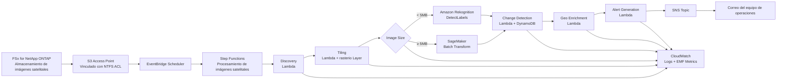

# UC15: Defensa y Espacio — Arquitectura de Análisis de Imágenes Satelitales

🌐 **Language / 언어 / 语言 / 語言 / Langue / Sprache / Idioma**: [日本語](architecture.md) | [English](architecture.en.md) | [한국어](architecture.ko.md) | [简体中文](architecture.zh-CN.md) | [繁體中文](architecture.zh-TW.md) | [Français](architecture.fr.md) | [Deutsch](architecture.de.md) | Español

> Nota: Esta traducción ha sido producida por Amazon Bedrock Claude. Las contribuciones para mejorar la calidad de la traducción son bienvenidas.

## Descripción general

Pipeline de análisis automático de imágenes satelitales (GeoTIFF / NITF / HDF5) que aprovecha FSx for NetApp ONTAP S3 Access Points. Ejecuta detección de objetos, cambios en series temporales y generación de alertas a partir de imágenes de gran capacidad en posesión de agencias de defensa, inteligencia y espaciales.

## Diagrama de arquitectura

## Flujo de datos

1. **Discovery**: Escanea el prefijo `satellite/` en S3 AP, enumera GeoTIFF/NITF/HDF5
2. **Tiling**: Convierte imágenes grandes a COG (Cloud Optimized GeoTIFF), divide en tiles de 256x256
3. **Object Detection**: Selección de ruta según tamaño de imagen
   - `< 5 MB` → Rekognition DetectLabels (vehículos, edificios, embarcaciones)
   - `≥ 5 MB` → SageMaker Batch Transform (modelo dedicado)
4. **Change Detection**: Obtiene tile anterior de DynamoDB usando geohash como clave, calcula área de diferencia
5. **Geo Enrichment**: Extrae coordenadas, hora de captura y tipo de sensor del encabezado de imagen
6. **Alert Generation**: Publica en SNS cuando se supera el umbral

## Matriz IAM

| Principal | Permission | Resource |
|-----------|------------|----------|
| Discovery Lambda | `s3:ListBucket`, `s3:GetObject`, `s3:PutObject` | S3 AP Alias |
| Processing Lambdas | `rekognition:DetectLabels` | `*` |
| Processing Lambdas | `sagemaker:InvokeEndpoint` | Account endpoints |
| Processing Lambdas | `dynamodb:Query/PutItem` | ChangeHistoryTable |
| Processing Lambdas | `sns:Publish` | Notification Topic |
| Step Functions | `lambda:InvokeFunction` | Solo UC15 Lambdas |
| EventBridge Scheduler | `states:StartExecution` | State Machine ARN |

## Modelo de costos (mensual, estimación región Tokio)

| Servicio | Precio unitario estimado | Costo mensual estimado |
|----------|----------|----------|
| Lambda (6 funciones, 1 millón req/mes) | $0.20/1M req + $0.0000166667/GB-s | $15 - $50 |
| Rekognition DetectLabels | $1.00 / 1000 img | $10 / 10K imágenes |
| SageMaker Batch Transform | $0.134/hora (ml.m5.large) | $50 - $200 |
| DynamoDB (PPR, historial de cambios) | $1.25 / 1M WRU, $0.25 / 1M RRU | $5 - $20 |
| S3 (bucket de salida) | $0.023/GB-mes | $5 - $30 |
| SNS Email | $0.50 / 1000 notificaciones | $1 |
| CloudWatch Logs + Metrics | $0.50/GB + $0.30/métrica | $10 - $40 |
| **Total (carga ligera)** | | **$96 - $391** |

SageMaker Endpoint deshabilitado por defecto (`EnableSageMaker=false`). Habilitar solo durante validación de pago.

## Cumplimiento de regulaciones del sector público

### DoD Cloud Computing Security Requirements Guide (CC SRG)
- **Impact Level 2** (Public, Non-CUI): Operación en AWS Commercial
- **Impact Level 4** (CUI): Migración a AWS GovCloud (US)
- **Impact Level 5** (CUI Higher Sensitivity): AWS GovCloud (US) + controles adicionales
- FSx for NetApp ONTAP está aprobado para todos los Impact Levels mencionados

### Commercial Solutions for Classified (CSfC)
- NetApp ONTAP cumple con NSA CSfC Capability Package
- Cifrado de datos (Data-at-Rest, Data-in-Transit) implementado en 2 capas

### FedRAMP
- AWS GovCloud (US) cumple con FedRAMP High
- FSx ONTAP, S3 Access Points, Lambda, Step Functions todos cubiertos

### Soberanía de datos
- Datos completos dentro de la región (ap-northeast-1 / us-gov-west-1)
- Sin comunicación cross-region (toda comunicación VPC interna de AWS)

## Escalabilidad

- Ejecución paralela con Step Functions Map State (`MapConcurrency=10` por defecto)
- Procesamiento de 1000 imágenes por hora (Lambda paralelo + ruta Rekognition)
- Ruta SageMaker escala con Batch Transform (trabajo por lotes)

## Cumplimiento de Guard Hooks (Phase 6B)

- ✅ `encryption-required`: SSE-KMS en todos los buckets S3
- ✅ `iam-least-privilege`: Sin permisos comodín (Rekognition `*` es restricción de API)
- ✅ `logging-required`: LogGroup configurado en todas las Lambda
- ✅ `dynamodb-encryption`: SSE habilitado en todas las tablas
- ✅ `sns-encryption`: KmsMasterKeyId configurado

## Destino de salida (OutputDestination) — Pattern B

UC15 soporta el parámetro `OutputDestination` desde la actualización del 2026-05-11.

| Modo | Destino de salida | Recursos creados | Caso de uso |
|-------|-------|-------------------|------------|
| `STANDARD_S3` (predeterminado) | Nuevo bucket S3 | `AWS::S3::Bucket` | Acumulación de resultados de IA en bucket S3 aislado como tradicionalmente |
| `FSXN_S3AP` | FSxN S3 Access Point | Ninguno (escritura en volumen FSx existente) | Analistas visualizan resultados de IA en el mismo directorio que las imágenes satelitales originales vía SMB/NFS |

**Lambda afectadas**: Tiling, ObjectDetection, GeoEnrichment (3 funciones).  
**Lambda no afectadas**: Discovery (manifest continúa escribiéndose directamente en S3AP), ChangeDetection (solo DynamoDB), AlertGeneration (solo SNS).

Para más detalles, consulte [`docs/output-destination-patterns.md`](../../docs/output-destination-patterns.md).
