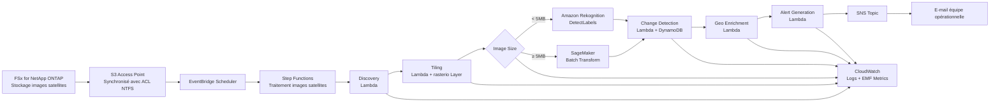

# UC15: Défense et Spatial — Architecture d'analyse d'images satellites

🌐 **Language / 언어 / 语言 / 語言 / Langue / Sprache / Idioma**: [日本語](architecture.md) | [English](architecture.en.md) | [한국어](architecture.ko.md) | [简体中文](architecture.zh-CN.md) | [繁體中文](architecture.zh-TW.md) | Français | [Deutsch](architecture.de.md) | [Español](architecture.es.md)

> Note : Cette traduction est produite par Amazon Bedrock Claude. Les contributions pour améliorer la qualité de la traduction sont les bienvenues.

## Vue d'ensemble

Pipeline d'analyse automatique d'images satellites (GeoTIFF / NITF / HDF5) exploitant les S3 Access Points de FSx for NetApp ONTAP. Exécute la détection d'objets, l'analyse de changements temporels et la génération d'alertes à partir d'images volumineuses détenues par des agences de défense, de renseignement et spatiales.

## Diagramme d'architecture

## Flux de données

1. **Discovery** : Scan du préfixe `satellite/` via S3 AP, énumération des GeoTIFF/NITF/HDF5
2. **Tiling** : Conversion des images volumineuses en COG (Cloud Optimized GeoTIFF), division en tuiles 256x256
3. **Object Detection** : Sélection du chemin selon la taille de l'image
   - `< 5 MB` → Rekognition DetectLabels (véhicules, bâtiments, navires)
   - `≥ 5 MB` → SageMaker Batch Transform (modèle dédié)
4. **Change Detection** : Récupération de la tuile précédente depuis DynamoDB avec geohash comme clé, calcul de la surface de différence
5. **Geo Enrichment** : Extraction des coordonnées, horodatage d'acquisition et type de capteur depuis l'en-tête de l'image
6. **Alert Generation** : Publication SNS en cas de dépassement de seuil

## Matrice IAM

| Principal | Permission | Resource |
|-----------|------------|----------|
| Discovery Lambda | `s3:ListBucket`, `s3:GetObject`, `s3:PutObject` | S3 AP Alias |
| Processing Lambdas | `rekognition:DetectLabels` | `*` |
| Processing Lambdas | `sagemaker:InvokeEndpoint` | Account endpoints |
| Processing Lambdas | `dynamodb:Query/PutItem` | ChangeHistoryTable |
| Processing Lambdas | `sns:Publish` | Notification Topic |
| Step Functions | `lambda:InvokeFunction` | UC15 Lambdas uniquement |
| EventBridge Scheduler | `states:StartExecution` | State Machine ARN |

## Modèle de coûts (mensuel, estimation région Tokyo)

| Service | Prix unitaire estimé | Coût mensuel estimé |
|----------|----------|----------|
| Lambda (6 fonctions, 1 million req/mois) | $0.20/1M req + $0.0000166667/GB-s | $15 - $50 |
| Rekognition DetectLabels | $1.00 / 1000 img | $10 / 10K images |
| SageMaker Batch Transform | $0.134/heure (ml.m5.large) | $50 - $200 |
| DynamoDB (PPR, historique changements) | $1.25 / 1M WRU, $0.25 / 1M RRU | $5 - $20 |
| S3 (bucket de sortie) | $0.023/GB-mois | $5 - $30 |
| SNS Email | $0.50 / 1000 notifications | $1 |
| CloudWatch Logs + Metrics | $0.50/GB + $0.30/métrique | $10 - $40 |
| **Total (charge légère)** | | **$96 - $391** |

SageMaker Endpoint désactivé par défaut (`EnableSageMaker=false`). Activation uniquement lors de validation payante.

## Conformité réglementaire secteur public

### DoD Cloud Computing Security Requirements Guide (CC SRG)
- **Impact Level 2** (Public, Non-CUI) : Exploitation sur AWS Commercial possible
- **Impact Level 4** (CUI) : Migration vers AWS GovCloud (US)
- **Impact Level 5** (CUI Higher Sensitivity) : AWS GovCloud (US) + contrôles supplémentaires
- FSx for NetApp ONTAP approuvé pour tous les Impact Levels ci-dessus

### Commercial Solutions for Classified (CSfC)
- NetApp ONTAP conforme au NSA CSfC Capability Package
- Chiffrement des données (Data-at-Rest, Data-in-Transit) implémenté en 2 couches

### FedRAMP
- AWS GovCloud (US) conforme FedRAMP High
- FSx ONTAP, S3 Access Points, Lambda, Step Functions tous couverts

### Souveraineté des données
- Données confinées dans la région (ap-northeast-1 / us-gov-west-1)
- Aucune communication cross-region (toutes communications VPC internes AWS)

## Évolutivité

- Exécution parallèle avec Step Functions Map State (`MapConcurrency=10` par défaut)
- Traitement de 1000 images par heure possible (Lambda parallèle + route Rekognition)
- Route SageMaker évolutive via Batch Transform (tâches batch)

## Conformité Guard Hooks (Phase 6B)

- ✅ `encryption-required` : SSE-KMS sur tous les buckets S3
- ✅ `iam-least-privilege` : Aucune autorisation wildcard (Rekognition `*` est une contrainte API)
- ✅ `logging-required` : LogGroup configuré pour tous les Lambda
- ✅ `dynamodb-encryption` : SSE activé sur toutes les tables
- ✅ `sns-encryption` : KmsMasterKeyId configuré

## Destination de sortie (OutputDestination) — Pattern B

UC15 prend en charge le paramètre `OutputDestination` depuis la mise à jour du 2026-05-11.

| Mode | Destination de sortie | Ressources créées | Cas d'usage |
|-------|-------|-------------------|------------|
| `STANDARD_S3` (par défaut) | Nouveau bucket S3 | `AWS::S3::Bucket` | Accumulation des résultats IA dans un bucket S3 isolé comme auparavant |
| `FSXN_S3AP` | FSxN S3 Access Point | Aucune (réécriture vers volume FSx existant) | Les analystes consultent les résultats IA dans le même répertoire que les images satellites originales via SMB/NFS |

**Lambdas affectés** : Tiling, ObjectDetection, GeoEnrichment (3 fonctions).  
**Lambdas non affectés** : Discovery (le manifest continue d'être écrit directement sur S3AP), ChangeDetection (DynamoDB uniquement), AlertGeneration (SNS uniquement).

Voir [`docs/output-destination-patterns.md`](../../docs/output-destination-patterns.md) pour plus de détails.
