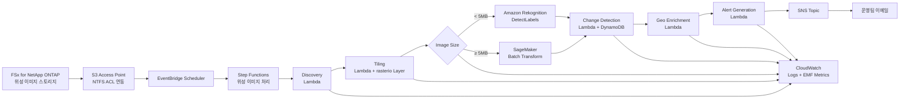

# UC15: 방위·우주 — 위성 영상 분석 아키텍처

🌐 **Language / 언어 / 语言 / 語言 / Langue / Sprache / Idioma**: [日本語](architecture.md) | [English](architecture.en.md) | 한국어 | [简体中文](architecture.zh-CN.md) | [繁體中文](architecture.zh-TW.md) | [Français](architecture.fr.md) | [Deutsch](architecture.de.md) | [Español](architecture.es.md)

> 참고: 이 번역은 Amazon Bedrock Claude로 생성되었습니다. 번역 품질 향상에 대한 기여를 환영합니다.

## 개요

FSx for NetApp ONTAP S3 Access Points를 활용한 위성 이미지(GeoTIFF / NITF / HDF5)의
자동 분석 파이프라인. 국방·인텔리전스·우주 기관이 보유한 대용량 이미지에서
객체 탐지·시계열 변화·알림 생성을 실행한다.

## 아키텍처 다이어그램

## 데이터 플로우

1. **Discovery**: S3 AP에서 `satellite/` 프리픽스를 스캔, GeoTIFF/NITF/HDF5를 열거
2. **Tiling**: 대형 이미지를 COG (Cloud Optimized GeoTIFF)로 변환, 256x256 타일로 분할
3. **Object Detection**: 이미지 크기로 경로 선택
   - `< 5 MB` → Rekognition DetectLabels(차량, 건물, 선박)
   - `≥ 5 MB` → SageMaker Batch Transform(전용 모델)
4. **Change Detection**: geohash를 키로 DynamoDB에서 이전 타일 취득, 차분 면적 계산
5. **Geo Enrichment**: 이미지 헤더에서 좌표·취득 시각·센서 타입 추출
6. **Alert Generation**: 임계값 초과 시 SNS 발행

## IAM 매트릭스

| Principal | Permission | Resource |
|-----------|------------|----------|
| Discovery Lambda | `s3:ListBucket`, `s3:GetObject`, `s3:PutObject` | S3 AP Alias |
| Processing Lambdas | `rekognition:DetectLabels` | `*` |
| Processing Lambdas | `sagemaker:InvokeEndpoint` | Account endpoints |
| Processing Lambdas | `dynamodb:Query/PutItem` | ChangeHistoryTable |
| Processing Lambdas | `sns:Publish` | Notification Topic |
| Step Functions | `lambda:InvokeFunction` | UC15 Lambdas만 |
| EventBridge Scheduler | `states:StartExecution` | State Machine ARN |

## 비용 모델(월간, 도쿄 리전 추산)

| 서비스 | 단가 추정 | 월액 추정 |
|----------|----------|----------|
| Lambda (6 functions, 1 million req/월) | $0.20/1M req + $0.0000166667/GB-s | $15 - $50 |
| Rekognition DetectLabels | $1.00 / 1000 img | $10 / 10K images |
| SageMaker Batch Transform | $0.134/hour (ml.m5.large) | $50 - $200 |
| DynamoDB (PPR, change history) | $1.25 / 1M WRU, $0.25 / 1M RRU | $5 - $20 |
| S3 (output bucket) | $0.023/GB-month | $5 - $30 |
| SNS Email | $0.50 / 1000 notifications | $1 |
| CloudWatch Logs + Metrics | $0.50/GB + $0.30/metric | $10 - $40 |
| **합계(경부하)** | | **$96 - $391** |

SageMaker Endpoint는 기본 비활성화(`EnableSageMaker=false`). 유료 검증 시에만 활성화.

## Public Sector 규제 대응

### DoD Cloud Computing Security Requirements Guide (CC SRG)
- **Impact Level 2** (Public, Non-CUI): AWS Commercial에서 운영 가능
- **Impact Level 4** (CUI): AWS GovCloud (US)로 이전
- **Impact Level 5** (CUI Higher Sensitivity): AWS GovCloud (US) + 추가 제어
- FSx for NetApp ONTAP는 위 모든 Impact Level에서 승인됨

### Commercial Solutions for Classified (CSfC)
- NetApp ONTAP는 NSA CSfC Capability Package 준수
- 데이터 암호화(Data-at-Rest, Data-in-Transit)를 2계층으로 구현 가능

### FedRAMP
- AWS GovCloud (US)에서 FedRAMP High 준수
- FSx ONTAP, S3 Access Points, Lambda, Step Functions 모두 커버

### 데이터 주권
- 리전 내 데이터 완결(ap-northeast-1 / us-gov-west-1)
- cross-region 통신 없음(전체 AWS 내부 VPC 통신)

## 확장성

- Step Functions Map State로 병렬 실행(`MapConcurrency=10` 기본값)
- 시간당 1000개 이미지 처리 가능(Lambda 병렬 + Rekognition 경로)
- SageMaker 경로는 Batch Transform으로 스케일(배치 작업)

## Guard Hooks 준수(Phase 6B)

- ✅ `encryption-required`: 모든 S3 버킷에서 SSE-KMS
- ✅ `iam-least-privilege`: 와일드카드 허용 없음(Rekognition `*`는 API 제약)
- ✅ `logging-required`: 모든 Lambda에 LogGroup 설정
- ✅ `dynamodb-encryption`: 모든 테이블에서 SSE 활성화
- ✅ `sns-encryption`: KmsMasterKeyId 설정 완료

## 출력 대상 (OutputDestination) — Pattern B

UC15는 2026-05-11 업데이트에서 `OutputDestination` 파라미터를 지원했습니다.

| 모드 | 출력 대상 | 생성되는 리소스 | 유스케이스 |
|-------|-------|-------------------|------------|
| `STANDARD_S3`(기본값) | 신규 S3 버킷 | `AWS::S3::Bucket` | 기존과 같이 분리된 S3 버킷에 AI 산출물을 축적 |
| `FSXN_S3AP` | FSxN S3 Access Point | 없음(기존 FSx 볼륨에 재기록) | 분석 담당자가 SMB/NFS 경유로 원본 위성 이미지와 동일 디렉터리에서 AI 산출물을 열람 |

**영향을 받는 Lambda**: Tiling, ObjectDetection, GeoEnrichment(3개 함수).  
**영향을 받지 않는 Lambda**: Discovery(manifest는 계속 S3AP 직접 기록), ChangeDetection(DynamoDB만), AlertGeneration(SNS만).

자세한 내용은 [`docs/output-destination-patterns.md`](../../docs/output-destination-patterns.md) 참조.
