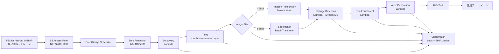

# UC15: 防衛・宇宙 — 衛星画像解析アーキテクチャ

🌐 **Language / 言語**: 日本語 | [English](architecture.en.md) | [한국어](architecture.ko.md) | [简体中文](architecture.zh-CN.md) | [繁體中文](architecture.zh-TW.md) | [Français](architecture.fr.md) | [Deutsch](architecture.de.md) | [Español](architecture.es.md)

## 概要

FSx for NetApp ONTAP S3 Access Points を活用した衛星画像（GeoTIFF / NITF / HDF5）の
自動解析パイプライン。防衛・インテリジェンス・宇宙機関が保有する大容量画像から、
物体検出・時系列変化・アラート生成を実行する。

## アーキテクチャ図

## データフロー

1. **Discovery**: S3 AP で `satellite/` プレフィックスをスキャン、GeoTIFF/NITF/HDF5 を列挙
2. **Tiling**: 大型画像を COG (Cloud Optimized GeoTIFF) に変換、256x256 タイルに分割
3. **Object Detection**: 画像サイズで経路選択
   - `< 5 MB` → Rekognition DetectLabels（車両、建物、船舶）
   - `≥ 5 MB` → SageMaker Batch Transform（専用モデル）
4. **Change Detection**: geohash をキーに DynamoDB から前回タイル取得、差分面積計算
5. **Geo Enrichment**: 画像ヘッダから座標・取得時刻・センサータイプ抽出
6. **Alert Generation**: 閾値超過で SNS 発行

## IAM マトリクス

| Principal | Permission | Resource |
|-----------|------------|----------|
| Discovery Lambda | `s3:ListBucket`, `s3:GetObject`, `s3:PutObject` | S3 AP Alias |
| Processing Lambdas | `rekognition:DetectLabels` | `*` |
| Processing Lambdas | `sagemaker:InvokeEndpoint` | Account endpoints |
| Processing Lambdas | `dynamodb:Query/PutItem` | ChangeHistoryTable |
| Processing Lambdas | `sns:Publish` | Notification Topic |
| Step Functions | `lambda:InvokeFunction` | UC15 Lambdas のみ |
| EventBridge Scheduler | `states:StartExecution` | State Machine ARN |

## コストモデル（月次、東京リージョン試算）

| サービス | 単価想定 | 月額想定 |
|----------|----------|----------|
| Lambda (6 functions, 1 million req/月) | $0.20/1M req + $0.0000166667/GB-s | $15 - $50 |
| Rekognition DetectLabels | $1.00 / 1000 img | $10 / 10K images |
| SageMaker Batch Transform | $0.134/hour (ml.m5.large) | $50 - $200 |
| DynamoDB (PPR, change history) | $1.25 / 1M WRU, $0.25 / 1M RRU | $5 - $20 |
| S3 (output bucket) | $0.023/GB-month | $5 - $30 |
| SNS Email | $0.50 / 1000 notifications | $1 |
| CloudWatch Logs + Metrics | $0.50/GB + $0.30/metric | $10 - $40 |
| **合計（軽負荷）** | | **$96 - $391** |

SageMaker Endpoint はデフォルト無効化（`EnableSageMaker=false`）。有料検証時のみ有効化。

## Public Sector 規制対応

### DoD Cloud Computing Security Requirements Guide (CC SRG)
- **Impact Level 2** (Public, Non-CUI): AWS Commercial で運用可
- **Impact Level 4** (CUI): AWS GovCloud (US) へ移行
- **Impact Level 5** (CUI Higher Sensitivity): AWS GovCloud (US) + 追加制御
- FSx for NetApp ONTAP は上記すべての Impact Level で承認済み

### Commercial Solutions for Classified (CSfC)
- NetApp ONTAP は NSA CSfC Capability Package 準拠
- データ暗号化（Data-at-Rest, Data-in-Transit）を 2 層で実装可

### FedRAMP
- AWS GovCloud (US) で FedRAMP High 準拠
- FSx ONTAP、S3 Access Points、Lambda、Step Functions すべてカバー

### データ主権
- リージョン内データ完結（ap-northeast-1 / us-gov-west-1）
- cross-region 通信なし（全 AWS 内部 VPC 通信）

## スケーラビリティ

- Step Functions Map State で並列実行（`MapConcurrency=10` デフォルト）
- 1 時間あたり 1000 画像処理可（Lambda 並列 + Rekognition ルート）
- SageMaker ルートは Batch Transform でスケール（バッチジョブ）

## Guard Hooks 準拠（Phase 6B）

- ✅ `encryption-required`: すべての S3 バケットで SSE-KMS
- ✅ `iam-least-privilege`: ワイルドカード許可なし（Rekognition `*` は API 制約）
- ✅ `logging-required`: 全 Lambda に LogGroup 設定
- ✅ `dynamodb-encryption`: すべてのテーブルで SSE 有効化
- ✅ `sns-encryption`: KmsMasterKeyId 設定済み