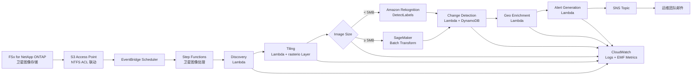

# UC15: 防卫·航天 — 卫星图像解析架构

🌐 **Language / 언어 / 语言 / 語言 / Langue / Sprache / Idioma**: [日本語](architecture.md) | [English](architecture.en.md) | [한국어](architecture.ko.md) | 简体中文 | [繁體中文](architecture.zh-TW.md) | [Français](architecture.fr.md) | [Deutsch](architecture.de.md) | [Español](architecture.es.md)

> 注意：此翻译由 Amazon Bedrock Claude 生成。欢迎对翻译质量提出改进建议。

## 概述

利用 FSx for NetApp ONTAP S3 Access Points 实现卫星图像（GeoTIFF / NITF / HDF5）的
自动分析流水线。国防、情报、航天机构所持有的大容量图像中，
执行物体检测、时序变化、告警生成。

## 架构图

## 数据流

1. **Discovery**: 通过 S3 AP 扫描 `satellite/` 前缀，枚举 GeoTIFF/NITF/HDF5
2. **Tiling**: 将大型图像转换为 COG (Cloud Optimized GeoTIFF)，分割为 256x256 瓦片
3. **Object Detection**: 根据图像大小选择路径
   - `< 5 MB` → Rekognition DetectLabels（车辆、建筑物、船舶）
   - `≥ 5 MB` → SageMaker Batch Transform（专用模型）
4. **Change Detection**: 以 geohash 为键从 DynamoDB 获取上次瓦片，计算差分面积
5. **Geo Enrichment**: 从图像头部提取坐标、获取时间、传感器类型
6. **Alert Generation**: 超过阈值时发布 SNS

## IAM 矩阵

| Principal | Permission | Resource |
|-----------|------------|----------|
| Discovery Lambda | `s3:ListBucket`, `s3:GetObject`, `s3:PutObject` | S3 AP Alias |
| Processing Lambdas | `rekognition:DetectLabels` | `*` |
| Processing Lambdas | `sagemaker:InvokeEndpoint` | Account endpoints |
| Processing Lambdas | `dynamodb:Query/PutItem` | ChangeHistoryTable |
| Processing Lambdas | `sns:Publish` | Notification Topic |
| Step Functions | `lambda:InvokeFunction` | 仅 UC15 Lambdas |
| EventBridge Scheduler | `states:StartExecution` | State Machine ARN |

## 成本模型（月度，东京区域估算）

| 服务 | 单价假设 | 月度假设 |
|----------|----------|----------|
| Lambda (6 functions, 1 million req/月) | $0.20/1M req + $0.0000166667/GB-s | $15 - $50 |
| Rekognition DetectLabels | $1.00 / 1000 img | $10 / 10K images |
| SageMaker Batch Transform | $0.134/hour (ml.m5.large) | $50 - $200 |
| DynamoDB (PPR, change history) | $1.25 / 1M WRU, $0.25 / 1M RRU | $5 - $20 |
| S3 (output bucket) | $0.023/GB-month | $5 - $30 |
| SNS Email | $0.50 / 1000 notifications | $1 |
| CloudWatch Logs + Metrics | $0.50/GB + $0.30/metric | $10 - $40 |
| **合计（轻负载）** | | **$96 - $391** |

SageMaker Endpoint 默认禁用（`EnableSageMaker=false`）。仅在付费验证时启用。

## Public Sector 法规合规

### DoD Cloud Computing Security Requirements Guide (CC SRG)
- **Impact Level 2** (Public, Non-CUI): 可在 AWS Commercial 运行
- **Impact Level 4** (CUI): 迁移至 AWS GovCloud (US)
- **Impact Level 5** (CUI Higher Sensitivity): AWS GovCloud (US) + 附加控制
- FSx for NetApp ONTAP 已获上述所有 Impact Level 批准

### Commercial Solutions for Classified (CSfC)
- NetApp ONTAP 符合 NSA CSfC Capability Package
- 可在 2 层实现数据加密（Data-at-Rest, Data-in-Transit）

### FedRAMP
- AWS GovCloud (US) 符合 FedRAMP High
- FSx ONTAP、S3 Access Points、Lambda、Step Functions 全部覆盖

### 数据主权
- 区域内数据完结（ap-northeast-1 / us-gov-west-1）
- 无跨区域通信（全部 AWS 内部 VPC 通信）

## 可扩展性

- Step Functions Map State 并行执行（默认 `MapConcurrency=10`）
- 每小时可处理 1000 张图像（Lambda 并行 + Rekognition 路径）
- SageMaker 路径通过 Batch Transform 扩展（批处理作业）

## Guard Hooks 合规（Phase 6B）

- ✅ `encryption-required`: 所有 S3 存储桶使用 SSE-KMS
- ✅ `iam-least-privilege`: 无通配符权限（Rekognition `*` 为 API 限制）
- ✅ `logging-required`: 所有 Lambda 设置 LogGroup
- ✅ `dynamodb-encryption`: 所有表启用 SSE
- ✅ `sns-encryption`: 已设置 KmsMasterKeyId

## 输出目标 (OutputDestination) — Pattern B

UC15 在 2026-05-11 的更新中支持了 `OutputDestination` 参数。

| 模式 | 输出目标 | 创建的资源 | 用例 |
|-------|-------|-------------------|------------|
| `STANDARD_S3`（默认） | 新建 S3 存储桶 | `AWS::S3::Bucket` | 按传统方式在独立的 S3 存储桶中积累 AI 成果物 |
| `FSXN_S3AP` | FSxN S3 Access Point | 无（写回现有 FSx 卷） | 分析人员通过 SMB/NFS 在与原始卫星图像相同的目录中查看 AI 成果物 |

**受影响的 Lambda**: Tiling、ObjectDetection、GeoEnrichment（3 个函数）。  
**不受影响的 Lambda**: Discovery（manifest 继续直接写入 S3AP）、ChangeDetection（仅 DynamoDB）、AlertGeneration（仅 SNS）。

详情请参阅 [`docs/output-destination-patterns.md`](../../docs/output-destination-patterns.md)。
