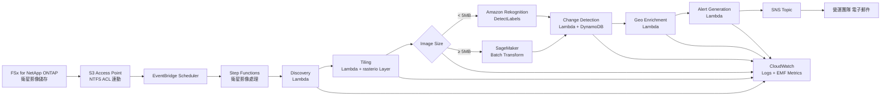

# UC15: 防衛・宇宙 — 衛星圖像解析架構

🌐 **Language / 언어 / 语言 / 語言 / Langue / Sprache / Idioma**: [日本語](architecture.md) | [English](architecture.en.md) | [한국어](architecture.ko.md) | [简体中文](architecture.zh-CN.md) | 繁體中文 | [Français](architecture.fr.md) | [Deutsch](architecture.de.md) | [Español](architecture.es.md)

> 注意：此翻譯由 Amazon Bedrock Claude 產生。歡迎對翻譯品質提出改進建議。

## 概述

利用 FSx for NetApp ONTAP S3 Access Points 的衛星影像（GeoTIFF / NITF / HDF5）
自動分析管線。國防、情報、太空機構所持有的大容量影像中，
執行物件偵測、時間序列變化、警報生成。

## 架構圖

## 資料流程

1. **Discovery**：在 S3 AP 掃描 `satellite/` 前綴，列舉 GeoTIFF/NITF/HDF5
2. **Tiling**：將大型影像轉換為 COG (Cloud Optimized GeoTIFF)，分割為 256x256 圖塊
3. **Object Detection**：依影像大小選擇路徑
   - `< 5 MB` → Rekognition DetectLabels（車輛、建築物、船舶）
   - `≥ 5 MB` → SageMaker Batch Transform（專用模型）
4. **Change Detection**：以 geohash 為鍵從 DynamoDB 取得前次圖塊，計算差異面積
5. **Geo Enrichment**：從影像標頭提取座標、取得時間、感測器類型
6. **Alert Generation**：超過閾值時發布 SNS

## IAM 矩陣

| Principal | Permission | Resource |
|-----------|------------|----------|
| Discovery Lambda | `s3:ListBucket`, `s3:GetObject`, `s3:PutObject` | S3 AP Alias |
| Processing Lambdas | `rekognition:DetectLabels` | `*` |
| Processing Lambdas | `sagemaker:InvokeEndpoint` | Account endpoints |
| Processing Lambdas | `dynamodb:Query/PutItem` | ChangeHistoryTable |
| Processing Lambdas | `sns:Publish` | Notification Topic |
| Step Functions | `lambda:InvokeFunction` | 僅限 UC15 Lambdas |
| EventBridge Scheduler | `states:StartExecution` | State Machine ARN |

## 成本模型（每月，東京區域試算）

| 服務 | 單價假設 | 每月假設 |
|----------|----------|----------|
| Lambda (6 functions, 1 million req/月) | $0.20/1M req + $0.0000166667/GB-s | $15 - $50 |
| Rekognition DetectLabels | $1.00 / 1000 img | $10 / 10K images |
| SageMaker Batch Transform | $0.134/hour (ml.m5.large) | $50 - $200 |
| DynamoDB (PPR, change history) | $1.25 / 1M WRU, $0.25 / 1M RRU | $5 - $20 |
| S3 (output bucket) | $0.023/GB-month | $5 - $30 |
| SNS Email | $0.50 / 1000 notifications | $1 |
| CloudWatch Logs + Metrics | $0.50/GB + $0.30/metric | $10 - $40 |
| **合計（輕負載）** | | **$96 - $391** |

SageMaker Endpoint 預設停用（`EnableSageMaker=false`）。僅在付費驗證時啟用。

## Public Sector 法規遵循

### DoD Cloud Computing Security Requirements Guide (CC SRG)
- **Impact Level 2** (Public, Non-CUI)：可在 AWS Commercial 運作
- **Impact Level 4** (CUI)：遷移至 AWS GovCloud (US)
- **Impact Level 5** (CUI Higher Sensitivity)：AWS GovCloud (US) + 額外控制
- FSx for NetApp ONTAP 已獲上述所有 Impact Level 核准

### Commercial Solutions for Classified (CSfC)
- NetApp ONTAP 符合 NSA CSfC Capability Package
- 可實作 2 層資料加密（Data-at-Rest, Data-in-Transit）

### FedRAMP
- AWS GovCloud (US) 符合 FedRAMP High
- FSx ONTAP、S3 Access Points、Lambda、Step Functions 全部涵蓋

### 資料主權
- 區域內資料完整（ap-northeast-1 / us-gov-west-1）
- 無跨區域通訊（全部為 AWS 內部 VPC 通訊）

## 可擴展性

- Step Functions Map State 並行執行（預設 `MapConcurrency=10`）
- 每小時可處理 1000 張影像（Lambda 並行 + Rekognition 路徑）
- SageMaker 路徑透過 Batch Transform 擴展（批次作業）

## Guard Hooks 遵循（Phase 6B）

- ✅ `encryption-required`：所有 S3 儲存貯體使用 SSE-KMS
- ✅ `iam-least-privilege`：無萬用字元許可（Rekognition `*` 為 API 限制）
- ✅ `logging-required`：所有 Lambda 設定 LogGroup
- ✅ `dynamodb-encryption`：所有資料表啟用 SSE
- ✅ `sns-encryption`：已設定 KmsMasterKeyId

## 輸出目的地 (OutputDestination) — Pattern B

UC15 在 2026-05-11 的更新中支援 `OutputDestination` 參數。

| 模式 | 輸出目的地 | 建立的資源 | 使用案例 |
|-------|-------|-------------------|------------|
| `STANDARD_S3`（預設） | 新 S3 儲存貯體 | `AWS::S3::Bucket` | 如同以往將 AI 成果物累積在獨立的 S3 儲存貯體 |
| `FSXN_S3AP` | FSxN S3 Access Point | 無（寫回既有 FSx 磁碟區） | 分析人員透過 SMB/NFS 在與原始衛星影像相同目錄中檢視 AI 成果物 |

**受影響的 Lambda**：Tiling、ObjectDetection、GeoEnrichment（3 個函式）。  
**不受影響的 Lambda**：Discovery（manifest 繼續直接寫入 S3AP）、ChangeDetection（僅 DynamoDB）、AlertGeneration（僅 SNS）。

詳情請參閱 [`docs/output-destination-patterns.md`](../../docs/output-destination-patterns.md)。
