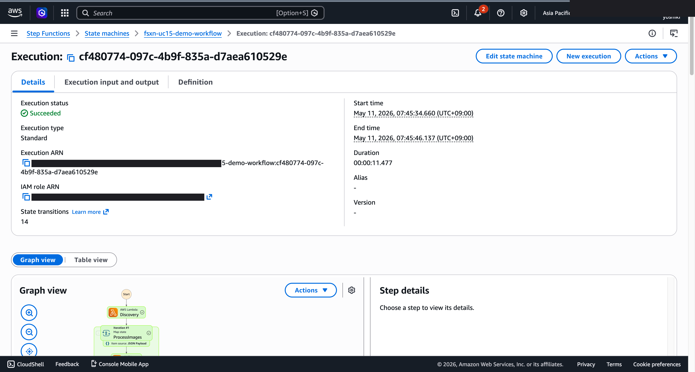

# UC15 Demoskript (30-Minuten-Slot)

🌐 **Language / 언어 / 语言 / 語言 / Langue / Sprache / Idioma**: [日本語](demo-guide.md) | [English](demo-guide.en.md) | [한국어](demo-guide.ko.md) | [简体中文](demo-guide.zh-CN.md) | [繁體中文](demo-guide.zh-TW.md) | [Français](demo-guide.fr.md) | Deutsch | [Español](demo-guide.es.md)

> Hinweis: Diese Übersetzung wurde von Amazon Bedrock Claude erstellt. Beiträge zur Verbesserung der Übersetzungsqualität sind willkommen.

## Voraussetzungen

- AWS-Konto, ap-northeast-1
- FSx for NetApp ONTAP + S3 Access Point
- `defense-satellite/template-deploy.yaml` bereits bereitgestellt (`EnableSageMaker=false`)

## Zeitplan

### 0:00 - 0:05 Einführung (5 Minuten)

- Anwendungsfall-Hintergrund: Zunahme von Satellitenbilddaten (Sentinel, Landsat, kommerzielles SAR)
- Herausforderungen bei herkömmlichem NAS: Kopierbasierte Workflows sind zeit- und kostenintensiv
- Vorteile von FSxN S3AP: Zero-Copy, NTFS ACL-Integration, serverlose Verarbeitung

### 0:05 - 0:10 Architekturerklärung (5 Minuten)

- Vorstellung des Step Functions-Workflows anhand eines Mermaid-Diagramms
- Umschaltlogik zwischen Rekognition / SageMaker basierend auf Bildgröße
- Mechanismus der Änderungserkennung mittels Geohash

### 0:10 - 0:15 Live-Bereitstellung (5 Minuten)

```bash
aws cloudformation deploy \
  --template-file defense-satellite/template-deploy.yaml \
  --stack-name fsxn-uc15-demo \
  --parameter-overrides \
    DeployBucket=<your-deploy-bucket> \
    S3AccessPointAlias=<your-ap-ext-s3alias> \
    VpcId=<vpc-id> \
    PrivateSubnetIds=<subnet-ids> \
    NotificationEmail=ops@example.com \
  --capabilities CAPABILITY_NAMED_IAM \
  --region ap-northeast-1
```

### 0:15 - 0:20 Beispielbildverarbeitung (5 Minuten)

```bash
# Beispiel-GeoTIFF hochladen
aws s3 cp sample-satellite.tif \
  s3://<s3-ap-arn>/satellite/2026/05/tokyo_bay.tif

# Step Functions-Ausführung
aws stepfunctions start-execution \
  --state-machine-arn <uc15-StateMachineArn> \
  --input '{}'
```

- Step Functions-Graph in der AWS-Konsole zeigen (Discovery → Map → Tiling → ObjectDetection → ChangeDetection → GeoEnrichment → AlertGeneration)
- Ausführungszeit bis SUCCEEDED überprüfen (normalerweise 2-3 Minuten)

### 0:20 - 0:25 Ergebnisüberprüfung (5 Minuten)

- S3-Ausgabe-Bucket-Hierarchie zeigen:
  - `tiles/YYYY/MM/DD/<basename>/metadata.json`
  - `detections/<tile_key>_detections.json`
  - `enriched/YYYY/MM/DD/<tile_id>.json`
- EMF-Metriken in CloudWatch Logs überprüfen
- Änderungserkennungsverlauf in DynamoDB-Tabelle `change-history`

### 0:25 - 0:30 Q&A + Zusammenfassung (5 Minuten)

- Einhaltung von Public Sector-Vorschriften (DoD CC SRG, CSfC, FedRAMP)
- GovCloud-Migrationspfad (gleiche Vorlage für `ap-northeast-1` → `us-gov-west-1`)
- Kostenoptimierung (SageMaker Endpoint nur im Produktivbetrieb aktivieren)
- Nächste Schritte: Integration mehrerer Satellitenanbieter, Sentinel-1/2 Hub-Integration

## Häufig gestellte Fragen und Antworten

**F. Wie werden SAR-Daten (Sentinel-1 HDF5) behandelt?**  
A. Discovery Lambda klassifiziert als `image_type=sar`, Tiling kann HDF5-Parser implementieren (rasterio oder h5py). Object Detection erfordert dediziertes SAR-Analysemodell (SageMaker).

**F. Was ist die Grundlage für den Bildgrößenschwellenwert (5MB)?**  
A. Obergrenze des Bytes-Parameters der Rekognition DetectLabels API. Über S3 sind bis zu 15MB möglich. Der Prototyp verwendet den Bytes-Pfad.

**F. Wie genau ist die Änderungserkennung?**  
A. Die aktuelle Implementierung ist ein einfacher Vergleich basierend auf bbox-Fläche. Für den Produktivbetrieb wird semantische Segmentierung mit SageMaker empfohlen.

---

## Über das Ausgabeziel: Auswählbar mit OutputDestination (Muster B)

UC15 defense-satellite unterstützt seit dem Update vom 11.05.2026 den Parameter `OutputDestination`
(siehe `docs/output-destination-patterns.md`).

**Ziel-Workload**: Satellitenbild-Tiling / Objekterkennung / Geo-Enrichment

**2 Modi**:

### STANDARD_S3 (Standard, wie bisher)
Erstellt einen neuen S3-Bucket (`${AWS::StackName}-output-${AWS::AccountId}`) und
schreibt AI-Artefakte dorthin. Nur das Manifest der Discovery Lambda wird in den S3 Access Point
geschrieben (wie bisher).

```bash
aws cloudformation deploy \
  --template-file defense-satellite/template-deploy.yaml \
  --stack-name fsxn-defense-satellite-demo \
  --parameter-overrides \
    OutputDestination=STANDARD_S3 \
    ... (andere erforderliche Parameter)
```

### FSXN_S3AP ("no data movement"-Muster)
Schreibt Tiling-Metadaten, Objekterkennungs-JSON und Geo-enriched-Erkennungsergebnisse über den FSxN S3 Access Point
zurück in **dasselbe FSx ONTAP-Volume** wie die ursprünglichen Satellitenbilder.
Analysten können AI-Artefakte direkt innerhalb der bestehenden SMB/NFS-Verzeichnisstruktur referenzieren.
Es wird kein Standard-S3-Bucket erstellt.

```bash
aws cloudformation deploy \
  --template-file defense-satellite/template-deploy.yaml \
  --stack-name fsxn-defense-satellite-demo \
  --parameter-overrides \
    OutputDestination=FSXN_S3AP \
    OutputS3APPrefix=ai-outputs/ \
    S3AccessPointName=eda-demo-s3ap \
    ... (andere erforderliche Parameter)
```

**Hinweise**:

- Angabe von `S3AccessPointName` wird dringend empfohlen (IAM-Berechtigung sowohl für Alias- als auch ARN-Format)
- Objekte über 5GB sind mit FSxN S3AP nicht möglich (AWS-Spezifikation), Multipart-Upload erforderlich
- ChangeDetection Lambda verwendet nur DynamoDB und wird daher nicht von `OutputDestination` beeinflusst
- AlertGeneration Lambda verwendet nur SNS und wird daher nicht von `OutputDestination` beeinflusst
- AWS-Spezifikationsbeschränkungen siehe
  [Abschnitt "AWS-Spezifikationsbeschränkungen und Workarounds" im Projekt-README](../../README.md#aws-仕様上の制約と回避策)
  und [`docs/output-destination-patterns.md`](../../docs/output-destination-patterns.md)

---

## Verifizierte UI/UX-Screenshots

Nach dem gleichen Ansatz wie die Phase 7 UC15/16/17 und UC6/11/14 Demos, mit Fokus auf
**UI/UX-Bildschirme, die Endbenutzer tatsächlich im täglichen Betrieb sehen**.
Technische Ansichten (Step Functions-Graph, CloudFormation-Stack-Ereignisse usw.)
sind in `docs/verification-results-*.md` zusammengefasst.

### Verifizierungsstatus für diesen Anwendungsfall

- ✅ **E2E**: SUCCEEDED (Phase 7 Extended Round, commit b77fc3b)
- 📸 **UI/UX**: Not yet captured

### Vorhandene Screenshots



### UI/UX-Zielbildschirme für Re-Verifizierung (empfohlene Aufnahmeliste)

- S3-Ausgabe-Bucket (detections/, geo-enriched/, alerts/)
- Rekognition Satellitenbildobjekterkennung Ergebnis-JSON
- GeoEnrichment koordinatenmarkierte Erkennungsergebnisse
- SNS-Alarm-Benachrichtigungs-E-Mail
- AI-Artefakte auf FSx ONTAP-Volume (FSXN_S3AP-Modus)

### Aufnahmeanleitung

1. **Vorbereitung**: `bash scripts/verify_phase7_prerequisites.sh` ausführen, um Voraussetzungen zu prüfen
2. **Beispieldaten**: Dateien über S3 AP Alias hochladen, dann Step Functions-Workflow starten
3. **Aufnahme** (CloudShell/Terminal schließen, Benutzername oben rechts im Browser maskieren)
4. **Maskierung**: `python3 scripts/mask_uc_demos.py <uc-dir>` für automatische OCR-Maskierung ausführen
5. **Bereinigung**: `bash scripts/cleanup_generic_ucs.sh <UC>` zum Löschen des Stacks ausführen
