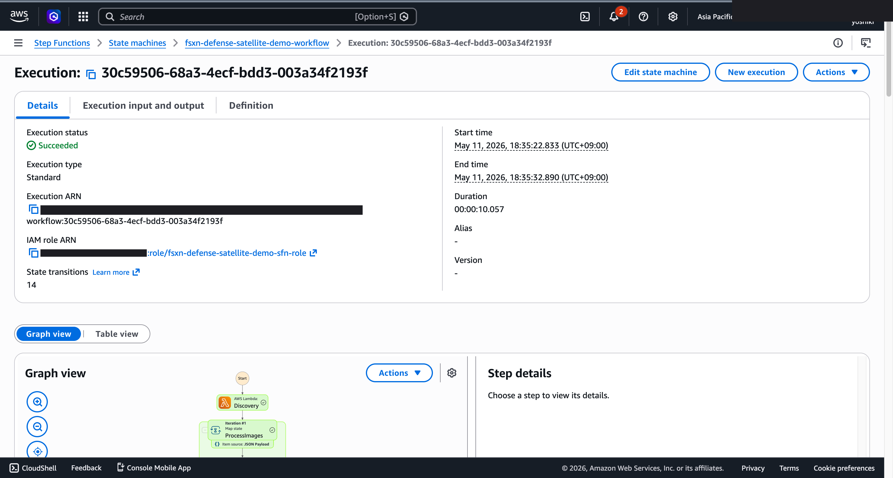
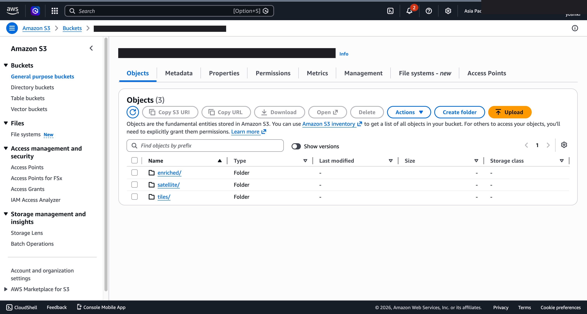
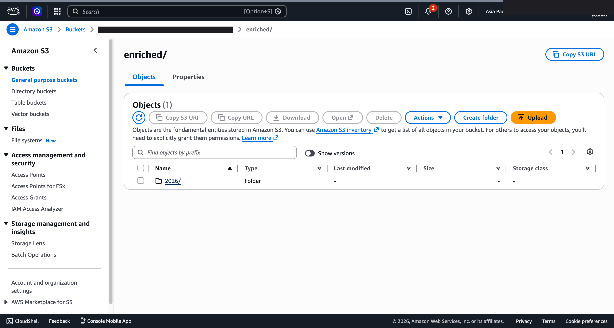
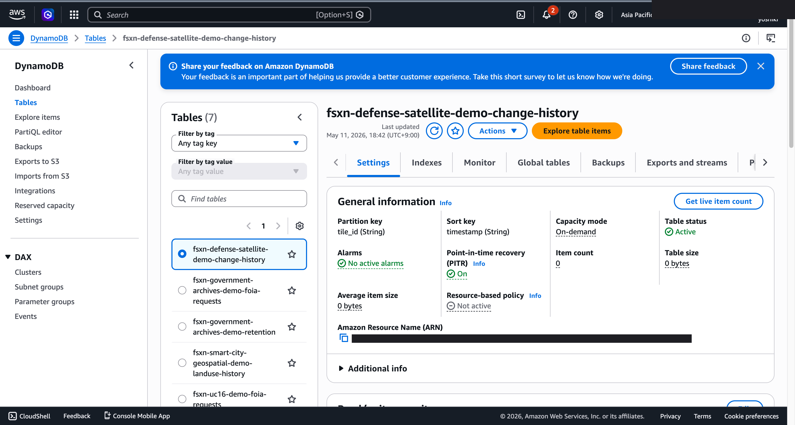
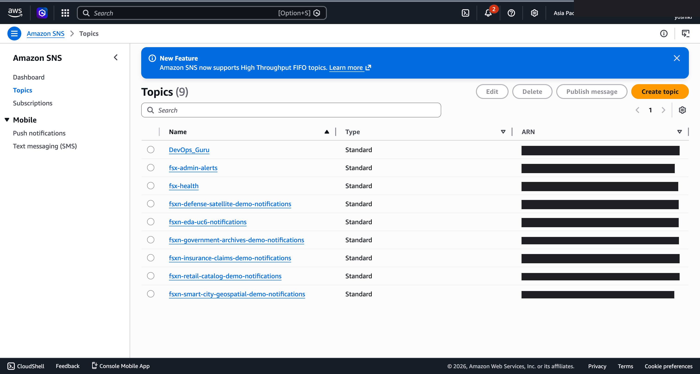

# UC15 Script de demostración (sesión de 30 minutos)

🌐 **Language / 언어 / 语言 / 語言 / Langue / Sprache / Idioma**: [日本語](demo-guide.md) | [English](demo-guide.en.md) | [한국어](demo-guide.ko.md) | [简体中文](demo-guide.zh-CN.md) | [繁體中文](demo-guide.zh-TW.md) | [Français](demo-guide.fr.md) | [Deutsch](demo-guide.de.md) | Español

> Nota: Esta traducción ha sido producida por Amazon Bedrock Claude. Las contribuciones para mejorar la calidad de la traducción son bienvenidas.

## Requisitos previos

- Cuenta de AWS, ap-northeast-1
- FSx for NetApp ONTAP + S3 Access Point
- `defense-satellite/template-deploy.yaml` desplegado (`EnableSageMaker=false`)

## Cronograma

### 0:00 - 0:05 Introducción (5 minutos)

- Contexto del caso de uso: aumento de datos de imágenes satelitales (Sentinel, Landsat, SAR comercial)
- Desafíos del NAS tradicional: flujos de trabajo basados en copias que consumen tiempo y costos
- Ventajas de FSxN S3AP: zero-copy, integración con NTFS ACL, procesamiento serverless

### 0:05 - 0:10 Explicación de la arquitectura (5 minutos)

- Presentación del flujo de trabajo de Step Functions con diagrama Mermaid
- Lógica de conmutación entre Rekognition / SageMaker según el tamaño de imagen
- Mecanismo de detección de cambios mediante geohash

### 0:10 - 0:15 Despliegue en vivo (5 minutos)

```bash
aws cloudformation deploy \
  --template-file defense-satellite/template-deploy.yaml \
  --stack-name fsxn-uc15-demo \
  --parameter-overrides \
    DeployBucket=<your-deploy-bucket> \
    S3AccessPointAlias=<your-ap-ext-s3alias> \
    VpcId=<vpc-id> \
    PrivateSubnetIds=<subnet-ids> \
    NotificationEmail=ops@example.com \
  --capabilities CAPABILITY_NAMED_IAM \
  --region ap-northeast-1
```

### 0:15 - 0:20 Procesamiento de imágenes de muestra (5 minutos)

```bash
# Subir GeoTIFF de muestra
aws s3 cp sample-satellite.tif \
  s3://<s3-ap-arn>/satellite/2026/05/tokyo_bay.tif

# Ejecutar Step Functions
aws stepfunctions start-execution \
  --state-machine-arn <uc15-StateMachineArn> \
  --input '{}'
```

- Mostrar el gráfico de Step Functions en la consola de AWS (Discovery → Map → Tiling → ObjectDetection → ChangeDetection → GeoEnrichment → AlertGeneration)
- Verificar el tiempo de ejecución hasta SUCCEEDED (normalmente 2-3 minutos)

### 0:20 - 0:25 Verificación de resultados (5 minutos)

- Mostrar la jerarquía del bucket de salida S3:
  - `tiles/YYYY/MM/DD/<basename>/metadata.json`
  - `detections/<tile_key>_detections.json`
  - `enriched/YYYY/MM/DD/<tile_id>.json`
- Verificar métricas EMF en CloudWatch Logs
- Historial de detección de cambios en la tabla DynamoDB `change-history`

### 0:25 - 0:30 Preguntas y respuestas + Cierre (5 minutos)

- Cumplimiento regulatorio del sector público (DoD CC SRG, CSfC, FedRAMP)
- Ruta de migración a GovCloud (misma plantilla de `ap-northeast-1` → `us-gov-west-1`)
- Optimización de costos (habilitar SageMaker Endpoint solo en operación real)
- Próximos pasos: integración de múltiples proveedores satelitales, integración con Sentinel-1/2 Hub

## Preguntas frecuentes y respuestas

**P. ¿Cómo se manejan los datos SAR (HDF5 de Sentinel-1)?**  
R. Discovery Lambda los clasifica como `image_type=sar`, Tiling puede implementar un parser HDF5 (rasterio o h5py). Object Detection requiere un modelo de análisis SAR dedicado (SageMaker).

**P. ¿Cuál es la base del umbral de tamaño de imagen (5MB)?**  
R. El límite superior del parámetro Bytes de la API DetectLabels de Rekognition. Vía S3 permite hasta 15MB. El prototipo adopta la ruta Bytes.

**P. ¿Cuál es la precisión de la detección de cambios?**  
R. La implementación actual es una comparación simple basada en el área del bbox. Para operación formal se recomienda segmentación semántica de SageMaker.

---

## Acerca del destino de salida: seleccionable con OutputDestination (Patrón B)

UC15 defense-satellite soporta el parámetro `OutputDestination` desde la actualización del 2026-05-11
(consulte `docs/output-destination-patterns.md`).

**Carga de trabajo objetivo**: Tiling de imágenes satelitales / Detección de objetos / Geo enrichment

**2 modos**:

### STANDARD_S3 (predeterminado, como antes)
Crea un nuevo bucket S3 (`${AWS::StackName}-output-${AWS::AccountId}`) y
escribe los resultados de IA allí. Solo el manifest de Discovery Lambda se escribe
en el S3 Access Point (como antes).

```bash
aws cloudformation deploy \
  --template-file defense-satellite/template-deploy.yaml \
  --stack-name fsxn-defense-satellite-demo \
  --parameter-overrides \
    OutputDestination=STANDARD_S3 \
    ... (otros parámetros obligatorios)
```

### FSXN_S3AP (patrón "no data movement")
Escribe los metadatos de tiling, JSON de detección de objetos y resultados de detección con Geo enrichment
de vuelta al **mismo volumen FSx ONTAP** que las imágenes satelitales originales a través del FSxN S3 Access Point.
Los analistas pueden referenciar directamente los resultados de IA dentro de la estructura de directorios
SMB/NFS existente. No se crea un bucket S3 estándar.

```bash
aws cloudformation deploy \
  --template-file defense-satellite/template-deploy.yaml \
  --stack-name fsxn-defense-satellite-demo \
  --parameter-overrides \
    OutputDestination=FSXN_S3AP \
    OutputS3APPrefix=ai-outputs/ \
    S3AccessPointName=eda-demo-s3ap \
    ... (otros parámetros obligatorios)
```

**Notas importantes**:

- Se recomienda encarecidamente especificar `S3AccessPointName` (permitir IAM tanto en formato Alias como ARN)
- Objetos superiores a 5GB no son posibles con FSxN S3AP (especificación de AWS), se requiere multipart upload
- ChangeDetection Lambda solo usa DynamoDB, por lo que no se ve afectado por `OutputDestination`
- AlertGeneration Lambda solo usa SNS, por lo que no se ve afectado por `OutputDestination`
- Para restricciones de especificación de AWS, consulte
  [la sección "Restricciones de especificación de AWS y soluciones alternativas" del README del proyecto](../../README.md#aws-仕様上の制約と回避策)
  y [`docs/output-destination-patterns.md`](../../docs/output-destination-patterns.md)

---

## Capturas de pantalla de UI/UX verificadas

Siguiendo la misma política que las demos de Phase 7 UC15/16/17 y UC6/11/14, se enfocan en **las pantallas
de UI/UX que los usuarios finales ven realmente en su trabajo diario**. Las vistas para técnicos (gráfico
de Step Functions, eventos de stack de CloudFormation, etc.) se consolidan en `docs/verification-results-*.md`.

### Estado de verificación de este caso de uso

- ✅ **Verificación E2E**: SUCCEEDED (Phase 7 Extended Round, commit b77fc3b)
- 📸 **Captura UI/UX**: ✅ Completada (Phase 8 Theme D, commit d7ebabd)

### Capturas de pantalla existentes (verificación Phase 7)










### Pantallas UI/UX objetivo para reverificación (lista de captura recomendada)

- Bucket de salida S3 (detections/, geo-enriched/, alerts/)
- Vista previa JSON de resultados de detección de objetos en imágenes satelitales de Rekognition
- Resultados de detección con coordenadas de GeoEnrichment
- Correo electrónico de notificación de alerta SNS
- Resultados de IA en volumen FSx ONTAP (modo FSXN_S3AP)

### Guía de captura

1. **Preparación previa**:
   - Verificar requisitos previos con `bash scripts/verify_phase7_prerequisites.sh` (existencia de VPC/S3 AP común)
   - Empaquetar Lambda con `UC=defense-satellite bash scripts/package_generic_uc.sh`
   - Desplegar con `bash scripts/deploy_generic_ucs.sh UC15`

2. **Colocación de datos de muestra**:
   - Subir GeoTIFF de muestra al prefijo `satellite-imagery/` vía S3 AP Alias
   - Iniciar Step Functions `fsxn-defense-satellite-demo-workflow` (entrada `{}`)

3. **Captura** (cerrar CloudShell/terminal, enmascarar nombre de usuario en la parte superior derecha del navegador):
   - Vista general del bucket de salida S3 `fsxn-defense-satellite-demo-output-<account>`
   - Vista previa de JSON de salida AI/ML (detections, geo-enriched)
   - Notificación por correo electrónico SNS (notificación de AlertGeneration)

4. **Procesamiento de enmascaramiento**:
   - Enmascaramiento automático con `python3 scripts/mask_uc_demos.py defense-satellite-demo`
   - Enmascaramiento adicional según `docs/screenshots/MASK_GUIDE.md` (si es necesario)

5. **Limpieza**:
   - Eliminar con `bash scripts/cleanup_generic_ucs.sh UC15`
   - Liberación de ENI de Lambda VPC en 15-30 minutos (especificación de AWS)
