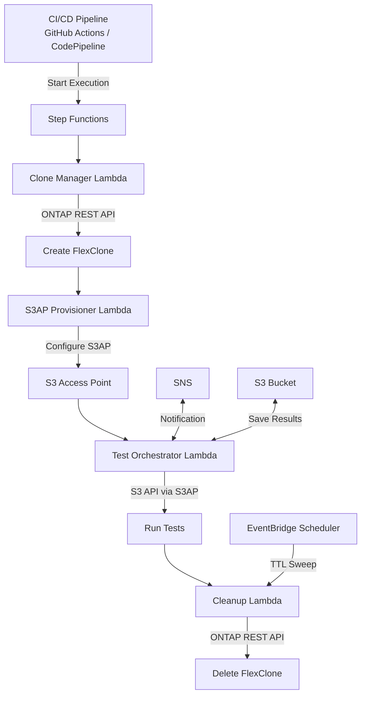

# FC7: DevOps FlexClone + S3AP — Dev/Test-Datenaktualisierung & CI/CD-Pipeline-Integration

🌐 **Language / Sprache**: [日本語](README.md) | [English](README.en.md) | [한국어](README.ko.md) | [简体中文](README.zh-CN.md) | [繁體中文](README.zh-TW.md) | [Français](README.fr.md) | Deutsch | [Español](README.es.md)

📚 **Docs**: [Architektur](docs/architecture.en.md) | [Demo-Anleitung](docs/demo-guide.en.md)

## Überblick

Ein Automatisierungsmuster, das ONTAP FlexClone mit S3 Access Points kombiniert, um **sofortige Kopien von Produktionsdaten über die serverlose S3-API zugänglich zu machen**.

Dieses Muster erweitert den von EBS Volume Clones ([AWS-Blog](https://aws.amazon.com/blogs/storage/accelerate-development-workflows-with-amazon-ebs-volume-clones/)) eingeführten Workflow — „sofortige Kopie → Dev/Test-Nutzung → automatische Löschung" — mit FSx for ONTAP FlexClone + S3 Access Points für höhere Effizienz.

### Vergleich mit EBS Volume Clones

| Funktion | EBS Volume Clones | FlexClone + S3AP (dieses UC) |
|----------|-------------------|--------------------------|
| Kopiergeschwindigkeit | Sofort (Sekunden) | Sofort (nur Metadaten) |
| Speichereffizienz | Vollständige Kopie (verbraucht Kapazität) | **Platzsparend (nur geänderte Blöcke)** |
| Zugriffsmethode | EC2-Anhängen erforderlich | **S3-API (serverlos)** |
| AZ-Beschränkung | Nur gleiche AZ | **Zugriff von VPC-externem Lambda** |
| Automatische Bereinigung | Manuell/benutzerdefiniert | **TTL-basierte automatische Löschung** |
| CI/CD-Integration | Benutzerdefinierte Implementierung | **Step Functions nativ** |

## Architektur



## Anwendungsfälle

### 1. Dev/Test-Datenaktualisierung (täglich)

Erstellung eines täglichen FlexClone des Produktionsvolumes und Bereitstellung des S3AP-Alias an das Entwicklungsteam. Der Klon des Vortags wird vor der Erstellung des nächsten automatisch gelöscht.

```bash
# Beispiel für manuellen Trigger
aws stepfunctions start-execution \
  --state-machine-arn arn:aws:states:ap-northeast-1:ACCOUNT:stateMachine:DevTestRefresh \
  --input '{"source_volume": "production_data", "ttl_hours": 24, "requester": "dev-team"}'
```

### 2. CI/CD-Pipeline-Testdaten (bei Bedarf)

Automatisch ausgelöst bei PR-Merge oder Nightly Builds. Sofortige Bereinigung nach Testabschluss.

```yaml
# GitHub Actions Integrationsbeispiel
- name: Provision test data
  run: |
    EXECUTION_ARN=$(aws stepfunctions start-execution \
      --state-machine-arn ${{ secrets.STATE_MACHINE_ARN }} \
      --input '{"source_volume": "testdata_master", "test_suite": "integration"}' \
      --query 'executionArn' --output text)
    # Wait for completion
    aws stepfunctions describe-execution --execution-arn $EXECUTION_ARN --query 'status'
```

### 3. DR-Tests (wöchentlich/monatlich)

Validierung von DR-Verfahren anhand eines Klons der Produktionsdaten. Kein Einfluss auf die Produktion.

## Bereitstellung

```bash
sam deploy \
  --template-file template.yaml \
  --stack-name devops-flexclone-cicd \
  --parameter-overrides \
    OntapManagementIp=10.0.1.100 \
    OntapSecretName=fsxn/ontap-credentials \
    SvmName=svm1 \
    SourceVolumeName=production_data \
    SimulationMode=true \
  --capabilities CAPABILITY_IAM
```

## Erfolgskennzahlen

| Ergebnis | Kennzahl | Messung | Menschliche Prüfung |
|----------|----------|---------|---------------------|
| Schnellere Datenbereitstellung | Klon-Erstellungszeit | < 60 Sekunden (nur Metadaten) | ✅ |
| Speichereffizienz | Klon-Kapazitätsverbrauch | < 5 % des Quellvolumes | ✅ |
| CI/CD-Pipeline-Beschleunigung | Testdaten-Vorbereitungszeit | 90 %+ Reduktion vs. Snapshots | ✅ |
| Automatische Bereinigungsrate | TTL-abgelaufene Klon-Löschrate | 100 % | — |
| Testzuverlässigkeit | Testerfolgsrate mit produktionsäquivalenten Daten | > 95 % | ✅ |

## Einschränkungen

- FlexClone wird innerhalb desselben Aggregates erstellt (IOPS werden mit dem übergeordneten Volume geteilt)
- Schreibvorgänge über S3AP sind auf maximal 5 GB begrenzt (NFS für größere Testdaten-Schreibvorgänge verwenden)
- Lambda-VPC-Platzierungsanforderungen hängen von der NetworkOrigin-Einstellung ab (siehe Steering-Docs)
- FlexClone-Split konvertiert in ein unabhängiges Volume (Verlust der Speichereffizienz)
