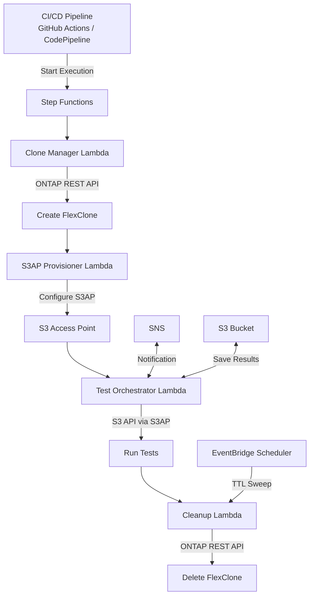

# UC29: DevOps FlexClone + S3AP — Dev/Test Data Refresh & CI/CD Pipeline Integration

[English](README.en.md) | [日本語](README.md) | [한국어](README.ko.md) | [中文(简)](README.zh-CN.md) | [中文(繁)](README.zh-TW.md) | [Français](README.fr.md) | [Deutsch](README.de.md) | [Español](README.es.md)

## Overview

An automation pattern combining ONTAP FlexClone with S3 Access Points to **make instant copies of production data accessible via serverless S3 API**.

This extends the workflow pioneered by EBS Volume Clones ([AWS Blog](https://aws.amazon.com/blogs/storage/accelerate-development-workflows-with-amazon-ebs-volume-clones/)) — "instant copy → use for dev/test → auto-delete" — using FSx for ONTAP FlexClone + S3 Access Points for added efficiency.

### Comparison with EBS Volume Clones

| Feature | EBS Volume Clones | FlexClone + S3AP (This UC) |
|---------|-------------------|--------------------------|
| Copy speed | Instant (seconds) | Instant (metadata-only) |
| Storage efficiency | Full copy (consumes capacity) | **Space-efficient (changed blocks only)** |
| Access method | EC2 attach required | **S3 API (serverless)** |
| AZ constraint | Same-AZ only | **Accessible from VPC-external Lambda** |
| Auto-cleanup | Manual/custom | **TTL-based auto-deletion** |
| CI/CD integration | Custom implementation | **Step Functions native** |

## Architecture



## Use Cases

### 1. Dev/Test Data Refresh (Daily)

Create a daily FlexClone of the production volume and provide the S3AP alias to the development team. Previous day's clone is auto-deleted before the next one is created.

```bash
# Manual trigger example
aws stepfunctions start-execution \
  --state-machine-arn arn:aws:states:ap-northeast-1:ACCOUNT:stateMachine:DevTestRefresh \
  --input '{"source_volume": "production_data", "ttl_hours": 24, "requester": "dev-team"}'
```

### 2. CI/CD Pipeline Test Data (On-demand)

Auto-triggered on PR merge or nightly builds. Cleans up immediately after tests complete.

```yaml
# GitHub Actions integration example
- name: Provision test data
  run: |
    EXECUTION_ARN=$(aws stepfunctions start-execution \
      --state-machine-arn ${{ secrets.STATE_MACHINE_ARN }} \
      --input '{"source_volume": "testdata_master", "test_suite": "integration"}' \
      --query 'executionArn' --output text)
    # Wait for completion
    aws stepfunctions describe-execution --execution-arn $EXECUTION_ARN --query 'status'
```

### 3. DR Testing (Weekly/Monthly)

Validate DR procedures against a clone of production data. Zero impact on production.

## Deployment

```bash
sam deploy \
  --template-file template.yaml \
  --stack-name devops-flexclone-cicd \
  --parameter-overrides \
    OntapManagementIp=10.0.1.100 \
    OntapSecretName=fsxn/ontap-credentials \
    SvmName=svm1 \
    SourceVolumeName=production_data \
    SimulationMode=true \
  --capabilities CAPABILITY_IAM
```

## Success Metrics

| Outcome | Metric | Measurement | Human Review |
|---------|--------|-------------|--------------|
| Faster data provisioning | Clone creation time | < 60 seconds (metadata-only) | ✅ |
| Storage efficiency | Clone capacity consumption | < 5% of source volume | ✅ |
| CI/CD pipeline acceleration | Test data prep time | 90%+ reduction vs snapshots | ✅ |
| Auto-cleanup rate | TTL-expired clone deletion rate | 100% | — |
| Test reliability | Test success rate with production-equivalent data | > 95% | ✅ |

## Constraints

- FlexClone is created within the same aggregate (IOPS shared with parent)
- Writes via S3AP are limited to 5 GB max (use NFS for larger test data writes)
- Lambda VPC placement requirements depend on NetworkOrigin setting (see steering docs)
- FlexClone split converts to an independent volume (loses space efficiency)
