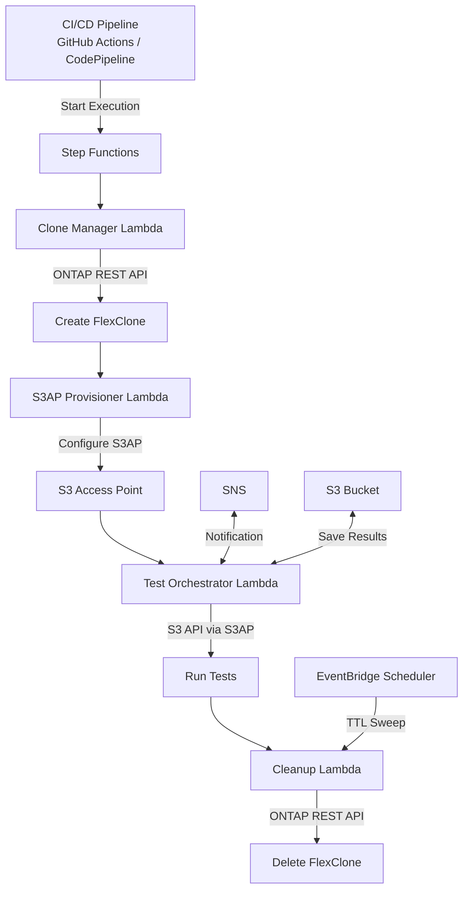

# FC7: DevOps FlexClone + S3AP — Actualisation des données Dev/Test et intégration CI/CD

🌐 **Language / Langue**: [日本語](README.md) | [English](README.en.md) | [한국어](README.ko.md) | [简体中文](README.zh-CN.md) | [繁體中文](README.zh-TW.md) | Français | [Deutsch](README.de.md) | [Español](README.es.md)

📚 **Docs**: [Architecture](docs/architecture.en.md) | [Guide de démonstration](docs/demo-guide.en.md)

## Vue d'ensemble

Un modèle d'automatisation combinant ONTAP FlexClone avec S3 Access Points pour **rendre les copies instantanées des données de production accessibles via l'API S3 serverless**.

Ce modèle étend le workflow initié par EBS Volume Clones ([Blog AWS](https://aws.amazon.com/blogs/storage/accelerate-development-workflows-with-amazon-ebs-volume-clones/)) — « copie instantanée → utilisation dev/test → suppression automatique » — en utilisant FSx for ONTAP FlexClone + S3 Access Points pour une meilleure efficacité.

### Comparaison avec EBS Volume Clones

| Fonctionnalité | EBS Volume Clones | FlexClone + S3AP (ce UC) |
|----------------|-------------------|--------------------------|
| Vitesse de copie | Instantanée (secondes) | Instantanée (métadonnées uniquement) |
| Efficacité du stockage | Copie complète (consomme la capacité) | **Économe en espace (blocs modifiés uniquement)** |
| Méthode d'accès | Attachement EC2 requis | **API S3 (serverless)** |
| Contrainte AZ | Même AZ uniquement | **Accessible depuis Lambda externe au VPC** |
| Nettoyage automatique | Manuel/personnalisé | **Suppression automatique basée sur TTL** |
| Intégration CI/CD | Implémentation personnalisée | **Step Functions natif** |

## Architecture



## Cas d'utilisation

### 1. Actualisation des données Dev/Test (quotidienne)

Création d'un FlexClone quotidien du volume de production et fourniture de l'alias S3AP à l'équipe de développement. Le clone de la veille est automatiquement supprimé avant la création du suivant.

```bash
# Exemple de déclenchement manuel
aws stepfunctions start-execution \
  --state-machine-arn arn:aws:states:ap-northeast-1:ACCOUNT:stateMachine:DevTestRefresh \
  --input '{"source_volume": "production_data", "ttl_hours": 24, "requester": "dev-team"}'
```

### 2. Données de test pour pipeline CI/CD (à la demande)

Déclenché automatiquement lors d'un merge de PR ou des builds nocturnes. Nettoyage immédiat après la fin des tests.

```yaml
# Exemple d'intégration GitHub Actions
- name: Provision test data
  run: |
    EXECUTION_ARN=$(aws stepfunctions start-execution \
      --state-machine-arn ${{ secrets.STATE_MACHINE_ARN }} \
      --input '{"source_volume": "testdata_master", "test_suite": "integration"}' \
      --query 'executionArn' --output text)
    # Wait for completion
    aws stepfunctions describe-execution --execution-arn $EXECUTION_ARN --query 'status'
```

### 3. Tests DR (hebdomadaire/mensuel)

Validation des procédures DR à partir d'un clone des données de production. Aucun impact sur la production.

## Déploiement

```bash
sam deploy \
  --template-file template.yaml \
  --stack-name devops-flexclone-cicd \
  --parameter-overrides \
    OntapManagementIp=10.0.1.100 \
    OntapSecretName=fsxn/ontap-credentials \
    SvmName=svm1 \
    SourceVolumeName=production_data \
    SimulationMode=true \
  --capabilities CAPABILITY_IAM
```

## Indicateurs de succès

| Résultat | Indicateur | Mesure | Revue humaine |
|----------|------------|--------|---------------|
| Provisionnement plus rapide | Temps de création du clone | < 60 secondes (métadonnées uniquement) | ✅ |
| Efficacité du stockage | Consommation de capacité du clone | < 5 % du volume source | ✅ |
| Accélération du pipeline CI/CD | Temps de préparation des données de test | Réduction de 90 %+ vs snapshots | ✅ |
| Taux de nettoyage automatique | Taux de suppression des clones expirés TTL | 100 % | — |
| Fiabilité des tests | Taux de succès des tests avec données équivalentes production | > 95 % | ✅ |

## Contraintes

- FlexClone est créé dans le même aggregate (IOPS partagées avec le parent)
- Les écritures via S3AP sont limitées à 5 Go maximum (utiliser NFS pour les écritures de données de test volumineuses)
- Les exigences de placement VPC des Lambda dépendent du paramètre NetworkOrigin (voir docs steering)
- Le split de FlexClone convertit en volume indépendant (perte d'efficacité spatiale)
