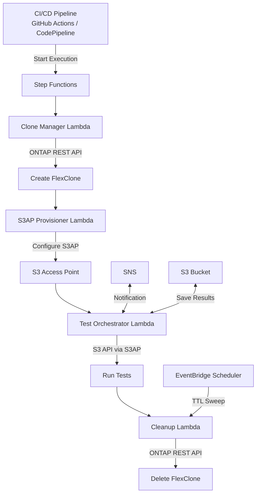

# FC7: DevOps FlexClone + S3AP — 개발/테스트 데이터 갱신 및 CI/CD 파이프라인 통합

🌐 **Language / 언어**: [日本語](README.md) | [English](README.en.md) | 한국어 | [简体中文](README.zh-CN.md) | [繁體中文](README.zh-TW.md) | [Français](README.fr.md) | [Deutsch](README.de.md) | [Español](README.es.md)

📚 **문서**: [아키텍처](docs/architecture.en.md) | [데모 가이드](docs/demo-guide.en.md)

## 개요

ONTAP FlexClone과 S3 Access Points를 결합하여 **프로덕션 데이터의 즉시 복사본을 서버리스 S3 API로 액세스**할 수 있게 하는 자동화 패턴입니다.

이 패턴은 EBS Volume Clones([AWS 블로그](https://aws.amazon.com/blogs/storage/accelerate-development-workflows-with-amazon-ebs-volume-clones/))가 개척한 "즉시 복사 → 개발/테스트 사용 → 자동 삭제" 워크플로우를 FSx for ONTAP FlexClone + S3 Access Points로 확장하여 효율성을 향상시킵니다.

### EBS Volume Clones와의 비교

| 기능 | EBS Volume Clones | FlexClone + S3AP (본 UC) |
|------|-------------------|--------------------------|
| 복사 속도 | 즉시 (초 단위) | 즉시 (메타데이터 전용) |
| 스토리지 효율성 | 전체 복사 (용량 소비) | **공간 효율적 (변경 블록만)** |
| 액세스 방법 | EC2 연결 필요 | **S3 API (서버리스)** |
| AZ 제약 | 동일 AZ만 | **VPC 외부 Lambda에서 액세스 가능** |
| 자동 정리 | 수동/커스텀 | **TTL 기반 자동 삭제** |
| CI/CD 통합 | 커스텀 구현 | **Step Functions 네이티브** |

## 아키텍처



## 유스케이스

### 1. 개발/테스트 데이터 갱신 (매일)

프로덕션 볼륨의 일일 FlexClone을 생성하고 개발팀에 S3AP 별칭을 제공합니다. 전일 클론은 다음 클론 생성 전에 자동 삭제됩니다.

```bash
# 수동 트리거 예시
aws stepfunctions start-execution \
  --state-machine-arn arn:aws:states:ap-northeast-1:ACCOUNT:stateMachine:DevTestRefresh \
  --input '{"source_volume": "production_data", "ttl_hours": 24, "requester": "dev-team"}'
```

### 2. CI/CD 파이프라인 테스트 데이터 (온디맨드)

PR 병합 또는 야간 빌드 시 자동 트리거됩니다. 테스트 완료 후 즉시 정리됩니다.

```yaml
# GitHub Actions 통합 예시
- name: Provision test data
  run: |
    EXECUTION_ARN=$(aws stepfunctions start-execution \
      --state-machine-arn ${{ secrets.STATE_MACHINE_ARN }} \
      --input '{"source_volume": "testdata_master", "test_suite": "integration"}' \
      --query 'executionArn' --output text)
    # Wait for completion
    aws stepfunctions describe-execution --execution-arn $EXECUTION_ARN --query 'status'
```

### 3. DR 테스트 (주간/월간)

프로덕션 데이터의 클론을 사용하여 DR 절차를 검증합니다. 프로덕션에 영향 없음.

## 배포

```bash
sam deploy \
  --template-file template.yaml \
  --stack-name devops-flexclone-cicd \
  --parameter-overrides \
    OntapManagementIp=10.0.1.100 \
    OntapSecretName=fsxn/ontap-credentials \
    SvmName=svm1 \
    SourceVolumeName=production_data \
    SimulationMode=true \
  --capabilities CAPABILITY_IAM
```

## 성공 지표

| 결과 | 지표 | 측정 | 인간 리뷰 |
|------|------|------|-----------|
| 빠른 데이터 프로비저닝 | 클론 생성 시간 | < 60초 (메타데이터 전용) | ✅ |
| 스토리지 효율성 | 클론 용량 소비 | 소스 볼륨의 < 5% | ✅ |
| CI/CD 파이프라인 가속 | 테스트 데이터 준비 시간 | 스냅샷 대비 90%+ 단축 | ✅ |
| 자동 정리율 | TTL 만료 클론 삭제율 | 100% | — |
| 테스트 신뢰성 | 프로덕션 동등 데이터 테스트 성공률 | > 95% | ✅ |

## 제약사항

- FlexClone은 동일 aggregate 내에서 생성됨 (부모와 IOPS 공유)
- S3AP를 통한 쓰기는 최대 5 GB로 제한 (대용량 테스트 데이터 쓰기는 NFS 사용)
- Lambda VPC 배치 요구사항은 NetworkOrigin 설정에 따라 다름 (스티어링 문서 참조)
- FlexClone 분할은 독립 볼륨으로 변환됨 (공간 효율성 상실)
