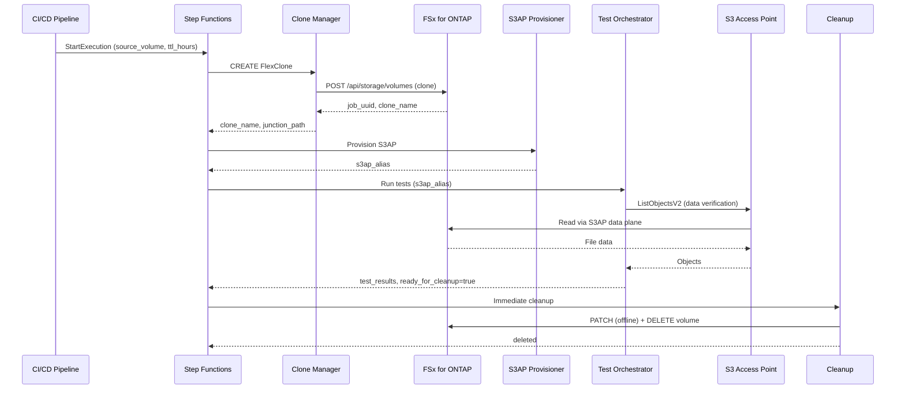

# FC7 Architecture: DevOps FlexClone + S3AP

## Data Flow



## Component Overview

| Lambda | Role | ONTAP API | VPC Requirement |
|--------|------|-----------|-----------------|
| Clone Manager | FlexClone lifecycle management | POST/GET/PATCH/DELETE volumes | In-VPC (management IP access) |
| S3AP Provisioner | S3AP config, alias return | — | VPC-external OK |
| Test Orchestrator | Test execution, result collection | — | Depends on NetworkOrigin |
| Cleanup | TTL sweep + immediate deletion | GET/PATCH/DELETE volumes | In-VPC (management IP access) |

## Step Functions State Machine

```json
{
  "StartAt": "CreateClone",
  "States": {
    "CreateClone": {
      "Type": "Task",
      "Resource": "arn:aws:lambda:...:clone-manager",
      "Parameters": {
        "action": "CREATE",
        "source_volume.$": "$.source_volume",
        "ttl_hours.$": "$.ttl_hours",
        "requester.$": "$.requester"
      },
      "Next": "ProvisionS3AP"
    },
    "ProvisionS3AP": {
      "Type": "Task",
      "Resource": "arn:aws:lambda:...:s3ap-provisioner",
      "Next": "RunTests"
    },
    "RunTests": {
      "Type": "Task",
      "Resource": "arn:aws:lambda:...:test-orchestrator",
      "Next": "Cleanup"
    },
    "Cleanup": {
      "Type": "Task",
      "Resource": "arn:aws:lambda:...:cleanup",
      "Parameters": {
        "mode": "immediate",
        "clone_name.$": "$.clone_name"
      },
      "End": true
    }
  }
}
```

## Technical Comparison with EBS Volume Clones

| Aspect | EBS Volume Clones | FlexClone + S3AP |
|--------|-------------------|------------------|
| **Copy mechanism** | CoW (Copy-on-Write) block-level | CoW block-level (WAFL) |
| **Instant availability** | ✅ Available within seconds | ✅ Metadata-only, instant |
| **Data independence** | Fully independent (accessible during init) | Shares with parent (until split) |
| **Storage consumption** | Full clone size (after init) | Differential blocks only |
| **Access method** | Attach to EC2 | S3 API / NFS / SMB |
| **Scope** | Same-AZ only | S3AP: accessible from outside VPC |
| **IOPS** | Independent IOPS per clone | Shared with parent aggregate |
| **Max size** | 64 TiB (EBS limit) | ONTAP volume limit |
| **Automation** | CreateVolume API | ONTAP REST API |
| **Cleanup** | DeleteVolume API | ONTAP REST API + TTL automation |
