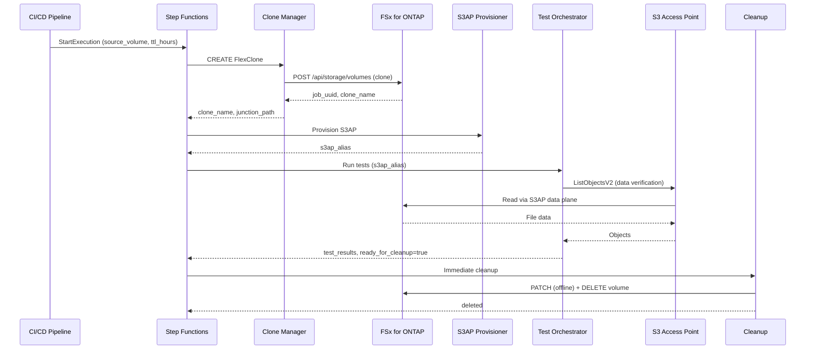

# FC7 アーキテクチャ: DevOps FlexClone + S3AP

## データフロー



## コンポーネント構成

| Lambda | 役割 | ONTAP API | VPC 要件 |
|--------|------|-----------|---------|
| Clone Manager | FlexClone ライフサイクル管理 | POST/GET/PATCH/DELETE volumes | VPC 内（管理 IP アクセス） |
| S3AP Provisioner | S3AP 設定・エイリアス返却 | — | VPC 外可 |
| Test Orchestrator | テスト実行・結果収集 | — | NetworkOrigin 依存 |
| Cleanup | TTL sweep + 即時削除 | GET/PATCH/DELETE volumes | VPC 内（管理 IP アクセス） |

## Step Functions ステートマシン

```json
{
  "StartAt": "CreateClone",
  "States": {
    "CreateClone": {
      "Type": "Task",
      "Resource": "arn:aws:lambda:...:clone-manager",
      "Parameters": {
        "action": "CREATE",
        "source_volume.$": "$.source_volume",
        "ttl_hours.$": "$.ttl_hours",
        "requester.$": "$.requester"
      },
      "Next": "ProvisionS3AP"
    },
    "ProvisionS3AP": {
      "Type": "Task",
      "Resource": "arn:aws:lambda:...:s3ap-provisioner",
      "Next": "RunTests"
    },
    "RunTests": {
      "Type": "Task",
      "Resource": "arn:aws:lambda:...:test-orchestrator",
      "Next": "Cleanup"
    },
    "Cleanup": {
      "Type": "Task",
      "Resource": "arn:aws:lambda:...:cleanup",
      "Parameters": {
        "mode": "immediate",
        "clone_name.$": "$.clone_name"
      },
      "End": true
    }
  }
}
```

## EBS Volume Clones との技術比較

| 観点 | EBS Volume Clones | FlexClone + S3AP |
|------|-------------------|------------------|
| **コピー メカニズム** | CoW (Copy-on-Write) ブロックレベル | CoW ブロックレベル（WAFL） |
| **即時利用** | ✅ 秒単位で利用可能 | ✅ メタデータのみで即時 |
| **データ独立性** | 完全独立（初期化中もアクセス可能） | 親ボリュームと共有（split まで） |
| **ストレージ消費** | クローン全体分（初期化完了後） | 差分ブロックのみ |
| **アクセス方法** | EC2 にアタッチ | S3 API / NFS / SMB |
| **スコープ** | same-AZ 内のみ | S3AP: VPC 外からもアクセス可 |
| **IOPS** | クローン独立の IOPS | 親アグリゲートと共有 |
| **最大サイズ** | 64 TiB (EBS 上限) | ONTAP ボリューム上限 |
| **自動化** | CreateVolume API | ONTAP REST API |
| **クリーンアップ** | DeleteVolume API | ONTAP REST API + TTL 自動化 |
